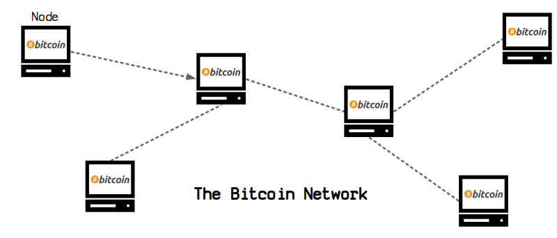
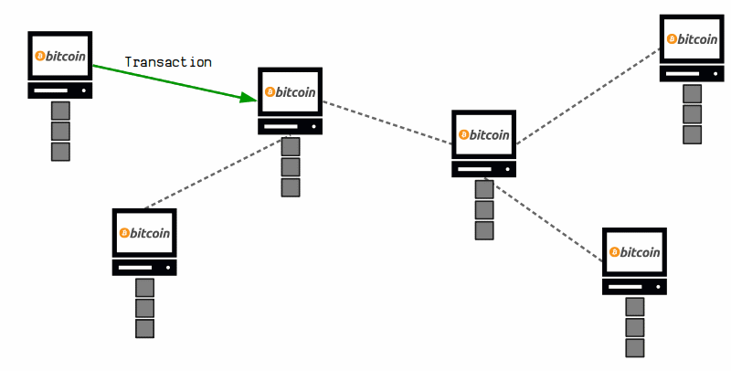
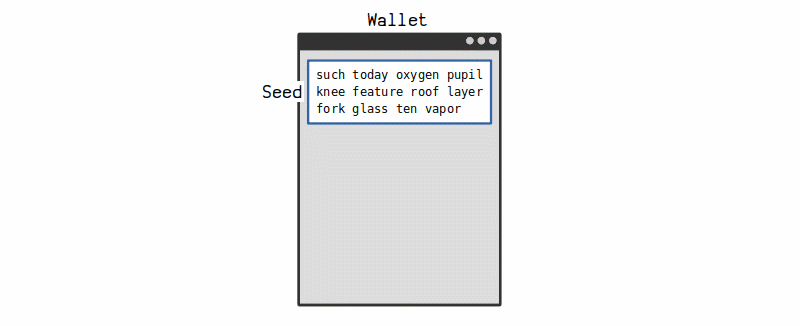
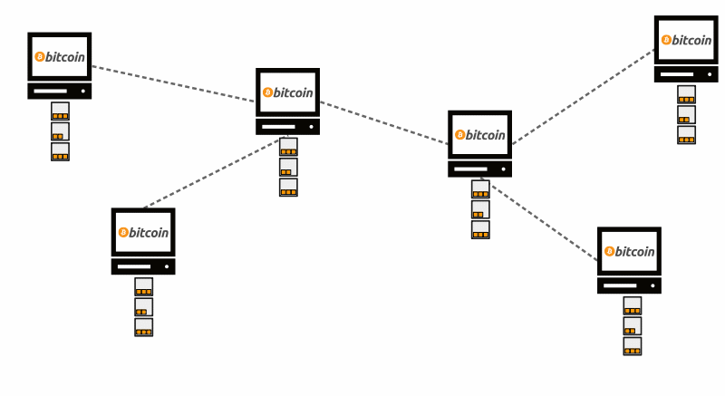

# 开始
下载你的第一个钱包。

> 简单地开始并不断改进比不开始要好。
> 
所以你听说过比特币，想要参与其中。怎么开始呢？

让我来告诉你…

## 比特币核心
真正开始使用比特币的最佳方式是下载[Bitcoin Core](https://bitcoin.org/en/download)。

当您运行该程序时，它将连接到运行相同程序的其他人，创建一个相互通信的计算*network*。

第一次运行比特币核心时，您将开始从网络上的其他节点下载一个文件。该文件称为*blockchain*，它是一个大的**交易文件**。

一旦您下载并验证了完整的区块链（目前为0.00 GB），您就可以开始进行自己的*transactions*，这些交易会在网络中传播，并写入每个人计算机上的区块链。

这就是比特币的基础知识。

## 比特币钱包

运行比特币核心的要求是你需要**下载并存储完整的区块链**。这是一件好事，因为它创建了一个额外的区块链副本，而且你还在帮助将交易传递给其他计算机。

然而，并非每个人都有足够的硬盘空间来存储自己的区块链副本。

因此，你可以使用称为比特币“钱包”的东西，而不是运行比特币核心。钱包允许你发送和接收比特币，但不需要你自己的区块链副本。

如果您不想运行完整节点，比特币钱包是开始使用比特币的最简单方式。

使用钱包而不是比特币核心的缺点是什么？

* **比特币核心** - 您拥有每笔交易的副本。因此，您可以验证收到的每笔交易并在自己的计算机上查看它们，无需信任任何其他人。
* **钱包** - 钱包需要连接到节点以获取交易信息。因此，您需要信任钱包连接到诚实的节点以获取正确的交易详细信息。

使用钱包是使用比特币最方便的方法（这是我使用它的方式），但运行完整节点是使用比特币而无需信任任何人的方法（这也是我喜欢做的）。

选择由您。

## 我应该使用哪个比特币钱包？
比特币是一个开源程序，因此任何人都可以创建自己的钱包。以下是我推荐的开始使用的钱包：

* **桌面**：[Electrum](https://electrum.org/)
* **安卓**：[Samourai](https://samouraiwallet.com/)
* **iOS**：[Green](https://blockstream.com/green/)或[Mycelium](https://wallet.mycelium.com/)
但是，正如我所说，任何人都可以创建比特币钱包，因此请确保您使用的钱包可靠（而不仅仅是外观最好的）。

>提示：如果你不认识或不信任制作钱包的人，你就不能相信你的比特币会得到安全保护。

## 钱包是做什么的?

钱包是用于存储和管理比特币的工具。当您首次开始使用比特币钱包时，它会为您生成一个种子。这个种子是一个随机生成的12-24个单词的列表，世界上没有其他人见过。

你的种子是独一无二的，它用于创建你钱包中的每个**地址**。

* *地址*是你提供给别人的，以便你可以接收比特币。
* 每个地址都有它自己的*私钥*，当你向别人发送比特币时使用它。

简而言之，比特币钱包管理您的密钥和地址，以便您可以发送和接收比特币。

>**提示**：如果你丢失了钱包，你可以通过种子恢复你所有的密钥（和所有的比特币）。

>**警告**：保护好你的种子，并且不要向任何人展示。如果有人得到了你的种子，他们就能够访问你的比特币。

## 比特币是如何工作的？

比特币是一个计算机网络，它们一起工作来共享一个名为区块链的文件。

您可以将区块链想象为一个巨大的保险箱房间，其中每个保险箱都包含一定数量的比特币和一个锁。

当您进行*transaction*时，您的钱包会从区块链中选择属于您的一箱比特币，并为您要发送比特币的人创建一箱新的比特币。

您的钱包将另一个人的地址放入新盒子上的锁中，并使用必要的私钥解锁当前锁定在您地址上的比特币盒子。

换句话说，你正在打开你的保险箱，并为其他人创建一个新的保险箱。

无论如何，这个交易（只是一些数据）被发送到网络上的一台计算机，从计算机到计算机中继，直到网络上的每个人都有你的交易副本。

最终，这笔交易将出现在每个人的区块链中。

这是因为网络中的一个节点将它们收到的最新交易收集到一个区块中，然后将该区块*mines*到区块链上（这需要能源）。然后，他们与网络上的其他节点共享这个挖掘的区块，并将其添加到他们的区块链中。

因此，在规律的间隔中，网络上的每个节点都会使用发送到网络中的最新交易来更新他们的区块链。这个过程不断重复，所以区块链不断增长新的交易。

无论如何，一旦交易进入区块链，它就无法被删除[^1]，这意味着交易完成，比特币已经转移。

这就是比特币的工作原理。

## 结论

如果你对比特币程序感到好奇并想要支持网络，那么就下载并运行[Bitcoin Core](https://bitcoin.org/en/download)。

比特币核心客户端
另一方面，如果你不关心运行完整节点的工作，只想发送和接收比特币，那么就直接获取一个钱包。

* **桌面**：[Electrum](https://electrum.org/)
* **安卓**：[Samourai](https://samouraiwallet.com/)
* **iOS**：[Green](https://blockstream.com/green/)或[Mycelium](https://wallet.mycelium.com/)
个人而言，我在家里的电脑上运行一个节点（因为我喜欢学习比特币并想要支持网络），但我在日常发送和接收比特币时使用钱包。我建议先下载一个钱包开始使用，如果你决定想要了解更多，再考虑运行节点。

>**注意**：本网站致力于与比特币核心节点进行交互并了解其工作原理，但为了简单起见，本“入门指南”的其余部分将只关注使用钱包。

无论如何，开始使用比特币的最佳方式就是实际使用它，而要做到这一点，你需要获得你的第一个比特币……

（你会在使用过程中逐渐了解其余部分。）

## 链接
* https://bitcoin-intro.com/ -另一个使用比特币的良好介绍。此页面顶部引用的来源。 

[^1]:一笔交易可以从区块链中移除，但这并不容易。请参见*51%攻击*。

作者：Greg Walker，2020年1月6日

最后更新日期：2020年7月21日
2020年7月21日: redirected and renamed files from /guide/ to /technical/
2020年3月28日: updated html for h1 headers and subheadings - now dynamic from yaml
2020年3月28日: updated html for h1 headers and subheadings
2020年2月27日: /beginners/sending - first draft
2020年2月14日: /beginners/buying - first draft
2020年2月9日: /beginners/getting-started - fixed link
2020年2月9日: /beginners/getting-started - animated some diagrams
2020年2月7日: /beginners/getting-started - first draft