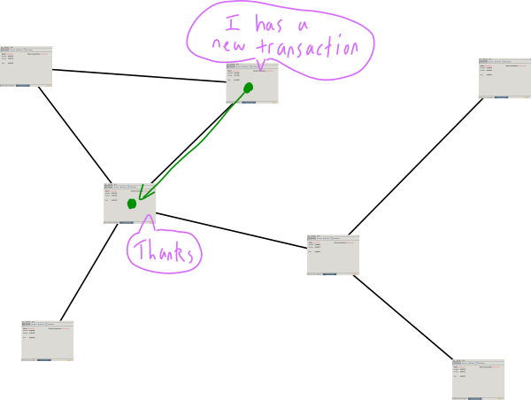
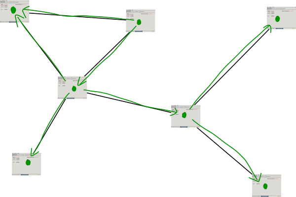

# 
比特币网络

运行比特币程序的计算机网络。

## 什么是比特币网络？

比特币网络由所有运行比特币软件（通常称为“比特币客户端”）的人组成。

  

比特币是由运行相同计算机程序的人组成的网络。

## 这个网络有什么作用？
网络上的人（也就是比特币客户端）**相互交流**。  

  

非常善于交际。

“相互交流”指的是网络中的各个部分（如节点）会通过发送信息的方式进行交流，以便了解网络其他部分的状态和活动。这是网络中信息传递和同步的一种方式。

例如，消息可能是有关**新交易的信息**。  

  

分享有关新交易的信息。

这种信息共享（例如交易）使网络上的所有人保持最新状态，如果想在互联网上运行数字货币，这一点非常重要。

  

最终每个人都会知道这笔新交易。这是一个好网络。

比特币网络被描述为[“点对点网络”](https://en.wikipedia.org/wiki/Peer-to-peer)，因为：

1. 每个人都互相连接，所以它是一个网络。
2. 网络上的每个人都是平等的，所以我们是同伴。

## 谁构成了这个网络？
如上所述，**任何具有有效互联网连接并运行比特币客户端的人都可以加入比特币网络。**

真的，任何人都可以加入比特币网络。你只需要互联网连接和[比特币客户端](https://bitcoin.org/en/download)，这就像其他的软件一样。

一旦你开始运行，你将被称为比特币网络上的节点。  

  

节点 - 稍微简洁的说法就是“运行比特币客户端并在网络中传递信息的个体”。

如需更多关于节点的信息，请查看[节点](../1.Network/Nodes/Nodes.md)。

## 我该如何加入网络？
这就对了。

你只需要下载（并运行）[比特币客户端](https://bitcoin.org/en/download)。

当你运行客户端时，它会连接到其他节点并开始下载完整的区块链（包含所有验证过的交易的文件）。之后，你的客户端将开始接收来自其他节点的交易并在网络中传递它们。

恭喜，你现在是比特币网络上的节点。

>你可能需要[编辑一些路由器设置，以允许其他节点连接到你](https://bitcoin.org/en/full-node#gui-peer-info)，但这只是一个小的配置问题。通过下载并运行比特币客户端，你就已经95%成为比特币网络上活跃节点。