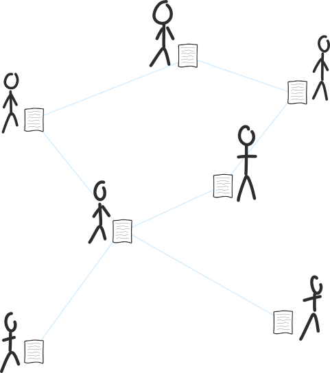

# 区块链
比特币交易的共享文件。

## 什么是区块链？
>**区块链是一个文件，其中包含每个比特币交易的列表。**

区块链

[比特币网络](../../1.Network/Network.md)上的每个人都共享这个文件的副本，并且它会定期更新最新的交易。

比特币网络：每个人共享一份交易文件（称为区块链）。

## 为什么区块链很重要？

>**区块链告诉你每个人拥有多少比特币。**

这是因为拥有完整的交易清单可以让你计算出每个地址上有多少比特币。因此，你可以计算出每个人拥有多少比特币。

区块链就像一本日志或账本。

>**账本** - 一本记录企业货币交易的借方和贷方形式的书籍。

## 为什么它被称为区块链？
因为交易不是单独添加到文件中的，而是被捆绑在一起并以块的形式添加。因此，被称为**区块链**。

此外，这些块是链接在一起的，因此对链下面的块进行的任何更改都会改变上面的块。因此，称为**链接块**或**区块链**。
.png)
交易被添加到块中，这些块被链接在一起。

交易的区块化使得每个人都更容易分享区块链的副本。随着我们拥有的互联网连接速度，分享每10分钟更新一次的文件比分享多次每秒更新的文件更容易。

交易的链接是一项安全功能。它使得篡改区块链变得困难，而不被人察觉。

## 区块链是如何共享的？
区块链由[比特币网络](../../1.Network/Network.md)上的节点共享，就像一个完全合法且非版权的视频文件可能在[BitTorrent网络](https://en.wikipedia.org/wiki/BitTorrent)上共享一样。
.png)
比特币点对点区块链文件共享。如果我的文件没有最新的交易块，有人会与我分享它们。

P2P文件共享是一个单独的话题，但现在只需知道区块链像BitTorrent文件一样在比特币网络上共享。

## 我可以在哪里获取区块链的副本？

你可以通过下载原始的[比特币客户端](https://bitcoin.org/en/download)，获得一份真正的、合法的、电气化的~~单轨~~区块链副本。

安装并运行该客户端后，它将连接到网络并开始下载区块链。它有180GB以上，所以需要一些时间。

>什么？它确实包含了你知道的每一笔比特币交易（自2009年1月3日以来的每一笔交易），所以180GB以上是合理的。此外，完整区块链的初始下载只需要一次。之后，更新最新块只需要很少的空间，大约1MB。

当下载完成后，你将拥有完整的区块链副本，并掌握了每一笔比特币交易的清单。此外，每次运行比特币客户端时，你都将帮助与加入网络的其他人分享该文件。你的一些朋友甚至可能会开始称你为“全节点”。

通过保留区块链副本并与网络上的其他人分享，你使比特币更加强大。

>如果你是比特流的粉丝，你可以把自己想象成在**播种**区块链。每个人都喜欢播种者。

## 我的电脑上的区块链文件存储在哪里？
区块链存储在类似blk00000.dat的文件中。还有blk00001.dat、blk00002.dat等等。它被分成多个文件，因为这比使用一个巨大的文件更容易。

它们的位置取决于您使用的操作系统：

**Linux**
>/home/[username]/.bitcoin/blocks/

**windows**
>C:\Users\[username]\AppData\Roaming\Bitcoin\

**Mac**
>~/Library/Application Support/Bitcoin/

然而，这些“.dat”文件包含的数据是为计算机设计的，因此如果您打开其中一个，您会看到很多无意义的信息。但请相信我，所有的交易都在里面。

>如果您想浏览一个可读版本的区块链，请尝试我的*区块链浏览器*。我基本上从[“blk*.dat”](../../../../Technical/Blockchain/Blkdat/blkdat.md)文件中获取数据（就是您拥有的那些副本），解析它们，并在网页上显示其内容。