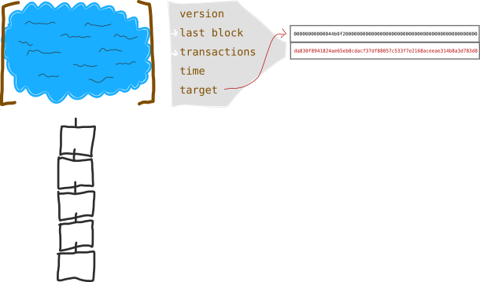
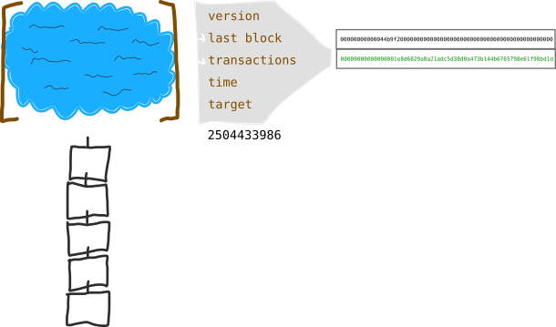
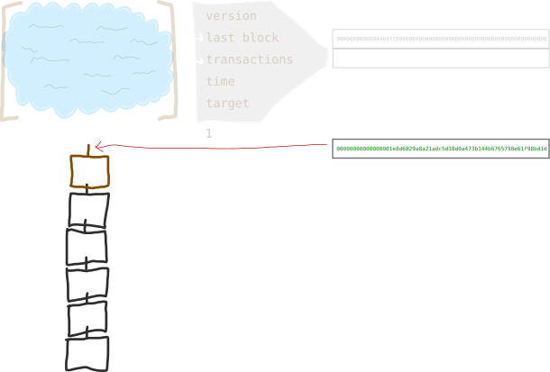

# 
区块

比特币交易的集合。

## 什么是区块？
>**区块是已添加到[区块链](../1.Blockchain/Blockchain.md)中的一堆交易。**

## 区块是如何形成的？
区块是由矿工挖掘形成的。

### 继续说…
当你进行比特币交易时，它不会立即添加到区块链中。相反，它会被保留在交易池（或内存池）中。

.png)

交易池

如果你是矿工，你的工作就是从交易池中收集交易到“候选区块”中，并尝试将该候选区块添加到区块链中。

.png)

候选区块

## 区块头
你还可以为每个候选区块提供区块头，它包含了关于区块的元数据信息。  

.png)  

区块头

矿工在尝试向区块链添加区块时使用此元数据。
>**元数据**是指描述其他数据的数据，可以作为信息标签。

### 区块头字段  
这些字段的详细信息现在并不重要，但这里还是简单介绍一下：

**版本**  
描述区块内数据的结构。这是为了使计算机能够正确读取每个区块的内容。

**上一个区块**  
上一个区块的识别号码。我们正在尝试为当前候选区块获取其中一个。

[**默克尔根**](../../../../Technical/Block/block-header/merkle-root/merkle-root.md)  
将区块内所有交易哈希在一起形成一条文本。所有字段都是唯一的，但可以认为这是区块头的最重要部分。

**时间**  
当前时间。非常方便。

[**目标**](../../../../Technical/Mining/Mining.md)  
矿工努力添加候选区块到区块链的值。它由比特币网络设置，稍后会跟你说清楚。

## 如何将区块添加到区块链中？
要将候选区块添加到区块链中，需要对**区块头中的数据进行哈希处理**，并希望结果低于某个特定目标值。

区块哈希和目标值

目标是根据[难度](../3.Difficulty/Difficulty.md)计算的，难度是由比特币网络设定的一个值，用于调节将交易块添加到区块链的难度。

>**将目标视为候选区块的阈值 - 难度越大，目标值越低，越难找到低于该值的区块哈希。**

别担心，我知道这个难度和目标的问题会让你困惑，但随着时间的推移，你会越来越理解的。

>[**难度**](../3.Difficulty/Difficulty.md)  
比特币网络设定的值，旨在调节区块解决的速度。它每2016个区块调整一次，以确保每10分钟产生一个新的区块。

## 随机数
我撒谎了。你实际上不是仅对区块头进行哈希处理。你实际上需要将它与另一个数字一起进行哈希处理。

.png)

区块随机数

这个数字被称为[随机数](../../../../Technical/Block/block-header/Nonce/Nonce.md)，它是矿工用来帮助他们得到区块哈希值低于目标值的虚拟字段。

>**随机数**——在加密通信中仅使用一次的任意数字。

如果第一个随机数不起作用（从0开始），请继续递增它并对区块头进行哈希处理。最终你将找到一个随机数返回小于目标值的区块哈希值。  

  

区块随机数成功

>我知道这些哈希值包含字母，但你仍然可以像处理其他数字一样来处理它们。它们只是十六进制值，计算机非常喜欢使用它们。

## 恭喜

一旦你找到了有效的随机数，该区块便被“解决”，其中所有的交易都被添加到区块链中。

区块完成

所有矿工现在将返回交易池，并开始处理下一个候选区块。他们将在下一个区块头中使用你的区块哈希，并开始竞争将新的交易块添加到区块链中。

干得好。