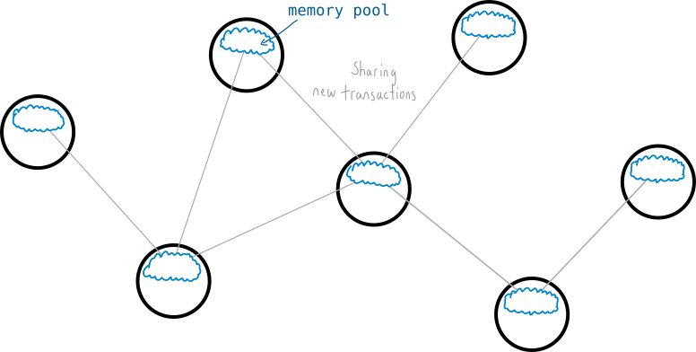
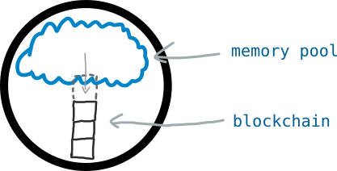
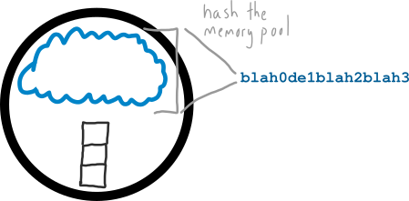
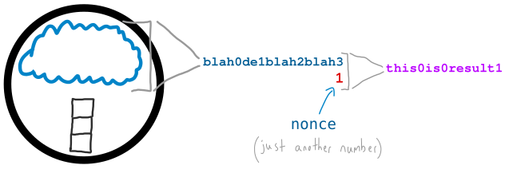
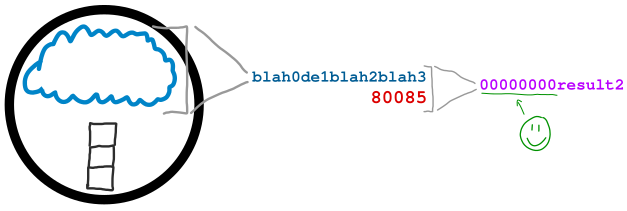
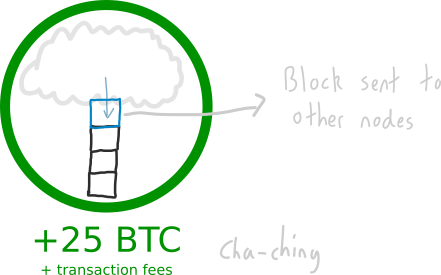
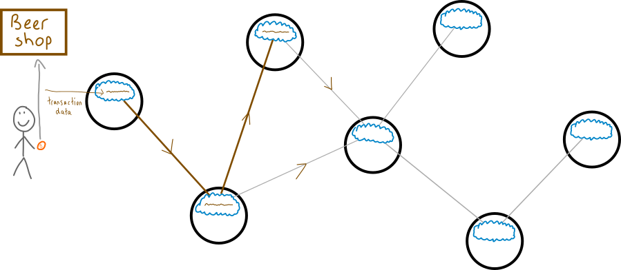
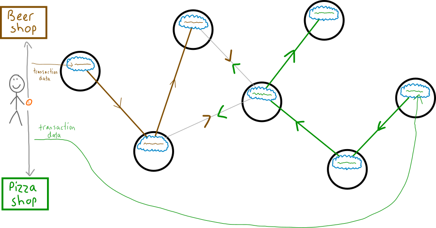
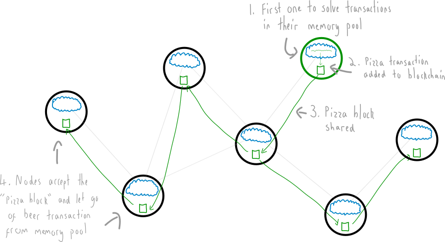

# 挖矿
将区块添加到区块链的过程。

## 什么是挖矿？
挖矿是将交易添加到*区块链*的过程。

## 它是如何工作的？
*比特币网络*上的每个*节点*都共享有关新交易的信息。它们将这些交易存储在其内存池中。

每个节点还可以尝试将其内存池中的交易挖掘到一个文件中。这个文件是每个比特币交易的账本，称为**区块链**。

>**然而，要将来自内存池的交易添加到区块链中，节点必须使用大量的计算机处理能力。**

这种处理能力是通过内存池中存在的挑战来实现的。

## 这个挑战是什么呢？

好的，想象一下你是一个节点。在任何时刻，你都可以将内存池中的交易压缩成一个由数字和字母组成的单个“字符串”。

现在，您的目标是使用另一个数字对此字符串进行哈希，以尝试获得一个以特定数量的零开头的新字符串。

现在，这听起来很容易，但实际上很难。它是完全随机的，你只能通过试错来找到一个成功的结果。这就是挖矿——大量的哈希计算（使用大量计算机的处理能力），并希望能够幸运地找到一个成功的结果。

但是，如果你足够幸运地找到一个成功的哈希结果，你内存池中的交易将被添加到区块链中，网络上的每个节点都将把你的交易块添加到他们的区块链中。

你还将获得25个比特币的奖励，以及从刚刚添加到区块链中的交易中获得的任何费用。

>“一定数量的零”是由*难度*决定的。难度由网络设定，并根据挖矿者的数量而变化——挖矿者越多，难度越大，开始时需要更多的零（这使得寻找获胜结果更加困难）。

>这是区块链中添加区块的略微简化的版本。如需更多细节，请查看*区块*。

## 为什么挖矿是必要的？

好问题。为什么不直接将交易添加到区块链中？

>**因为挖矿允许整个比特币网络就哪些交易被“归档”达成共识，这是数字货币中防止欺诈的方式。**

### 继续讲…

当您进行比特币交易时，网络上的节点不会立即收到有关它的信息。相反，交易通过从一个节点传递到下一个节点来在比特币网络上传输。

然而，实际上可以使用同样的比特币进行另一笔交易，并将该交易插入网络中。例如，您可以用一些比特币买一杯啤酒，然后迅速尝试用这些比特币购买一块披萨。

换句话说，这是一种古老的**欺诈行为**。

尽管你在购买啤酒的交易之后购买比萨饼，但由于交易在比特币网络中的传播方式，网络将对你是否应该获得啤酒或比萨饼存在争议。

## 那么网络是如何决定选择哪些交易呢？
当然是通过挖矿。

>**如果网络上的一个节点完成了挑战，那么它内存池中的交易就会被添加到区块链中。**

这似乎是一种有些不正规的选择交易方式，我知道，但这是比特币网络在处理冲突信息时达成共识的解决方案。
>好的方面是，每个新交易块被添加到区块链只需要大约10分钟的时间，因此您只需要等待10分钟以确认比特币已经“到达”新地址（而没有被发送到替代地址）。

## 挖矿的另一个好处是

>**如果你想尝试控制添加到区块链中的区块（即交易），你必须与比特币网络上的每个其他挖矿节点竞争解决区块难题。**

换句话说，你需要拥有一台具有足够处理能力的计算机，能够超越每个比特币矿工的综合处理能力。

这是完全可能的-你只需要花费几十亿美元的硬件，就可以做到这一点（尽管这个数字随着每个新矿工加入网络而增加）。

## 我该如何开始挖矿？

想要尝试那25BTC的奖励吗？

>**要开始挖矿，你需要在比特币客户端中打开一个开关。**

然而，由于尝试使用笔记本电脑上的CPU来挖掘比特币非常低效，所以“挖矿”开关已经从软件界面中移除。

但不用担心，因为功能仍然存在...你只需要输入一个命令：

前往：帮助 > 调试窗口 > 控制台

然后输入这个命令
> setgenerate true

这是“开启挖矿”的命令。您的客户端现在将从内存池中的交易生成区块（交易块），并开始对它们进行哈希。

您将知道它正在工作，因为您的处理器将开始运行，同时对生成的块进行哈希以尝试获得有效的结果。

它可能不会解决一个块（这将是一个奇迹），但尝试一下也很有趣。

    要关闭挖矿：
    
    >setgenerate false