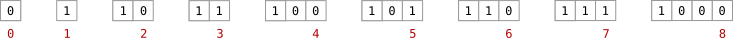
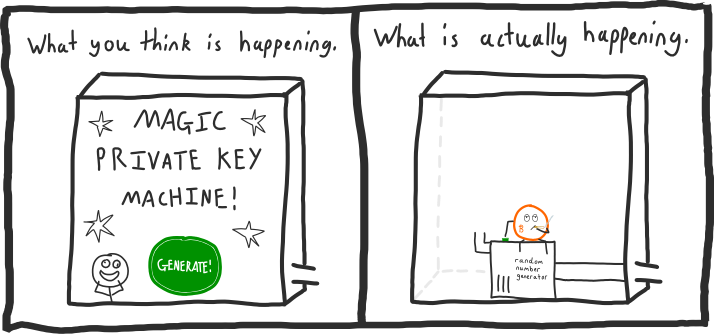

# <center>私钥</center>
<center>随机生成的很长数字。</center>

## 什么是私钥？
私钥是随机生成的数字。
例子
一个私钥
108165236279178312660610114131826512483935470542850824183737259708197206310322

但更准确地说，因为比特币使用256位数字，随机生成的私钥起始看起来像这样：
例子
二进制
1110111100100011010110101010110011111001000011011001111101001010101011011101100011001001001011100100101100100101011000101110000111011001111010111001011111110000110111111001101110100011101101010000100000100101100001110011100111001011000000010011110110110010

>是的，这仍然是一个数字。它只是用二进制表示，这是一种在计算机中存储数字的基本方式。因为你知道，比特币毕竟是一个计算机程序。

无论如何，我们可以轻松地将这个私钥从二进制转换为十进制：
例子
十进制
108165236279178312660610114131826512483935470542850824183737259708197206310322

或者十六进制:
例子
十六进制
ef235aacf90d9f4aadd8c92e4b2562e1d9eb97f0df9ba3b508258739cb013db2

这没有区别。它们都是相同的数字，它们都是相同的私钥。

因为毕竟，私钥只是一个数字。

>原始的私钥通常以十六进制格式显示。

## 什么是256位数字？
一个256位数字是一个可以存储在256位数据中的数字。

**什么是位？**
一个比特是计算机内最小的数据单位。

|Unit|Size|
|---|---|
|gigabyte|1024 megabytes|
|megabyte|1024 kilobytes|
|kilobyte|1024 bytes|
|byte|8 bits|
|bit||

事实上，一个比特是如此的小，它只能存储值为1或0。
.png)

然而，你仍然可以使用比特表示其他类型的数据，例如日常数字。
例如，以下是如何使用比特在计算机中存储几个不同的数字：


无论如何，256位数字只是一个可以用256个这些比特（最多）表示的数字。
.png)

换句话说，一个256位的数字在以下范围内：

>min:0
max:115792089237316195423570985008687907853269984665640564039457584007913129639935

正如你所看到的，256位给你足够的空间使用一些相当大的数字。

而256位数字就是指适合在256位数据中使用的数字。

>256位数字的总数相当于2^256。

## 私钥从哪里来？

当我说它们是随机生成的时，我并没有撒谎。

说实话，当你使用任何比特币软件生成私钥时，它们并不是在执行魔术 - 它们只是给你一个随机的256位数字。


因此，你完全可以创建自己的私钥。你只需要能够生成一个随机的256位数字。

你可以通过多种方式实现这一点：
例子:
1. 抛256次硬币。
.png)
这将为你提供一个二进制的私钥。

2. 使用你喜欢的编程语言生成一个随机数。
```python
# need to use the operating system's random number generator for security
import random
random.SystemRandom().randint(1, 115792089237316195423570985008687907852837564279074904382605163141518161494336)
```
这将为你提供一个十进制的私钥。

3. 使用SHA256哈希函数对一些数据进行[哈希处理](../../../../Technical/Other/Hash%20Function/Hash%20Function.md)。（*尝试一下*）
.png)
这将给你一个十六进制的私钥。

所有这些方法都会给你一个256位的数字。如果你拥有一个256位的数字，你就拥有了一个私钥。

>**你需要确保你创建的私钥是完全随机的。**[^1]
如果你使用的随机数生成器不可靠（即它在生成随机数的方式上有模式），那么你会让自己容易受到熟悉你所使用的随机数生成器弱点的任何人的攻击。
如果有人能够重新创建与你相同的私钥，他们就可以取走你的比特币。
因此，大多数新手指南都会让你对生成自己的私钥感到恐惧，因为没有人想为你的新手错误负责。
但是，不要让所有这些恐吓阻止你。只要你不是新手，你就会没事的。
>>将单词“比特币”放入SHA256哈希函数中（并将其用作你的私钥）比随机更滑稽。
>>如果你仍然不确定，只需将硬币翻转256次。你不能更随机了。

任何人都可以通过生成一个随机数来创建自己的“比特币账户”，这是比特币的一个美妙特性。这意味着没有人掌控着发行账户，因此比特币开放给任何能生成一个256位数字的人。

### 如果有人生成了与我相同的私钥会怎样？
然后他们将能够窃取你的比特币。

但不要担心，没有人会随机生成与你相同的私钥。
**他们肯定可以吧？**
好的，他们可能会生成相同的私钥，但由于可能的私钥范围很大，这种情况相对较少。

例如，如果我有一百万只猴子，每只猴子每秒可以生成一百万个私钥（我训练得很好），那么平均需要大约3,671,743,063,080,802,746,815,416,825,491,118,336,277,193,184,902,172亿年[^2]，才能有一只猴子生成与你相同的私钥。

因此，正如你所看到的，我没有足够的时间或猴子能力，其他人也是如此。
>**选择一个随机的私钥有如此之多的可能性，这本身就是一种安全性。**

**好的，可以。**
不，我还没结束。

256位数字的范围（因此也是可能的私钥数量）是难以想象的巨大。就像人类无法想象宇宙的规模一样，人类也无法理解256位数字的范围。

因此，如果你对256位数字的安全性有任何疑虑，那么要么是因为你没有使用足够可靠的随机数生成器，要么是因为你还不了解我们正在处理的数字的数量级。

现在请离开我的网站。

[^1]:没有什么是完全随机的，但你应该尽力而为。
[^2]:这是我的数学```python
keys = 115792089237316195423570985008687907852837564279074904382605163141518161494336
monkeys = 1000000
monkeyhashrate = 1000000

keyspersecond = monkeys * monkeyhashrate

seconds = keys / keyspersecond
minutes = seconds / 60
hours = minutes / 60
days = hours / 24
years = days / 365
millionyears = years / 1000000

print millionyears
```