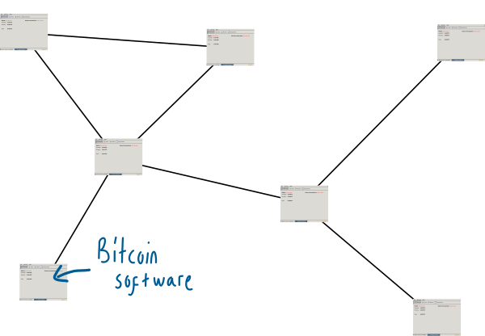
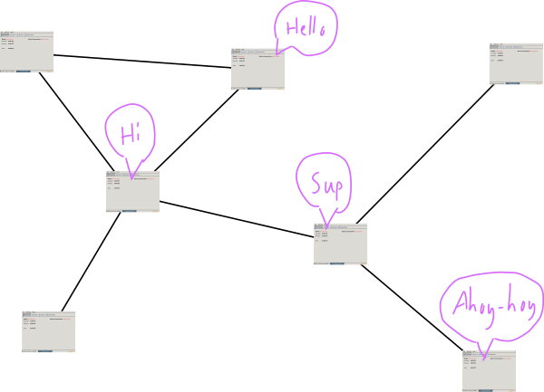

# 比特币网络
运行比特币程序的计算机网络。

## 什么是比特币网络？

比特币网络由运行比特币软件（更为人所知的是“比特币客户端”）的所有人组成。

## 网络的作用是什么？
网络上的人（也就是比特币客户端）**相互交流**。

“相互交流”指的是在网络的其他部分传递信息。这是通过相互发送消息来实现的。

例如，一条消息可能是有关**新交易的信息**。

这种信息共享（例如交易）使得网络上的每个人都能保持最新的状态，这对于在互联网上运行数字货币非常重要。

比特币网络被描述为[“点对点网络”](https://en.wikipedia.org/wiki/Peer-to-peer)，因为：

1. 每个人都互相连接，所以它是一个网络。
2. 网络上的每个人都是平等的，所以我们是对等的。

## 谁构成了这个网络？
如上所述，**任何具有活动互联网连接并运行比特币客户端的人都可以加入比特币网络。**

真的，任何人都可以加入比特币网络。你只需要一个互联网连接和一个*比特币客户端*，这是像任何其他软件一样的一块软件。

一旦你开始运行，你将被称为比特币网络上的节点。

如需更多关于节点的信息，请查看*节点*。

## 我该如何加入网络？
这就对了。

你只需要下载（并运行）一个*比特币客户端*。

当你运行客户端时，它会连接到其他节点并开始下载完整的区块链（包含所有验证过的交易的文件）。之后，你的客户端将开始接收来自其他节点的交易并在网络中传递它们。

恭喜，你现在是比特币网络上的一个节点。

>你可能需要[编辑一些路由器设置，以允许其他节点连接到你](https://bitcoin.org/en/full-node#gui-peer-info)，但这只是一个小的配置问题。通过下载和运行比特币客户端，你就已经完成了成为比特币网络上一个活跃节点的95%。