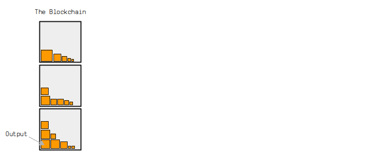

# **比特币是如何运作的**

比特币是一种于**2009年创建的电子支付系统**。它允许你向世界上任何人发送资金，而且无需请求任何人的许可来创建账户。

它是作为现代金融体系的解决方案而创建的，在现代金融体系中，我们有少数几家大银行，它们控制着谁可以开户，哪些交易可以处理。这意味着对货币的控制是集中的，我们必须相信银行会负责任地行事。

>我们必须信任银行来保管我们的钱，并以电子方式转账，但它们在信贷泡沫的浪潮中放贷，几乎没有准备金。-[中本聪](https://satoshi.nakamotoinstitute.org/posts/p2pfoundation/1/)

银行业的集中化以及由此引发的2007年金融危机激发了比特币的发展。这是一个支付系统，它的运行没有一个中央控制点。它是由中本聪匿名设计的，于[2009年1月](https://www.metzdowd.com/pipermail/cryptography/2009-January/014994.html)发布。

任何人都可以运行该程序或使用该系统。

以下是对其工作原理的简单解释。

## 什么是比特币?
比特币只是一个**计算机程序**。你可以下载并在您的计算机上运行它。

来吧，[试试](https://bitcoin.org/en/download)
当你运行该程序时，它将连接到其他也在运行该程序的计算机，并且它们将开始与你共享文件。这个文件被称为*blockchain*，它基本上是一个大的*transactions*。

当一笔新的交易进入网络时，它会从一台计算机转发到另一台计算机，直到每个人都有一份交易的副本。每隔大约10分钟，网络上的随机计算机(*node*)将把它们收到的最新交易添加到区块链上，并与网络上的其他所有人共享更新。

因此，比特币程序创建了一个庞大的计算机网络，这些计算机相互通信、**共享文件并用新的交易更新文件**。
## 比特币解决了什么问题？
在比特币出现之前，已经可以在计算机网络中转发交易了。但问题是**你可以在计算机网络中插入冲突的交易**。例如，你可以创建两个不同的交易，用于花费同一数字货币，并同时将这两个交易发送到网络中。
这就是所谓的“**双重支出**”。

因此，如果你创建一个没有中央控制点的电子支付系统，你就会遇到计算出这些交易中哪一个是“先发生”的问题，当你有一个由所有独立行动的计算机组成的网络时，这是一件很难做到的事情。有些电脑会先收到绿色的交易，有些电脑会先收到红色的交易。
谁来决定哪一个是“第一”的并且应该是唯一写入文件的？
比特币通过强制节点在将其写入文件之前将其接收的所有交易保存在*memory*中来解决这个问题。然后，每隔10分钟，网络上的一个随机节点会将其内存中的事务添加到文件中。

更新后的文件将与网络共享，节点将接受更新文件中的交易为“正确”，从其内存中删除任何冲突的交易。因此，不会将任何双重支出交易写入文件中，所有节点都可以在彼此达成一致的情况下更新其文件。

将交易添加到文件的过程称为*ming*，它基本上是一个网络范围内的竞争，不能由网络上的单个节点控制。

## 挖矿是如何工作的？
首先，每个节点会将他们收到的最新*transactions*存储在*memory pool*中。任何节点都可以尝试将内存池中的交易挖掘到*blockchain*文件中。
为了做到这一点，一个节点将从其内存池中收集交易，并将其放入一个称为*block*的容器中，然后使用处理能力尝试将这个交易区块添加到区块链上。

那么这个处理能力从哪里得来呢？要将这个区块添加到区块链中，你必须将你的交易区块输入到一个叫做*hash function*的东西中。哈希函数基本上是一个小型计算机程序，可以接受任何数量的数据，将其混合，然后输出一个完全随机（但唯一）的数字。

为了使您的区块成功添加到区块链上，该数字（*block hash*）必须低于*target*，而目标值是网络上所有人都同意的阈值数字。

如果您的结果区块哈希值不在目标值之下，您可以对区块内部数据进行微小调整，再次将其放入哈希函数中。这将产生一个完全不同的数字，希望它会在目标值之下。如果不是，您需要再次调整区块并重试。

总之，挖矿的过程利用处理能力尽可能快地执行哈希计算，以尝试成为网络上第一个获得低于目标的块哈希的计算机。如果成功，您可以将交易块添加到区块链中并与网络的其他部分共享。
>**注意**：虽然任何人仍然可以尝试挖掘区块，但在家用计算机上这样做已不再具有竞争力。现在有专门设计的硬件计算机，旨在尽可能快地执行哈希计算，这意味着挖掘现在主要由那些拥有专门比特币矿机和廉价电力的人员执行

## 比特币来自哪里？
作为使用处理能力尝试将新的交易块添加到区块链的激励，每个新块都会提供一定数量的以前不存在的比特币。因此，如果您能够成功挖掘一个块，您就能够“发送”这些新的比特币作为您的努力挖矿的奖励。

这个新比特币的奖励被称为块奖励，也是这个过程被称为“挖矿”的原因。

## 为什么文件被称为“区块链”？
正如我们所见，交易不是单独添加到文件中的 - 它们被收集在一起，以块的形式添加。每个新块都建立在现有块之上，因此文件由一系列*块*构成；因此，称为*区块链*。

此外，网络上的每个节点始**终会采用它们接收到的*最长块链***作为“官方”版本。这意味着矿工始终会尝试在已知的最长块链的“顶端”上构建，因为任何不属于最长链的块都不会被其他节点视为有效。

因此，如果有人想要重写交易历史，他们需要重建一个更长的区块链，以创建一个新的最长链，让其他节点采用。然而，要实现这一点，单个矿工需要拥有比网络中其他矿工加起来更多的计算机处理能力。

因此，如果有人想要重写交易历史，他们需要重建一个更长的区块链，以创建一个新的最长链，让其他节点采用。然而，要实现这一点，单个矿工需要拥有比网络中其他矿工加起来更多的计算机处理能力。

## 交易是如何工作的？
你可以将区块链想象成一个保险箱存储设施，我们称之为*outputs*。这些输出只是容器，用于存放不同数量的比特币。

当你进行比特币*transaction*时，你选择一些输出并解锁它们，然后创建新的输出并加上新的*locks*。

因此，当你“发送”比特币给某人时，实际上是将一定数量的比特币放入一个新的保险箱中，并在上面加上一个锁，只有你“发送”比特币给的那个人能够解锁。

例如，如果我想要向您发送一些比特币，我将从区块链中选择一些我可以解锁的输出，并从它们创建一个新的输出，只有你可以解锁。此外，如果我不想将我解锁的所有比特币都发送给您，我将创建一个额外的输出作为我的“找零”，并将其锁定给自己。

如果您想将比特币发送给其他人，您将重复选择已存在的输出（您可以解锁）并从中创建新的输出的过程。因此，比特币交易形成了一个类似图形的结构，其中比特币的移动通过一系列交易连接在一起。

最后，当一笔交易被挖掘到区块链上时，被使用的输出（已花费）将不能在另一笔交易中使用，而新创建的输出将可在未来的交易中使用。

## 你如何拥有比特币？

要能够“接收”比特币，您需要拥有自己的一组*keys*。这组密钥就像您的帐号号码和密码，但在比特币中，它们被称为您的*public key*和*private key*。

例如，如果我想给你发送一些比特币，你首先需要给我你的**公钥**。当我创建交易时，我会把你的公钥放在output（保险箱）上的锁里。当你想把比特币发送给其他人时，你会使用你的**私钥**来解锁这个output。

那么你在哪里可以获取公钥和私钥呢？好吧，借助**密码学**，你实际上可以自己生成它们。

简而言之，你的私钥只是一个大的随机数，而你的公钥是从这个私钥计算出来的一个数。但聪明的部分是，你可以把你的公钥给别人，但他们无法从中计算出私钥。

现在，当您想解锁分配给您公钥的比特币时，您使用私钥创建所谓的*digital signature*。这个数字签名证明了您是公钥的所有者（因此可以解锁比特币），而不必透露您的私钥。这个数字签名也只对创建它的交易有效，因此不能用来解锁锁定在同一公钥下的其他比特币。

这个系统被称为“公钥密码学”，自1978[^1]的密钥，而无需中央机构发行账户和密码。

## 所有内容放在一起
*get started with bitcoin*，您需要生成自己的*private key*和*public key*。您的私钥只是一个非常大的随机数，您的公钥是从它计算出来的。这些密钥可以在计算机上轻松生成，甚至可以在简单的计算器上生成。大多数人使用比特币钱包来帮助生成和管理他们的密钥。

要接收比特币，您需要将您的公钥提供给想要向您发送比特币的人。这个人将创建一笔*transaction*，在其中解锁他们拥有的比特币，并创建一个新的“保险箱”，将您的公钥放在锁内。

这个交易被发送到比特币网络上的任何一个*node*，然后从计算机到计算机中继，直到*network*上的每个节点都有交易的副本。从这里开始，每个节点都有机会尝试将他们收到的最新交易挖掘到区块链上。

这个*mining*过程涉及一个节点从其*memory pool*中收集交易到一个*block*中，然后反复将该块数据通过*hash function*（每次进行微小的调整）以尝试获得低于*target*的*block hash*。

第一个找到低于目标哈希值的矿工将把该块添加到他们的*blockchain*中，并将此块广播给网络上的其他节点。每个节点也会将该块添加到他们的区块链中（从内存池中删除任何冲突的交易），并重新启动挖矿过程，以尝试在该链中在新块上构建。

最后，挖掘出这个区块的矿工会在区块内放置自己的*special transaction*，以便收集一定数量的比特币，这些比特币之前不存在。这个**区块奖励**作为节点继续构建区块链的激励，同时将新币分配到比特币网络中。

## 结论
比特币是一个计算机程序，它与世界各地的其他计算机共享一个安全文件。这个安全文件由交易组成，这些交易使用密码学允许人们发送和接收数字保险箱。因此，这创造了一个电子支付系统，任何人都可以使用，而且去中心化。

比特币网络自2009年1月发布以来一直运行顺畅。2019年，比特币网络处理了超过1.12亿笔交易，总共移动了**15.58万亿美元**[^2]。

比特币程序本身也在积极开发中，自发布以来已有超过**600**人为代码做出了贡献[^3]。这是因为该软件是“开源”的，这意味着任何人都可以查看代码并为其改进做出贡献。

https://bitcoin.org/bitcoin.pdf (白皮书)

https://github.com/bitcoin/bitcoin/ (源代码)

## 想要了解更多吗？
好的，你来对地方了。

这个网站充满了有关比特币如何运作的**简单解释**。

1. *初学者指南* - 有时候你只需要一个完整的基础教程。这是我在2015年第一次学习比特币运作时写的最简短、最简单的指南。
2. *技术指南* - 更全面、更深入的比特币运作指南。适合程序员。
3. *区块链浏览器* - 通过浏览数据并查看它们如何相互连接，你可以感受比特币的运作方式。就像打开汽车引擎盖看里面的一样。
4. [视频(YouTube)](https://www.youtube.com/channel/UCj9MFr-7a02d_qe4xVnZ1sA/videos)- 这些是程序员从比特币的角度深入解释其机制的视频。如果你想用比特币编写东西，这些视频课程会让你入门。
5. [代码(GitHub)](https://github.com/in3rsha/learnmeabitcoin-code)- 常见比特币操作的示例代码片段。

## 为什么我应该相信你？
我在比特币方面没有官方资格。我只是阅读了很多代码，[编写了很多代码](https://github.com/in3rsha)，[并提出了很多问题](https://bitcoin.stackexchange.com/users/24926/inersha)。我所知道的关于比特币的一切都来自实践。

另外，*我很酷*

## 为什么所有这些信息都是免费的？

因为：

* 比特币是一个[开源程序](https://github.com/bitcoin/bitcoin)，你可以免费运行它。
* 我所学到的关于[比特币](https://bitcoin.stackexchange.com/)、编程和[写作](https://www.pokerseo.org/about/)的一切都是免费的。
* 这个网站是完全由免费的[开源工具](https://learnmeabitcoin.com/thanks#development)构建的。
那么为什么不免费教育呢？

尽管如此，捐赠非常感激：[3Beer3irc1vgs76ENA4coqsEQpGZeM5CTd](bitcoin:3Beer3irc1vgs76ENA4coqsEQpGZeM5CTd)

## 为什么你做这个网站？

因为我想让其他人也能理解比特币的工作原理。

比特币可以让你向世界上任何人转移价值，我认为这很重要。如果你理解了比特币的工作原理，你可以创建自己的酷炫软件，产生积极的影响。

[^1]:https://en.wikipedia.org/wiki/RSA_(cryptosystem)
[^2]:536,916,338 bitcoins were moved in 2020. The exchange rate on 31 December 2020 was $29,013.39/BTC
[^3]:https://github.com/bitcoin/bitcoin/graphs/contributors