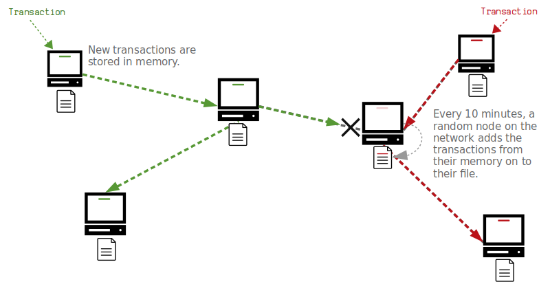

# **比特币是如何运作的**

粗体文本*
比特币是一种于**2009年创建的电子支付系统**。它允许你向世界上任何人发送资金，而且无需请求任何人的许可来创建账户。

它是作为现代金融体系的解决方案而创建的，在现代金融体系中，我们有少数几家大银行，它们控制着谁可以开户，哪些交易可以处理。这意味着对货币的控制是集中的，我们必须相信银行会负责任地行事。

>我们必须信任银行来保管我们的钱，并以电子方式转账，但它们在信贷泡沫的浪潮中放贷，几乎没有准备金。-[中本聪](https://satoshi.nakamotoinstitute.org/posts/p2pfoundation/1/)

银行业的集中化以及由此引发的2007年金融危机激发了比特币的发展。这是一个支付系统，它的运行没有一个中央控制点。它是由中本聪匿名设计的，于[2009年1月](https://www.metzdowd.com/pipermail/cryptography/2009-January/014994.html)发布。

任何人都可以运行该程序或使用该系统。

以下是对其工作原理的简单解释。
## 什么是比特币?
比特币只是一个**计算机程序**。你可以下载并在您的计算机上运行它。

来吧，[试试](https://bitcoin.org/en/download)
当你运行该程序时，它将连接到其他也在运行该程序的计算机，并且它们将开始与你共享文件。这个文件被称为*blockchain*，它基本上是一个大的*transactions*。

当一笔新的交易进入网络时，它会从一台计算机转发到另一台计算机，直到每个人都有一份交易的副本。每隔大约10分钟，网络上的随机计算机(*node*)将把它们收到的最新交易添加到区块链上，并与网络上的其他所有人共享更新。

因此，比特币程序创建了一个庞大的计算机网络，这些计算机相互通信、**共享文件并用新的交易更新文件**。
## 比特币解决了什么问题？
在比特币出现之前，已经可以在计算机网络中转发交易了。但问题是**你可以在计算机网络中插入冲突的交易**。例如，你可以创建两个不同的交易，用于花费同一数字货币，并同时将这两个交易发送到网络中。
这就是所谓的“**双重支出**”。

因此，如果你创建一个没有中央控制点的电子支付系统，你就会遇到计算出这些交易中哪一个是“先发生”的问题，当你有一个由所有独立行动的计算机组成的网络时，这是一件很难做到的事情。有些电脑会先收到绿色的交易，有些电脑会先收到红色的交易。
谁来决定哪一个是“第一”的并且应该是唯一写入文件的？
比特币通过强制节点在将其写入文件之前将其接收的所有交易保存在*memory*中来解决这个问题。然后，每隔10分钟，网络上的一个随机节点会将其内存中的事务添加到文件中。

更新后的文件将与网络共享，节点将接受更新文件中的交易为“正确”，从其内存中删除任何冲突的交易。因此，不会将任何双重支出交易写入文件中，所有节点都可以在彼此达成一致的情况下更新其文件。

将交易添加到文件的过程称为*ming*，它基本上是一个网络范围内的竞争，不能由网络上的单个节点控制。

## 挖矿是如何工作的？
首先，每个节点会将他们收到的最新*transactions*存储在*memory pool*中。任何节点都可以尝试将内存池中的交易挖掘到*blockchain*文件中。
为了做到这一点，一个节点将从其内存池中收集交易，并将其放入一个称为*block*的容器中，然后使用处理能力尝试将这个交易区块添加到区块链上。

那么这个处理能力从哪里得来呢？要将这个区块添加到区块链中，你必须将你的交易区块输入到一个叫做*hash function*的东西中。哈希函数基本上是一个小型计算机程序，可以接受任何数量的数据，将其混合，然后输出一个完全随机（但唯一）的数字。

为了使您的区块成功添加到区块链上，该数字（*block hash*）必须低于*target*，而目标值是网络上所有人都同意的阈值数字。

如果您的结果区块哈希值不在目标值之下，您可以对区块内部数据进行微小调整，再次将其放入哈希函数中。这将产生一个完全不同的数字，希望它会在目标值之下。如果不是，您需要再次调整区块并重试。

总之，挖矿的过程利用处理能力尽可能快地执行哈希计算，以尝试成为网络上第一个获得低于目标的块哈希的计算机。如果成功，您可以将交易块添加到区块链中并与网络的其他部分共享。
>**注意**：虽然任何人仍然可以尝试挖掘区块，但在家用计算机上这样做已不再具有竞争力。现在有专门设计的硬件计算机，旨在尽可能快地执行哈希计算，这意味着挖掘现在主要由那些拥有专门比特币矿机和廉价电力的人员执行

## 比特币来自哪里？
作为使用处理能力尝试将新的交易块添加到区块链的激励，每个新块都会提供一定数量的以前不存在的比特币。因此，如果您能够成功挖掘一个块，您就能够“发送”这些新的比特币作为您的努力挖矿的奖励。

这个新比特币的奖励被称为块奖励，也是这个过程被称为“挖矿”的原因。

## 为什么文件被称为“区块链”？
正如我们所见，交易不是单独添加到文件中的 - 它们被收集在一起，以块的形式添加。每个新块都建立在现有块之上，因此文件由一系列*块*构成；因此，称为*区块链*。

此外，网络上的每个节点始**终会采用它们接收到的*最长块链***作为“官方”版本。这意味着矿工始终会尝试在已知的最长块链的“顶端”上构建，因为任何不属于最长链的块都不会被其他节点视为有效。

因此，如果有人想要重写交易历史，他们需要重建一个更长的区块链，以创建一个新的最长链，让其他节点采用。然而，要实现这一点，单个矿工需要拥有比网络中其他矿工加起来更多的计算机处理能力。
