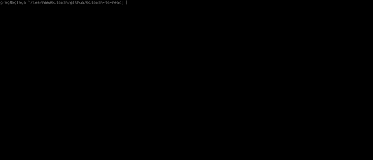

# 
Neo4j

该网站的区块链浏览器运行的数据库。

该网站的[区块链浏览器](https://learnmeabitcoin.com/explorer/)由[Neo4j](https://neo4j.com/)（图形数据库）提供支持。

我认为图形数据库最适合存储比特币数据，因为所有区块和交易都连接在一起以创建一个巨大的图形：

## 浏览器

你可以在此处使用 Neo4j 浏览器探索比特币图形数据库：
* **浏览器**： http: //neo4j.learnmeabitcoin.com
* **用户名/密码**：联系我

## 下载

## 进口

以下是我用来将区块链从 Bitcoin Core 节点导入 Neo4j 的代码：

* [比特币到 Neo4j](https://github.com/in3rsha/bitcoin-to-neo4j)

>该脚本将运行整个区块链并将其导入 Neo4j，但你需要等待几个月**才能**完成。此外，为了更好地衡量，数据库的大小约为**区块链的 6 倍。**

## 指导

* [如何将区块链导入 Neo4j](https://learnmeabitcoin.com/neo4j/how/) - 有关如何创建自己的工具以将比特币数据导入 Neo4j 图形数据库的简化书面教程。

## 视频

* [使用 Neo4j 导入和分析比特币区块链](https://www.youtube.com/watch?v=NSaYAPiJc-M) （Youtube，68 分钟） - 视频解释了我如何将区块链导入 Neo4j。