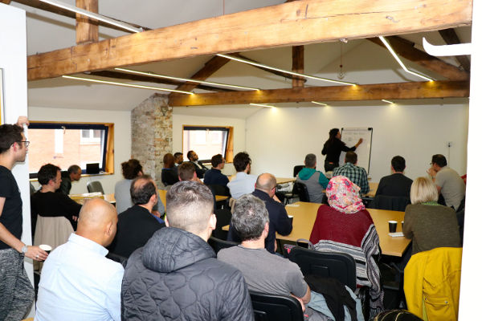

# 
会谈 

现实生活中的我。

## 即将推出

|标题|事件|地点|日期|
|---|---|---|---|---|

## 以前的

|标题|事件|地点|日期|
|---|---|---|---|
|比特币入门|[比特币谢菲尔德](https://www.meetup.com/bitcoinsheffield/events/267807033/)|谢菲尔德|2020 年 1 月 29 日|
|交易（脚本）	|[比特币谢菲尔德](https://www.meetup.com/bitcoinsheffield/events/266201195/)	|谢菲尔德	|2019 年 11 月 27 日|
|区块链如何运作？	|[比特布鲁姆 2019](http://www.bitbrum.org/)	|伯明翰|	2019 年 11 月 3 日|
|私钥和地址|	[比特币谢菲尔德](https://www.meetup.com/bitcoinsheffield/events/265561319/)	|谢菲尔德	|2019 年 10 月 30 日
|区块链如何运作？|	[埋葬加密货币聚会](https://www.eventbrite.co.uk/e/bury-crypto-meetup-tickets-73336612783)	|埋葬	|2019 年 10 月 7 日|
|交易如何进行？	|[比特币谢菲尔德](https://www.meetup.com/bitcoinsheffield/events/264616824/)	|谢菲尔德	|2019 年 9 月 25 日|
|区块链如何运作？|	[比特币谢菲尔德](https://www.meetup.com/bitcoinsheffield/events/263481554/)	|谢菲尔德	|2019 年 8 月 28 日|
|比特币简介	|[比特币谢菲尔德](https://www.meetup.com/bitcoinsheffield/events/262448147/)	|谢菲尔德	|2019 年 7 月 24 日|
|比特币简介	|[谢菲尔德PHP](https://www.sheffieldphp.co.uk/)	|谢菲尔德	|2019 年 7 月 18 日|
|比特币简介|	[西北比特币聚会](https://www.meetup.com/North-West-Bitcoin-Meetup/)	|沃灵顿	|2019 年 6 月 20 日|
|采矿基础知识	|[2019 年英国 Coinfest](https://coinfestuk.org/CF2019/)	|曼彻斯特	|2019 年 4 月 4 日|
|脚本技术	|[跟我学比特币](https://www.youtube.com/watch?v=6Fa04MnURhw)	|	|2018 年 5 月 9 日|
|按键和地址 技术	|[跟我学比特币](https://www.youtube.com/watch?v=GT6AuURD8Y0)	||	2018 年 3 月 9 日|
|交易技术	|[跟我学比特币](https://www.youtube.com/watch?v=Shd9nXe1X-0)	|	|2018 年 1 月 15 日|
|采矿基础知识	|[比特布鲁姆 2017](http://bitbrum.org/)	|伯明翰|	2017 年 11 月 19 日|
|采矿技术	|[跟我学比特币](https://www.youtube.com/watch?v=MJ0OzrkHvXA)	||	2017 年 11 月 12 日|
|采矿基础知识	|[比特布莱顿 2017](http://bitbrighton.org/)	|布莱顿|	2017 年 10 月 28 日|
|隔离证人|	[比特币曼彻斯特](https://www.meetup.com/Bitcoin-Manchester/events/243121974/)	|曼彻斯特	|2017 年 10 月 2 日|
|采矿基础知识	|[加密货币聚会](https://www.eventbrite.co.uk/e/cryptocurrencies-bitcoin-mining-explained-tickets-37594815104)	|利奇菲尔德|	2017 年 10 月 1 日|
|比特币介绍	|[铰接式](https://www.arrkgroup.com/)|	曼彻斯特|	2017 年 9 月 20 日|
|交易基础知识|	[比特币曼彻斯特](https://www.meetup.com/Bitcoin-Manchester/events/241911084/)	|曼彻斯特	|2017 年 8 月 8 日|
|将区块链导入 Neo4j	|[Neo4j 在线聚会](https://www.youtube.com/watch?v=NSaYAPiJc-M)		||2017 年 7 月 6 日|
|采矿基础知识	|[比特币曼彻斯特](https://www.meetup.com/Bitcoin-Manchester/events/240630815/)|	曼彻斯特|	2017 年 6 月 29 日|
|采矿基础知识	|[2017 年英国 Coinfest](https://www.meetup.com/CoinFestUK/events/230963519/)|	曼彻斯特|	|2017 年 4 月 7 日|
|使用 Neo4j 存储区块链	|[Neo4j 聚会](https://www.meetup.com/graphdb-london/events/237954465/)|	伦敦|	2017 年 3 月 29 日|

## 你想让我讲一下吗？
给[我](../About/about.md)发电子邮件！

我喜欢做尽可能简单地解释比特币如何运作的演讲。
