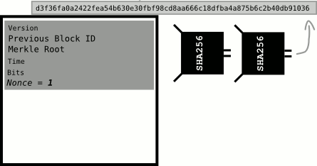

# 
Nonce

用于辅助挖矿的数字。

**随机数**是[区块头](../block-header.md)中的一个字段。

我称它为“挖矿字段”。

>**随机数**是“仅使用一次的数字”的缩写。  
[cryptography.wikia.com](http://cryptography.wikia.com/wiki/Cryptographic_nonce)

## 它有什么用处？

挖矿者通过调整Nonce来尝试使区块头的[哈希值](../../../Other/Hash%20Function/Hash%20Function.md)低于[目标值](../../../Mining/Target/Target.md)，即获得候选区块的有效的[区块哈希值](../../block-hash/block-hash.md)。

区块头中的所有其他字段都是预先确定的，因此随机数使你能够创建不同的哈希结果。[区块404,104](https://learnmeabitcoin.com/explorer/block/00000000000000000274CB1A04C382475310F70CEE3776AF06414F22F8337044)。

>如果矿工获得了低于目标的区块的哈希值，他们可以将其发送到网络中，每个人都会将其添加到他们的区块链中，矿工将因此获得区块奖励。  
因此，挖矿的过程就是围绕着寻找一个幸运数字或“随机数”展开的。

## Gif
.gif)

## 为什么它被称为“nonce”？
这只是密码学中使用的术语之一，就像Alice、Bob等等。

>在密码学中，随机数是一个仅能使用一次的任意数字。

我知道，我也更喜欢“挖矿字段”。

## 工具

* [哈希块头](https://learnmeabitcoin.com/tools/hashblockheader/)

## 相关

* [挖矿](../../../Mining/Mining.md)