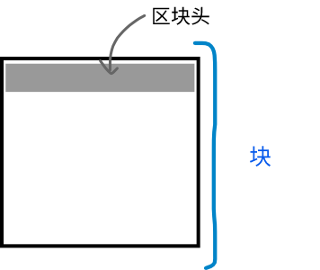
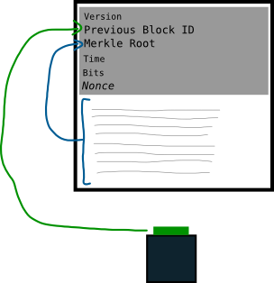

# <center>区块头</center>
<center>一个数据块的摘要。</center>

区块头就像是交易块顶部的元数据。



区块头中的字段提供了整个区块的唯一摘要。



## 例子
这是区块 [123,456 的区块头](https://learnmeabitcoin.com/explorer/block/0000000000002917ED80650C6174AAC8DFC46F5FE36480AAEF682FF6CD83C3CA)：
```
010000009500c43a25c624520b5100adf82cb9f9da72fd2447a496bc600b0000000000006cd862370395dedf1da2841ccda0fc489e3039de5f1ccddef0e834991a65600ea6c8cb4db3936a1ae3143991
```

## 字段

|字段| 描述|
|---|---|
|版本 |	区块的版本|
|上一个区块的哈希值| 当前区块在创建时，基于的前一个区块的[区块哈希](../block-hash/block-hash.md)。这就是将这些区块“链接”在一起的方式。|
|[默克尔根](./merkle-root/merkle-root.md)|由这个区块中的所有交易哈希得到的一个综合哈希值。提供了该区块中所有交易的单行摘要。|
|时间 | 矿工开始尝试挖掘这个区块的时间。|
|[位](../block-header/bits/bits.md) |	目标哈希值的简化版本.|
|[随机数](./Nonce/Nonce.md) |矿工改变的字段，以尝试获得低于目标值的区块头哈希值（区块哈希值）。|

## 数据结构

|字段|	大小|	数据|
|---|---|---|
|版本|	4 bytes|[小端序](../../Other/Little-endian/Little-Endian.md)|
|前一个区块的哈希值|	32 bytes|	小端序|
|默克尔根|	32 bytes|	小端序|
|时间|	4 bytes|	小端序|
|位|	4 bytes|	小端序|
|随机数|	4 bytes|	小端序|

## 工具
* [哈希区块头](https://learnmeabitcoin.com/tools/hashblockheader/) - 插入单个区块头字段，获取序列化区块头和区块哈希值。