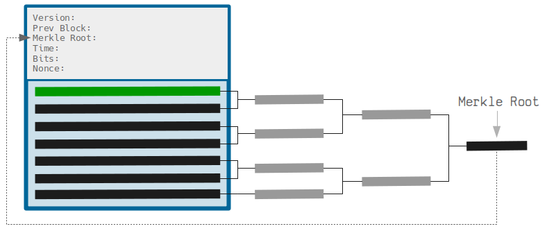
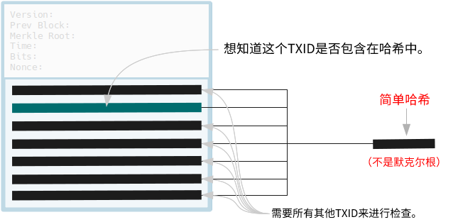
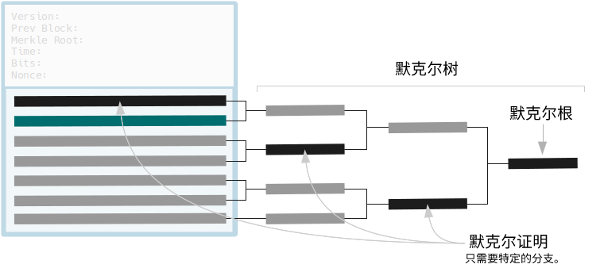
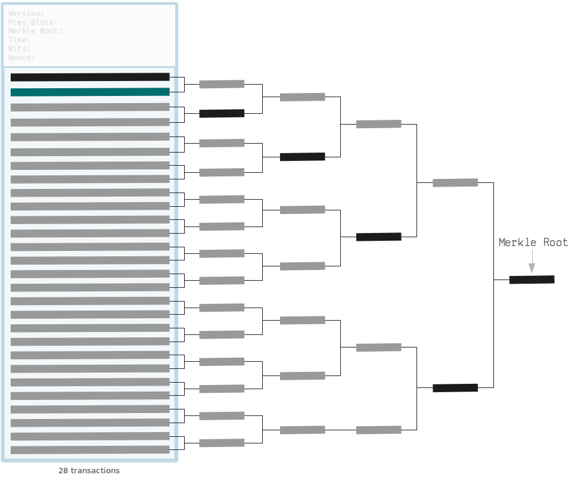
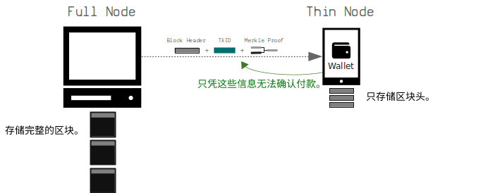
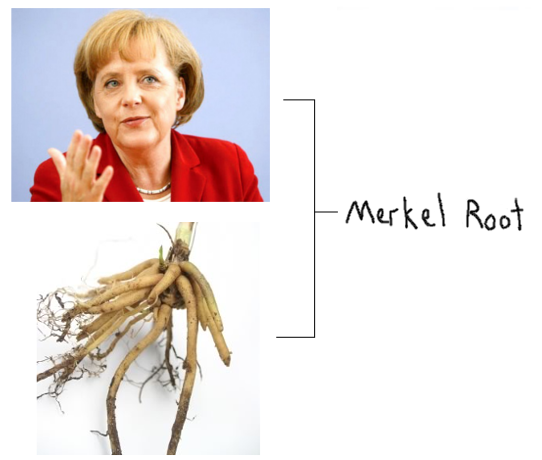

# <center>根节点</center>
<center>一个区块中所有交易的指纹。</center>



默克尔根据[TXIDs](../../../Transaction/TXID/TXID.md)的配对进行[哈希](../../../Other/Hash%20Function/Hash%20Function.md)，从而为块中的**所有交易提供一个短而独特的指纹**。

然后将此Merkle根用作[块头](../../block-header/block-header.md)中的字段，这意味着每个块头都将具有块内每个交易的简短表示。

## 为什么要使用Merkle根？

如果我们想为块中的所有交易创建唯一的指纹，我们可以一次性将所有TXIDs哈希在一起。但是，如果稍后想要检查TXID是否是该哈希的一部分，我们还需要知道**所有其他TXID**：



你需要每隔一个TXID才能重新创建相同的哈希。

但是使用默克尔树，如果我们想要检查一个TXID是否属于默克尔根，我们只需要知道**树的路径上的一些哈希值**：



你只需要正确的分支（“默克尔证明”）来重构默克尔根。

因此，通过使用merkle根作为块头的指纹，我们可以在不必知道块中的每个TXID的情况下，在之后查找是否存在交易。

>Merkle树只是一种高效的方法，可以证明某物在集合中，而无需知道完整的集合。

### 这值得吗？

当一个区块中的交易数量较少时，使用默克尔树似乎没有太多好处，但当树中的起始“叶子”数量多得多时，你确实可以看到巨大的差异。



在这个包含 28 个交易的区块中，我们不需要 27 个其他哈希值，而只需要 5 个哈希值来证明 TXID 被用作最终哈希值的一部分。

Merkle树更加高效，特别是在处理有2000多个交易的块时...

### Merkle证明示例

假设我们只有一个包含2352个交易的[块头](../block-header.md)，并且我们想要检查特定的[TXID](../../../Transaction/TXID/TXID.md)是否在该块中。

* **如果没有Merkle根**（即仅为块头中所有txids的简单哈希），我们需要下载**75232字节**（2351 x 32字节TXIDs）的数据来重新创建块头中的指纹并验证TXID是否存在于块中。
* **使用Merkle根**，我们只需要下载**384字节**（沿着Merkle树路径的12个32字节分支）来重新创建Merkle根并验证TXID是否存在于块中。

这是**Merkle证明**的样子：
```
txid
----
51a3dd31a49acb157d010f08e5c4774721d6dd39217866f2ed42d209b66a6ff6

merkle proof
------------
50ba87bdd484f07c8c55f76a22982f987c0465fdc345381b4634a70dc0ea0b38 left
96b8787b1e3abed802cff132c891c2e511edd200b08baa9eb7d8942d7c5423c6 right
65e5a4862b807c83b588e0f4122d4ca2d46691d17a1ec1ebce4485dccc3380d4 left
1ee9441ddde02f8ffb910613cd509adbc21282c6e34728599f3ae75e972fb815 left
ec950fc02f71fc06ed71afa4d2c49fcba04777f353a001b0bba9924c63cfe712 left
5d874040a77de7182f7a68bf47c02898f519cb3b58092b79fa2cff614a0f4d50 left
0a1c958af3e30ad07f659f44f708f8648452d1427463637b9039e5b721699615 left
d94d24d2dcaac111f5f638983122b0e55a91aeb999e0e4d58e0952fa346a1711 left
c4709bc9f860e5dff01b5fc7b53fb9deecc622214aba710d495bccc7f860af4a left
d4ed5f5e4334c0a4ccce6f706f3c9139ac0f6d2af3343ad3fae5a02fee8df542 left
b5aed07505677c8b1c6703742f4558e993d7984dc03d2121d3712d81ee067351 left
f9a14bf211c857f61ff9a1de95fc902faebff67c5d4898da8f48c9d306f1f80f left

merkle root
-----------
17663ab10c2e13d92dccb4514b05b18815f5f38af1f21e06931c71d62b36d8af
```

默克尔证明包含了我们需要获取到**默克尔树根节点的分支上的哈希列表**。我们从想要检查的TXID“leaf”开始，通过递归地连接和哈希这个默克尔证明，就可以得到底部的默克尔根节点。

>默克尔证明的分支还需要让你知道它们是在“左侧”还是“右侧”，这样你就可以正确地将每对连接在一起，然后将它们一起哈希。

因此，虽然默克尔树在开始时需要一些额外的工作，但在后续的验证中能够节省能源。

## 比特币中什么时候使用默克尔树？

由于默克尔树的存在，你可以创建“**轻节点**”（或“轻量级钱包”），它们可以验证交易是否已经包含在区块中，**而无需下载和存储整个区块链**。

这些钱包只需要下载和存储[块头](../block-header.md)，并使用其中的默克尔根（以及它们从完整节点接收到的默克尔证明）来验证交易是否已经包含在区块中。

[区块头](../block-header.md)只有80个字节，而每个区块可以超过1000000个字节。

我没有经验，但是这里有一些有趣的链接：
* https://bitcoin.stackexchange.com/questions/32529/what-is-a-thin-client
* https://bitcoin.stackexchange.com/questions/11054/how-do-spv-simple-payment-verification-wallets-learn-about-incoming-transactio

## 你如何创建默克尔根？

以下是一个技术图示，解释了比特币中如何创建默克尔根：


以下是用Ruby代码创建Merkle根（从TXID数组）的代码。即使你现在不是程序员，阅读它也是值得的。
```ruby
require 'digest' # Need this for the SHA256 hash function

# Hash function used in the merkle root function (and in bitcoin in general)
def hash256(hex)
    binary = [hex].pack("H*")
    hash1 = Digest::SHA256.digest(binary)
    hash2 = Digest::SHA256.digest(hash1)
    result = hash2.unpack("H*")[0]
    return result
end

def merkleroot(txids)
  # 0. Keep an array of results for each level of hashing
  result = []

  # 1. Split up array in to pairs
  txids.each_slice(2) do |one, two|
    # 2. Concatenate each pair (or concatenate with itself if not a pair)
    if (two)
      concat = one + two
    else
      concat = one + one
    end

    # 3. Hash the concatenated pair and add to results array
    result << hash256(concat)
  end

  # Recursion: Exit Condition - Stop recursion when we have one final hash result.
  if result.length == 1
    # Convert the result to a string and return it
    return result.join('')
  end

  # Recursion: Do the same thing again for the array of hashed pairs.
  merkleroot(result)
end


# Test (e.g. block 000000000003ba27aa200b1cecaad478d2b00432346c3f1f3986da1afd33e506)
txids = [
  "8c14f0db3df150123e6f3dbbf30f8b955a8249b62ac1d1ff16284aefa3d06d87",
  "fff2525b8931402dd09222c50775608f75787bd2b87e56995a7bdd30f79702c4",
  "6359f0868171b1d194cbee1af2f16ea598ae8fad666d9b012c8ed2b79a236ec4",
  "e9a66845e05d5abc0ad04ec80f774a7e585c6e8db975962d069a522137b80c1d"
]

txids = txids.map {|x| x.scan(/../).reverse.join('') } # TXIDs must be in little endian
result = merkleroot(txids) # The result is in little endian, so lets convert it back to big endian...
puts result.scan(/../).reverse.join('') # f3e94742aca4b5ef85488dc37c06c3282295ffec960994b2c0d5ac2a25a95766
```

## 为什么它被称为“默克尔根”？
因为[Ralph Merkle](https://en.wikipedia.org/wiki/Ralph_Merkle)在1979年申请了专利。

>常见误解。


## 链接
* https://www.youtube.com/watch?v=gUwXCt1qkBU
* https://www.codeproject.com/Articles/1176140/Understanding-Merkle-Trees-Why-use-them-who-uses-t
  
##  Code
* [merkleroot.rb](https://github.com/in3rsha/learnmeabitcoin-code/blob/master/merkleroot.rb)
* [merkleroot.php](https://github.com/in3rsha/learnmeabitcoin-code/blob/master/merkleroot.php)