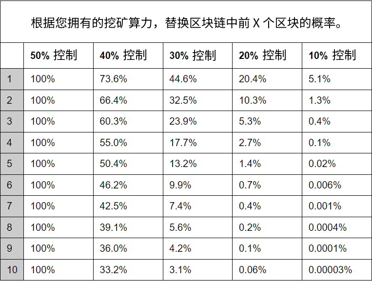
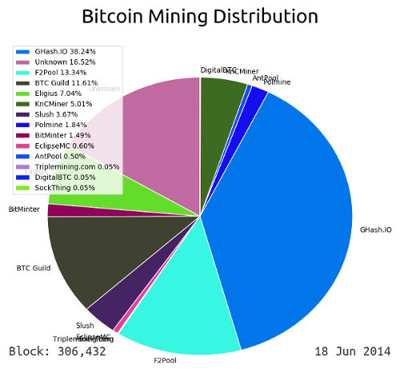

# <center>51%-攻击</center>
<center>重写区块链。</center>

.png)

51%攻击是指故意构建新的最长区块链来替换[区块链](../blockchain.md)中的区块的行为。这使你可以**替换**已经挖掘到区块链中的**交易**。

在你拥有**大部分挖矿算力**时，这种攻击最容易进行，因此被称为“多数攻击”或“51%攻击”。

## 51%攻击是如何达成的？

节点始终接受已知的[最长区块链](../longest-chain/longest-chain.md)作为区块链的有效版本。因此，如果你想要“撤消”区块链中的交易，你只需要构建一个不包含该交易的新的区块链。

.png)

<center>假设我们用比特币支付了一辆汽车并开着它离开了。</center>

当节点接收到这个新的更长的区块链时，它们将执行[链重组](../chain-reorganisation/chain-reorganisation.md)来停用旧的最长链中的区块，并激活你提供的新的最长链中的块。

.png)

<center>旧链中的交易现在无效了。我们为车的付款从未发生过。</center>

通过建立一个新的最长链来替换现有的链，实际上是重新编写区块链，并为网络上的每个节点创建新的交易历史记录。因此，你已经撤销了以前认为已经是区块链永久部分的交易。

然而，实施成功的51%攻击并不是这么简单的...

>**注意**：你需要在新链中包含替换交易，将比特币发送到新的目的地（例如发送到你的[地址](../../Keys/Address/Address.md)而不是汽车经销商的地址）。否则原始交易可能会再次被挖掘到主链中。

## 是什么防止了51%攻击？
每个矿工都被激励在当前最长的区块链上工作。因此，如果网络上其他矿工的综合挖矿算力大于你的算力，那么你很难超越其他矿工来构建更长的链并替换现有的链。

.png)

<center>矿工们一起合作可以比你独自工作更快地构建区块链。</center>

当然，如果你能够获得比所有其他矿工加起来更多的挖矿算力，那么你就能超越当前最长的区块链，并建立一个新的更长的区块链供其他人采用。

.png)

<center>如果你拥有超过网络上大部分的挖矿算力，那么构建更长的区块链只是时间问题。</center>

为了防止这种情况发生，我们需要确保没有单个矿工可以获取大部分的挖矿算力。这可以通过允许全世界的人参与挖矿，并通过提供区块奖励激励这些矿工来实现。

.png)

<center>矿工受到激励并工作在已知的最长区块链上。</center>

矿工们将精力集中在建立相同的链上，使得任何个人都难以重写已经写入区块链的内容。

>只要大部分的CPU能力被遵守规则、不受进行恶意攻击的网络节点控制，他们就会生成最长的链并超过攻击者。- 中本聪。-[中本聪](https://bitcoin.org/bitcoin.pdf)

## 进行51%攻击有多难？

关键在于首先获得执行攻击所需的硬件。这将非常昂贵和困难。但是，如果你确实成功获得了大部分的挖矿算力，那么建立新的最长链只是**时间问题**。

话虽如此，替换大量区块比替换少数几个区块需要更多的工作。交易在区块链中越深入，撤销它需要的时间和精力就越多。

.png)

<center>交易在区块链中越往后，越难被替换。</center>

但是，这是假设你能够获得占比51%或更多的挖矿算力，来超越所有其他矿工。祝你好运。

尽管如此，你仍然可以尝试使用少于50%的挖矿算力进行此类攻击，但是胜算非常小......

##  你能否使用少于50％的挖矿算力重写区块链？
是的，但你需要依靠运气。

挖矿是不可预测的，因此即使你只拥有少量的挖矿算力，也可能幸运地连续挖掘后面2个区块。这并非不可能。概率取决于你相对于其他人拥有多少挖矿算力。

.png)

当然，交易在区块链中的位置越低，你需要更幸运才能连续挖掘X个区块。如果没有人拥有大多数的挖矿算力，那么替换交易变得越来越困难，特别是当它进入区块链的更深处时。

.png)

<center>例如，如果矿工拥有40%的挖矿算力，他们大约有50%的机会能够替换掉链中深度为5个区块的交易。</center>

除非你在比特币网络上拥有相当大比例的挖矿算力，否则替换已挖掘的交易的机会很小，并且随着交易在链上越来越深，这些机会会迅速减少。

以下是你确切的机会表：



>**提示**：上表中的数字假定你正在尝试通过构建比当前最长链多一个区块的替代链来替换区块。

### 等式
区块链中能够有意重写区块的可能性取决于你拥有的采矿能力和你想替换的区块数量。

.png)

区块在链中的位置越深，替换它们就越困难，这是系统完整性和安全性的重要部分。这个公式来自于[比特币白皮书](https://bitcoin.org/bitcoin.pdf)（第11节）。

无论如何，这是该方程在Ruby代码中的样子：
```ruby
# p = probability honest node finds the next block
# q = probability attacker finds the next block
# z = number of blocks to catch up

def attacker_success_probability(q, z)
  p = 1 - q
  lambda = z * (q / p) # expected number of occurrences in the poisson distribution
  sum = 1.0

  for k in 0..z
    poisson = Math.exp(-lambda) # exp() raises e (natural logarithm) to a number
    for i in 1..k
      poisson *= lambda / i
    end

    sum -= poisson * (1 - (q/p)**(z-k) )
  end

  return sum
end

# Example
puts attacker_success_probability(0.4, 5) #=> 0.5506251290702077
```

**提示**：上述方程计算了追上最长链的概率（从落后指定数量的区块数开始）。如果你想替换链中的块，你需要再增加一个区块。

### 另一个图表

.png)

<center>你可以看到随着交易在区块链中的深入，能够替换交易的概率呈指数衰减。</center>

## 常见问题解答
**有人成功对比特币进行了51%攻击吗？**

没有，目前没有成功的案例。

在比特币的历史上，一些矿工曾接近或达到了50%以上的总挖矿算力，但没有人真正成功地进行了51%攻击。



<center>GHash.io在2014年接近达到50％。 </center>

[github.com/in3rsha/bitcoin-mining-distribution](https://github.com/in3rsha/bitcoin-mining-distribution)

>**注意**：即使矿工拥有超过50％的挖矿算力，也不一定意味着他们一定会进行攻击（这只是意味着他们可以）。如果有这么多的算力，保持挖矿并收集区块奖励可能比撤销单个交易（并因为你的攻击而使比特币价值下降）更有利可图。

## 需要多少哈希算力才能进行51％攻击？
可以使用当前[目标值](../../Mining/Target/Target.md)来估计需要多少哈希算力才能获得控制权。

>**提示**：目标值根据网络上所有矿工挖掘新区块的速度而变化。因此，可以使用它来计算需要有多快的哈希速度才能超过当前网络速度。

首先，可以通过查看最近挖掘区块的块头中的“[位](../../Block/block-header/bits/bits.md)”字段来获取当前目标。

```
$ bitcoin-cli getblockcount
805141

$ bitcoin-cli getblockhash 805141
00000000000000000003b9066141283f10977b07ab99196d47c975f5bc8bdfcc

$ bitcoin-cli getblockheader 00000000000000000003b9066141283f10977b07ab99196d47c975f5bc8bdfcc | grep bits
  "bits": "17050f7b",
```
现在，这个“位”值只是紧凑格式的目标。因此，从[位转换为目标](https://learnmeabitcoin.com/tools/bitstarget)我们得到：
```
0x000000000000000000050f7b0000000000000000000000000000000000000000
```

这就是所有矿工开采区块所需的数字。

通过将所有可能的哈希结果的范围除以该目标值，可以算出需要执行多少次哈希计算（平均）才能低于此值：
```
$ irb
irb(main):001:0> (2**256) / 0x000000000000000000148edf0000000000000000000000000000000000000000
=> 
```
所以，这告诉我们，我们需要平均做``次哈希运算来挖掘下一个区块。换句话说，这大致是网络上所有矿工每10分钟进行的哈希运算次数。
>有关如何获得“预期哈希数”的更多信息， 请参阅[区块链上工作量总值计算解释](../longest-chain/longest-chain.md#区块链上工作量总值计算解释)。

无论如何，使用这个数字可以计算出网络每秒的哈希值：
```
$ irb
irb(main):001:0> 58805356298556988331095 / 600 # there are 600 seconds in 10 minutes
=> 
```

比特币网络上每个矿工当前的综合哈希率是“哈希/秒”。将其转换为Th /s（太哈希） 得到：
```
$ php -a
php > echo number_format( / 1000**4);
0
```
要获得矿块50%的控制权，我们需要建设一个性能超过这个数值的矿场。

## 链接

* [Coin Dance - 最新区块](https://coin.dance/blocks/today) - 一个美观的网站，显示了当前比特币挖矿分布的饼图。分布越广泛越好。