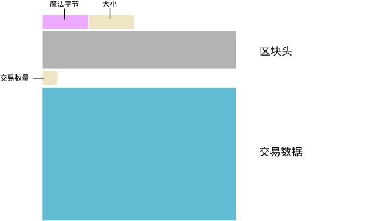

# <center>区块数据文件</center>
<center>原始的区块链数据文件。</center>

~/.bitcoin/blocks/目录下的**blk.dat**文件包含[比特币核心](https://bitcoin.org/en/download)节点接收到的原始区块数据。

这些blk.dat文件存储着“[区块链](../../../Beginners/How%20Bitcoin%20Works/2.Mining/1.Blockchain/Blockchain.md)”。

## 它们是如何工作的呢？
节点接收到的每个区块都会被追加到blk.dat文件中。

此外，它们并没有存储在一个巨大的文件中，而是分成多个blk * .dat文件。
```
~/.bitcoin/blocks
    blk00000.dat
    blk00001.dat
    blk00002.dat
    ......
```
节点首先将区块添加到blk00000.dat中，当它填满后，它会继续移动到blk00001.dat，然后是blk00002.dat……以此类推。

### 例如

blk.dat文件中的数据以**二进制**形式存储，每个新区块都会附加到文件末尾。

可以通过读取blk00000.dat的前293个字节来查看**创世块**。
```
f9beb4d91d0100000100000000000000000000000000000000000000000000000000000000000000000000003ba3edfd7a7b12b27ac72c3e67768f617fc81bc3888a51323a9fb8aa4b1e5e4a29ab5f49ffff001d1dac2b7c0101000000010000000000000000000000000000000000000000000000000000000000000000ffffffff4d04ffff001d0104455468652054696d65732030332f4a616e2f32303039204368616e63656c6c6f72206f6e206272696e6b206f66207365636f6e64206261696c6f757420666f722062616e6b73ffffffff0100f2052a01000000434104678afdb0fe5548271967f1a67130b7105cd6a828e03909a67962e0ea1f61deb649f6bc3f4cef38c4f35504e51ec112de5c384df7ba0b8d578a4c702b6bf11d5fac00000000
```
（请参见下面的[od](#1-od)命令，以获取二进制文件中的十六进制数据。）

### 结构

以上数据可以分成五个部分：



* 魔术字节和size字段可以帮助你确定每个块的数据开始和结束的位置。
* 区块头。
* 交易数量（[可变整数](../../Other/VarInt/varint.md)），随后是每个交易的交易数据。

### 数据
```
[ magic bytes ][    size     ][        block header        ][  tx count  ][          transaction data          ]
 <- 4 bytes ->  <- 4 bytes ->  <-        80 bytes        ->  <- varint ->  <-            remainder           ->
```
>该size字段能让人知道需要读取293字节才能获取整个区块。  
size字段为1d010000，因此将其转换成人类可以理解的格式：  
1.[交换字节顺序](https://learnmeabitcoin.com/tools/swapendian)以获得0000011d  
2.[转换为十进制](https://learnmeabitcoin.com/tools/hexdec)以获得285  
因此，除了初始的8个字节用于魔术字节 + size字段 外，接下来的块数据的大小将是**285个字节**。

### 注释
#### 1. 区块不会按顺序下载。
如果你正在解析blk.dat文件，请注意区块不会按顺序排列。例如，当你浏览文件时，你可能会遇到以下顺序的区块：
```
A B C E F D
```

>这是因为比特币节点会并行下载区块来尽快下载区块链。节点在下载时会提前下载更多的区块，而不是等待按顺序接收每一个区块。  
在比特币源代码中，你的节点将提前获取的最大距离（（或者说“最大的无序度”）由[BLOCK_DOWNLOAD_WINDOW](https://github.com/bitcoin/bitcoin/search?q=BLOCK_DOWNLOAD_WINDOW)控制。

#### 2. 最大blk.dat文件大小为128MiB（134,217,728字节）
此限制由[MAX_BLOCKFILE_SIZE](https://github.com/bitcoin/bitcoin/search?q=MAX_BLOCKFILE_SIZE)设置

### Linux工具
如上所述，blk.dat文件中的数据是二进制的，因此如果你在文本编辑器中打开一个文件，可能看不到多少有意义的内容。但是没有关系，因为二进制数据可以轻松转换为[十六进制](../../Other/Hexadecimal/hexadecimal.md)，有两个命令可以完成此任务：

#### 1. od
这是一个简单的命令。它会以你选择的格式显示文件的内容。
```
od -x --endian=big -N 293 -An blk00000.dat
```
*  -x <- 显示十六进制
*  -endian = big <- 以大端字节序显示字节
*  -N 293 <- 要读取的字节数
*  -An <- 不显示文件偏移量

>“od”代表八进制转储，但你可以以其他格式转储数据。

#### 2. hexdump
这类似于od，但它还提供了显示数据中的ascii文本的选项（这对于查看包含在交易数据中的消息很有用）。
```
$ hexdump -C -s 8 -n 285 blk00000.dat

00000008  01 00 00 00 00 00 00 00  00 00 00 00 00 00 00 00  |................|
00000018  00 00 00 00 00 00 00 00  00 00 00 00 00 00 00 00  |................|
00000028  00 00 00 00 3b a3 ed fd  7a 7b 12 b2 7a c7 2c 3e  |....;...z{..z.,>|
00000038  67 76 8f 61 7f c8 1b c3  88 8a 51 32 3a 9f b8 aa  |gv.a......Q2:...|
00000048  4b 1e 5e 4a 29 ab 5f 49  ff ff 00 1d 1d ac 2b 7c  |K.^J}._I......+||
00000058  01 01 00 00 00 01 00 00  00 00 00 00 00 00 00 00  |................|
00000068  00 00 00 00 00 00 00 00  00 00 00 00 00 00 00 00  |................|
00000078  00 00 00 00 00 00 ff ff  ff ff 4d 04 ff ff 00 1d  |..........M.....|
00000088  01 04 45 54 68 65 20 54  69 6d 65 73 20 30 33 2f  |..EThe Times 03/|
00000098  4a 61 6e 2f 32 30 30 39  20 43 68 61 6e 63 65 6c  |Jan/2009 Chancel|
000000a8  6c 6f 72 20 6f 6e 20 62  72 69 6e 6b 20 6f 66 20  |lor on brink of |
000000b8  73 65 63 6f 6e 64 20 62  61 69 6c 6f 75 74 20 66  |second bailout f|
000000c8  6f 72 20 62 61 6e 6b 73  ff ff ff ff 01 00 f2 05  |or banks........|
000000d8  2a 01 00 00 00 43 41 04  67 8a fd b0 fe 55 48 27  |*....CA.g....UH'|
000000e8  19 67 f1 a6 71 30 b7 10  5c d6 a8 28 e0 39 09 a6  |.g..q0..\..(.9..|
000000f8  79 62 e0 ea 1f 61 de b6  49 f6 bc 3f 4c ef 38 c4  |yb...a..I..?L.8.|
00000108  f3 55 04 e5 1e c1 12 de  5c 38 4d f7 ba 0b 8d 57  |.U......\8M....W|
00000118  8a 4c 70 2b 6b f1 1d 5f  ac 00 00 00 00           |.Lp+k.._.....|)
0000125
```
* -C <- 比特币使用的相同字节顺序显示数据，并显示 ASCII 文本
* -s <- 起始点（以字节为偏移量）
* -n <- 要读取的字节数

>**仅显示十六进制数据。**
你可以将一些命令串联起来，以便只获取原始十六进制数据输出：
```
hexdump -C -s 8 -n 285 blk00000.dat | cut -c 11-58 | tr '\n' ' ' | tr -d ' '
```
* cut -c 11-58 <- 剪切掉从每行的第11个字符到第58个字符之外的所有内容
* tr '\n' ' ' <- 将换行符转换为空格
* tr -d ' ' <- 删除所有空格

## 资源
* http://bitcoin.stackexchange.com/questions/50693/why-are-blk-dat-files-134200000-bytes
* https://www.suse.com/communities/blog/making-sense-hexdump/
* https://21.co/learn/view-the-genesis-block/
