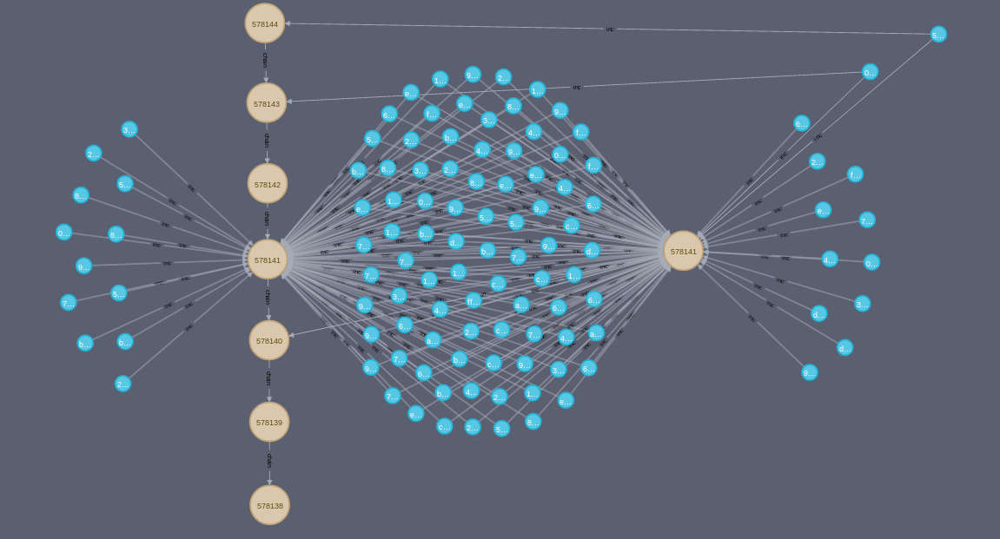

# <center>链重组</center>
<center>禁用和启用块以采用新的最长链。</center>

.png)

链重组（或“重组”）发生在你的节点接收到新的[最长链](../longest-chain/longest-chain.md)的区块时。你的节点将停用旧的最长链中的区块，而选择构建**新的最长链**的区块。

这个过程使得网络中的各个节点能够同意**相同版本的区块链**，因为全球公认的区块链视图始终是具有最长区块链的那个*。

*技术上来说，是具有最多工作量的链，但大多数区块数量通常是相同的。

## 什么时候会发生链重组？

链重组最常发生在两个区块同时被开采之后.

.png)

由于区块在网络中传播的速度，一些节点会先收到一个区块，而另一些节点会先收到另一个区块。因此，关于哪个区块实际上是“第一个”并应该位于每个人的区块链顶部会产生分歧。

.png)

<center>节点对于区块链的版本有不同的看法。</center>

那么，我们如何解决这个争议，确保每个人都同意相同的区块链版本呢？

这个问题可以在下一个区块被挖出时解决。下一个区块将建立在这些区块之一的基础上，创建一个新的最长链。当节点收到这个最新的区块时，它们会看到它创建了一个新的最长链，并会执行链重新组织来采用它。

.png)

<center>旧的短链中的区块被停用，新的更长链中的区块被激活。</center>

因此，由于区块链的链重组，每个节点都能够与其他节点独立地就相同版本的区块链达成一致。

## 旧的最长链中的交易会发生什么？

由于链重组，被停用的区块（也称为“孤块”）中的交易不再是区块链的交易历史的一部分。

.png)

<center>只有最长的区块链中的交易才是有效交易历史的一部分。</center>

因此，如果你试图花费孤立块中的比特币，节点会拒绝你的交易，因为你试图花费不存在于有效链中的比特币。

.png)

<center>就像孤立区块中的交易从未发生过一样。</center>

实际上，如果同时挖掘了两个区块，它们很可能会包含相同的交易，因此重组通常不会给任何人带来问题。

.png)

<center>你的交易很可能被包含在链重组后的“竞争”块中。</center>

然而，如果孤立块中存在一些交易，而这些交易不在竞争块中，那么它们将被发送回节点的内存池，并在网络中再次传播，以便有机会在未来的块中被挖掘。

.png)

但这并不是一个保证，如果一个交易在活跃的链中不存在，那么它就好像从未发生过一样。

**提示**：在考虑交易是否完成时，等待交易在区块链中深入超过一个块可能是值得的。总有可能被重新组织，并需要等待/希望它重新被挖掘到最长的链中。

### 孤块的视觉示例
在区块高度578141处，我们可以看到区块链进行了重新组织，一些孤立区块中的交易被重新挖掘回到了链中。



在[比特币Neo4j]图数据库中看到的块578141。

## 常见问题

### 链重组能有多大？

链重组可以包含任意数量的区块。

如果你的节点收到了一个比你当前活动链更长的新链，你的节点将进行链重组以采用新链，无论它有多长。

>这就是为什么拥有大部分哈希能力的矿工可以通过 [51% Attack](../51-attack/51-attack.md)替换你当前最长链中的区块和交易。最长的链总是获胜。

然而，“自然”的链重组（由于同时挖掘两个区块而发生的）**很少涉及你链顶部以上的区块**。

以下是我*节点***最近经历**的链重组：
|Height|Length|Date|
|---|---|---|
|*789147*|	1	|10 May 2023|
|*788837*|	1	|08 May 2023|
|*788805*|	1	|08 May 2023|
|*781487*|	1	|19 March 2023|
|*781277*|	1	|18 March 2023|
|*730848*|  1	|07 April 2022|
|*685135*|	1	|27 May 2021|
|*675407*|	1	|20 March 2021|
|*675392*|	1	|20 March 2021|

|Length	|Height	|Date|
|---|---|---|
|2| -|-|

## 链重新组织事件有多频繁？

不是很频繁。要使你的节点经历诚实的链重组，需要发生以下情况：

1. 同时挖掘了两个块。
2. 你的节点首先收到其中一个块，但另一个块最终被挖掘在其上并成为新的最长链。

我不知道这个的数学概率是多少，所以以下是基于我的比特币*节点*的数据显示的链重新组织的频率（该节点自**2016年12月17日**以来一直在连续运行）：

* **实际重新组织：11次[^1]**（每32580个块/220.5天一次）
* **避免重新组织：187次[^2]**（每1,916个块/13天一次）
  
## 在哪里可以找到链重新组织？
你可以使用bitcoin-cli getchaintips命令查看 你的节点观察到的链重新组织事件：
```
[
  {
    "height": 589919,
    "hash": "000000000000000000149b18e74316248d106e42ca410f509305ae58ccda6b13",
    "branchlen": 0,
    "status": "active"
  },
  {
    "height": 578141,
    "hash": "0000000000000000001253a5f37d3763dbe928d21f7d72a708f05268c044179c",
    "branchlen": 1,
    "status": "valid-fork"
  },
  {
    "height": 575695,
    "hash": "0000000000000000002409ed07fdbb1d0359a0c516014115c5451aea724baec8",
    "branchlen": 1,
    "status": "valid-headers"
  },
  ...
```

* brachlen字段告诉你竞争区块链中有多少个区块。

* 状态字段表示以下内容：
    * active - 这是我们当前的活动链（最长链）。
    * valid-fork - 我们的节点执行了链重组。我们下载并验证了这些区块，并将它们作为我们活动链的一部分，但后来在接收到新的更长的区块链后将其停用。
    * valid-headers - 我们的节点观察到可能发生链重组。我们下载了这些区块，但由于我们的活动链是等效的且变得更长，所以没有验证它们。
    *   headers-only - 我们的节点观察到可能发生链重组。我们接收了一个竞争链的区块头，但没有下载完整的区块。
    * invalid - 包含无效区块的分支。
    
.png)

因此，状态为valid-fork的分支是我们最初认为是活动区块链的一部分的区块，但在接收到新的更长的区块链后，我们将其停用的分支。

此外，具有有效valid-headers 的分支是我们在已经有等效活动链之后收到的竞争链。这些可能导致重组，但我们的链仍然是最长的链，因此没有进行重组。

>如果你没有连续几周或几个月运行节点，则不太可能看到任何链重新组织。当你的节点下载区块链时，它只会下载最长链中的块（而不是任何分支和旧的链重新组织中的块）。 你的节点需要在它们发生时经历链重新组织才能在bitcoin-cli getchaintips中显示出来。

## 总结
链重组是比特币节点功能的正常部分。采用已知最长的链允许网络中的节点就同一区块链达成一致，链重组只是这个过程的一部分。

由于链重组而被停用的块内交易将变为无效，但它们将被重新放入内存池中，以便有机会在新的最长链上被挖掘到区块中。

## 链接
*  https://bitcoin.stackexchange.com/questions/44437/how-to-detect-a-fork-with-bitcoin-cli?rq=1
*  https://bitcoin.stackexchange.com/questions/91111/understanding-getchaintips-in-terms-of-chain-reorganisations
*  https://github.com/bitcoin/bitcoin/blob/46d6930f8c7ba7cbcd7d86dd5d0117642fcbc819/src/rpc/blockchain.cpp


[^1]:我们收到了一个新的最长区块链并更新了它，停用了旧的最长区块链中的区块。
[^2]:我们听说有一条链可能成为新的最长链，但我们当时的活跃链仍然是最长的。