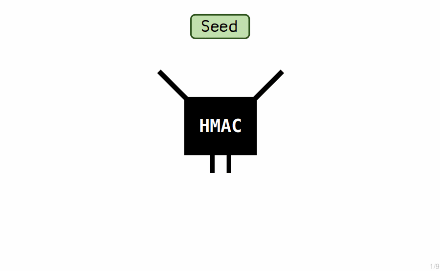
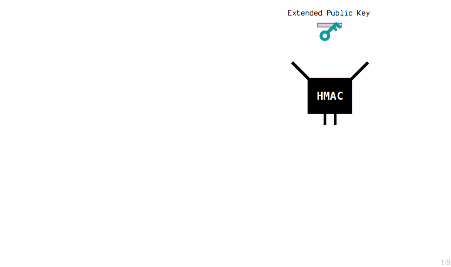
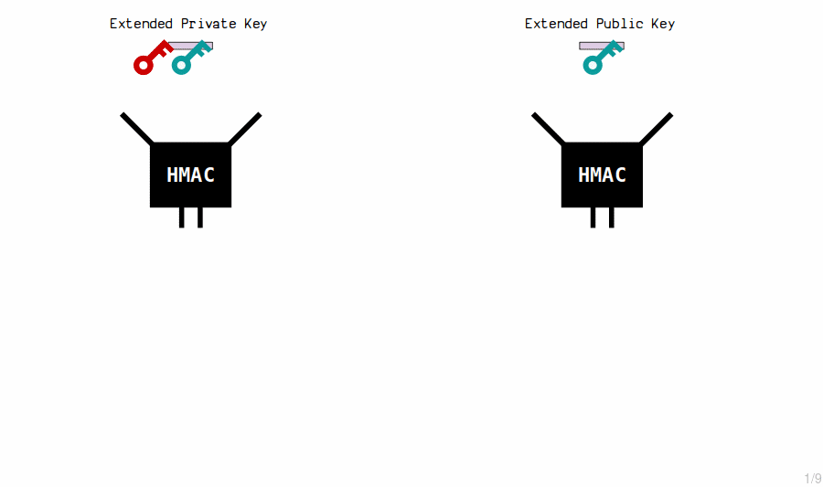
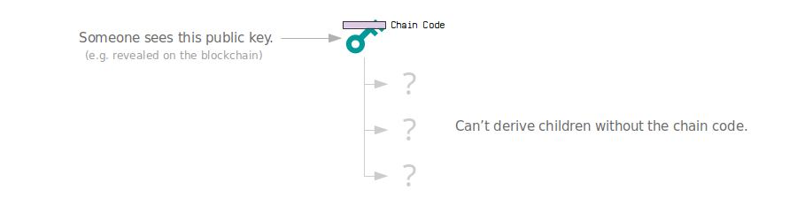
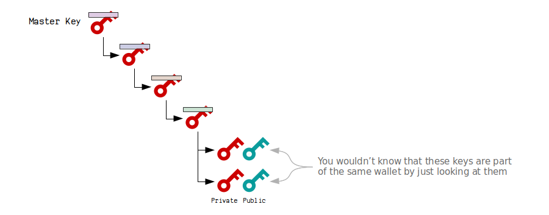
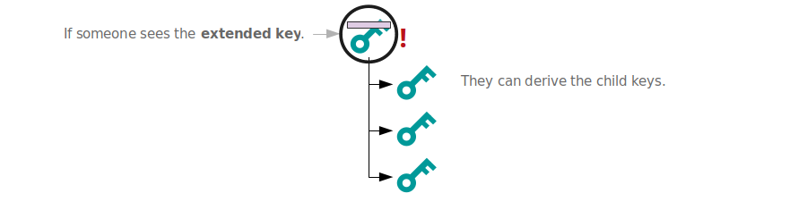
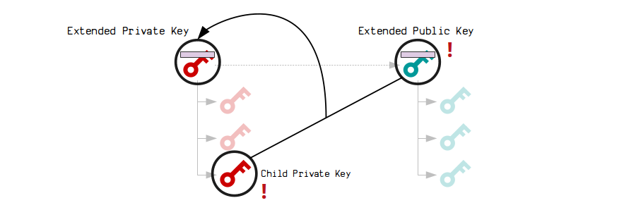

# HD钱包
使用单个种子生成密钥树。

[BIP 32](https://github.com/bitcoin/bips/blob/master/bip-0032.mediawiki)

**分层确定性钱包**（或“HD钱包”）是一种从单个来源生成所有密钥和地址的钱包。

* **确定性**意味着密钥和地址始终以相同的方式生成。
* **分层**意味着密钥和地址可以组织成树形结构。
但是这些钱包最好的地方是，您可以在不知道它们的*私钥*的情况下生成新的*公钥*。

## 为什么使用HD钱包？
### 1. 单个备份
在基本钱包中，每当您想接收一些比特币时，您都会独立生成私钥和公钥对。

这完全没有问题，但这意味着每次收到新付款时都需要备份您的钱包。


但是使用分层确定性钱包，您可以使用单个**种子**创建**主私钥**，并使用它来生成数十亿个“子”私钥和公钥。


现在你只需要备份**种子**，因为你从种子创建的主私钥总是以相同的方式（确定性地）生成钱包的密钥。

### 2. 组织
分层确定性钱包的另一个酷炫之处在于分层。

钱包中的每个**子密钥**也可以生成**自己的密钥**，这意味着你可以创建一个树形结构（或层次结构）来组织钱包中的密钥。

例如，你可以使用树的不同部分来管理不同的“账户”。


### 3. 独立生成公钥。
但是，关于**主私钥**的真正酷炫之处在于它有对应的**主公钥**，而且可以生成相同的子公钥，而不需要知道私钥。


因此，您可以将**主公钥**发送到另一台计算机（例如，Web商店服务器）以生成新的接收地址，而不必担心如果服务器遭到入侵，私钥会被盗窃。

>这对于像**硬件钱包**这样的东西非常有用，您希望将私钥保留在安全设备上，但同时也希望能够在不同的计算机上生成新的地址以接收付款。

这可能看起来像魔法，但这只是数学。

## HD钱包如何工作？
### 1.种子


**助记句子**
要启动一个HD钱包，您需要生成64个随机字节，我们将把它们用作种子。
为了获取一个HD钱包，我们可以使用一个更加用户友好的助记句，而不是一个原始的十六进制种子。

例如，上面的种子是从以下助记句创建的：
```
mnemonic: lion lady whisper pulp mix base park program bar stable movie upper
```
请参阅助记种子以获取详细信息。

### 2.主私钥


“主密钥”是通过将种子输入哈希函数（称为HMAC）来生成另一组64个字节而创建的。

我们使用这64个字节来创建我们的主扩展私钥。

* 前32个字节是私钥。
* 最后32个字节是链码。
链码只是额外的32个字节，我们将其与私钥配对以创建所谓的扩展密钥。

>**为什么要哈希种子？**我们可以直接使用64个字节的种子来创建主扩展私钥。然而，未来的子扩展密钥是使用HMAC创建的，因此保持创建方式一致是很好的。

**公钥**
嵌入此扩展密钥中的私钥可用于正常创建相应的公钥：
```
  private key: e57db2b938c6dd331df7e37ebd7f231705c8ce17cd6f9cecdee2a374693e88af
  public key:  02b88091c72d18f4482d2eaec90850b87fb172a72dcfc38a008c4d0b0238ca3352
```
但实际的主扩展私钥本身只是私钥和链码。

### 3. 子密钥(基本)
通过将扩展私钥的内容（私钥和链码）通过HMAC函数进行处理，可以生成新的子私钥。我们每次还包括一个索引号，这使得我们可以从单个主密钥创建多个子密钥。

通过改变索引，你可以得到一个与哈希函数完全不同的结果。

>因此，基本上，通过使用索引号将主扩展私钥哈希化，可以生成新的私钥。

一个扩展密钥可以生成2,147,483,648个这样的子密钥。

### 4. 子密钥（高级）
现在这才是有趣的部分。

假设我们想要一个扩展私钥来创建子私钥和公钥，但同时还想要相应的扩展公钥，它可以生成相同的子公钥怎么办？

**扩展公钥**
首先，我们需要构建扩展公钥。这只是从扩展私钥中获取的公钥，再加上相同的链码：


**扩展私钥的子密钥**
主扩展私钥通过将其对应的扩展公钥的内容通过HMAC函数进行处理，并将结果添加到原始私钥中来创建子私钥。


**扩展公钥的子密钥**
主扩展公钥通过将其内容通过HMAC函数进行处理，并将结果添加到原始公钥中来创建新的子公钥。


```
master extended public key:
  public key: 02b88091c72d18f4482d2eaec90850b87fb172a72dcfc38a008c4d0b0238ca3352
  chain code: 5a786e807f2bd4455af7dbee0ebb7fec1a4adf9d2c1db3b16e9dc9f6c8eb91f3

  child 0:
    public key: 03ad6f9270ffe0765b91b5992884f8ebb136a3c56a8b5b9b3ae7e91e40a4560e6c

  child 1:
    public key: 03929e5c42a371a311d1c7c62e5db92416b2681a75d23c73d4e01a155d3c28dbe4

  child 2:
    public key: 0248f166440c579bc1117d87da6ededd13bcbd9eef98e005f09331bf84bffb60d9
```
由于原始私钥和公钥都被同样的值调整了，新的子私钥和公钥相应对应。


>一个扩展密钥可以生成2,147,483,648个子密钥。
因此，一个扩展密钥总共可以派生4,294,967,296个子密钥（2,147,483,648个高级子密钥和2,147,483,648个基本子密钥）。

有关更多详细信息，请参见扩展密钥。

**为什么要使用链码扩展密钥？**

通过向密钥添加链码，意味着子密钥不仅仅是从密钥派生的。

例如，我们可以使用树中的公钥之一来接收付款，这将使其在区块链上可见。如果我们不使用链码，任何人都可以获取此公钥并派生其所有子密钥。


但是通过使用链码（不会影响区块链），其他人无法从公钥推导出其子密钥。

换句话说，链码是一些额外的保密数据，用于防止从一个密钥派生出来的子密钥被破解。

>**请记住**：当我们将普通密钥与额外的链码相结合时，我们称之为“扩展密钥”。

**HD钱包中的密钥是否连接在一起？**
不是的，您无法知道树中的任何两个公钥（或地址）是否属于同一个钱包（即派生自相同的主扩展密钥）。

尽管子密钥是以特定方式从主扩展密钥派生的，但实际的公钥本身并没有任何相似之处。就好像它们完全独立生成一样。


**HD钱包中的密钥是否安全？**

是的，从HD钱包获得的所有私钥和公钥与传统方式生成的一样安全。

但是，应该**特别注意保护使用的扩展密钥**，因为任何拥有它们的人都可以派生它们的所有子密钥。

例如，如果您透露了您的主扩展公钥，其他人将能够查看您钱包中的地址。他们不能偷取任何东西，因为他们无法生成私钥，但他们仍然可以看到您拥有多少比特币。


此外，泄露主扩展公钥**和**任何子私钥允许某人计算主扩展私钥。如果他们能够这样做，他们就可以**生成钱包中的所有私钥**：


简而言之，尽量不要公开您的主扩展公钥。如果您这样做，其他人可以找到您钱包中的所有地址。但是，如果您公开了子私钥，那么这与公开主扩展私钥一样糟糕。

## 扩展密钥是什么样子的？
为了使扩展密钥更易传递，我们将它们与一些附加数据一起序列化。

例如，这是我们的主扩展私钥在序列化时的样子：
```
version:     0488ade4     # puts "xprv" or "xpub" at the start after encoding to base58
depth:       00           # how deep we are in the key tree
index:       00000000     # the index number
fingerprint: 00000000     # this is from the hash of the parent key
chain code:  92c022d5b43ed7ecf65ebe37c5754cae1583bb4559a894291ed58529885651e5
key:         00389bb0ee8f01c94f7c94594e813ae2eccb67b0a64bc44c32a2663a7c012edcb1 # prepend 00 for private keys

serialized: 0488ade400000000000000000092c022d5b43ed7ecf65ebe37c5754cae1583bb4559a894291ed58529885651e500389bb0ee8f01c94f7c94594e813ae2eccb67b0a64bc44c32a2663a7c012edcb1
```
我们可以通过将其转换为base58（包括校验和）来使其更方便：
```
xprv9s21ZrQH143K3X6emxCTwJs3G4wQW2qJUnJKEZPBUkbR6auSitdSzEcVjR47uUH7cqnuq7CTCDABsYcmNJfCZcVWeGti616FnkgBfXyDEtx
```
这是我们扩展密钥的更有用的格式。它更容易在计算机之间共享并导入到钱包中。

有关详细信息，请参阅*扩展密钥*序列化。

## 谁提出了HD钱包的概念？

[Gregory Maxwell](https://github.com/gmaxwell)最初提出了这个想法，即可以通过调整公钥来获取新的公钥，而无需知道它们的私钥，这也被称为同态派生。

>[FSF](https://www.fsf.org/)希望接受比特币捐赠，并希望为每个用户生成新的地址，但不希望在他们的Web服务器上存储私钥。- Gregory Maxwell

Armory是第一个实现同态派生的钱包，并引入了使用链码的概念。

[Pieter Wuille](https://github.com/sipa)提出了使用分层结构的想法，并在Armory使用的方案基础上构建了BIP 32规范。

>HD钱包（BIP32）基于Armory的方案，但具有更大的灵活性（分层结构）和索引的随机访问（Armory的方案需要在派生地址号n之前生成所有N个地址）。- Pieter Wuille

## 什么是HD钱包的一些例子？
大多数现代钱包（自2013年以来）都是分层确定性钱包。以下是一些流行的例子：

* [Electrum](https://electrum.org/)
* [Samourai](https://samouraiwallet.com/)
* [Mycelium](https://wallet.mycelium.com/)
* [Trezor](https://trezor.io/)
* [Ledger](https://www.ledger.com/)
它们在创建钱包时为您提供种子，然后用于为其生成所有密钥和地址。

**派生路径**
然后根据以下结构生成实际密钥：
```
m/44'/0'/0'
m/49'/0'/0'
m/84'/0'/0'

```
有关更多细节，请参阅派生路径。

## 摘要


一个**分层确定性钱包**提供了一个有用的方法来生成新的*私钥*和8。

它是确定性的，因为每次都从种子以相同的方式生成所有子密钥，而且它是分层的，因为可以将密钥组织成树形结构（或层次结构）。额外的好处是可以在不知道私钥的情况下派生钱包中的公钥。

如果您对HD钱包的详细信息感兴趣，这里有一些更技术性的解释：

* *助记符种子*（为您的HD钱包生成用户友好的种子。）
* *扩展密钥*（创建主扩展密钥，并从中派生子密钥。）
* *导出路径*（钱包用于组织密钥的常见层次结构。）

## 链接
* https://bitcointalk.org/index.php?topic=19137 (Gregory Maxwell)
* https://github.com/bitcoin/bips/blob/master/bip-0032.mediawiki (Pieter Wuille)

* https://iancoleman.io/bip39/ (一个令人惊叹的网络工具)
* https://github.com/lian/bitcoin-ruby/blob/master/lib/bitcoin/ext_key.rb (Ruby中的干净实现)
* https://www.youtube.com/watch?v=OVvue2dXkJo (James Chiang的演讲)

* https://www.cs.cornell.edu/~iddo/detwal.pdf (Gregory Maxwell关于确定性钱包的幻灯片)
* https://eprint.iacr.org/2014/998.pdf (Gus Gutoski和Douglas Stebila的有趣论文)
