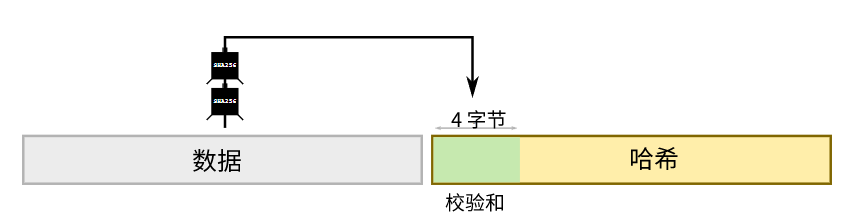
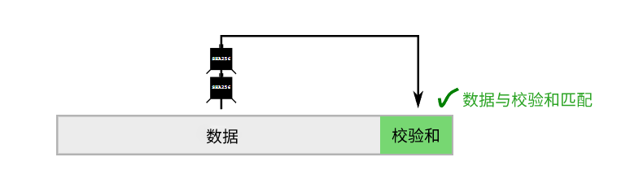
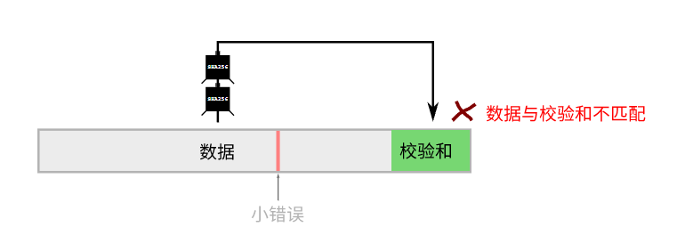

# <center>校验和</center>
<center>一种简单的检查数据错误的方法。</center>


>**校验和是一小段数据，作用是让你检查另一段数据是否与预期相同。**

例如，在比特币中，[地址](../Address/Address.md)包括校验和，以便可以检查它们是否已正确输入。

## 它们是如何工作的？
在比特币中，校验和是将数据通过[SHA256](https://learnmeabitcoin.com/tools/sha256)[哈希](../../Other/Hash%20Function/Hash%20Function.md)两次，然后取结果的前4个字节来创建的。



这为你提供了一小段可靠且相当独特的数据片段。有点像指纹。

然后将数据和校验和一起保留，以便在下次使用时检查整个内容是否已经正确输入。



如果你犯了一个小错误（在任何部分），数据将不再与校验和匹配。



因此，基本上，校验和是一种方便的错误检查工具。

## 比特币中哪些地方使用了校验和？
校验和包含在：

* [地址](../Address/Address.md)
* [WIF 私钥](../Private%20Key/WIF%20Private%20Key/WIF%20Private%20Key.md)

这两个密钥通常需要转录（复制、粘贴、输入、写入等），因此它们包含校验和非常有用。

校验和的存在使得软件能够在输入这些类型的密钥时能够进行验证。软件无法告诉你密钥应该是什么，但至少它能够避免由于拼写错误而向错误地址发送资金。

## 创建校验和。
如前所述，比特币中的校验和是将数据通过 **SHA256 哈希两次并取前 4 个字节来创建的**。

可以将比特币中的校验和称为“截断的 SHA256 哈希值”。

示例。
```
data                 = aaaaaaaaaaaaaaaaaaaaaaaaaaaaaaaaaaaaaaaa
sha256(sha256(data)) = 05c4de7c1069e9de703efd172e58c1919f48ae03910277a49c9afd7ded58bbeb
checksum             = 05c4de7c
```
>1字节=2个字符

>在执行sha256（sha256（data））之前，请不要忘记将数据转换为字节序列。换句话说，你不是对数据的字符串表示形式进行哈希，而是对其代表的字节。

## 代码。
这是你能在Ruby中计算校验和的方法：
```ruby
require 'digest'

def checksum(data)
    # 1. Convert data to binary before hashing it.
    binary = [data].pack("H*")

    # 2. Hash the data twice
    hash1 = Digest::SHA256.digest(binary)
    hash2 = Digest::SHA256.digest(hash1)

    # 3. Take the first 4 bytes
    checksum = hash2[0,4]

    # 4. Convert binary back to hexadecimal and return result
    hex = checksum.unpack("H*")[0] # unpack returns an array, so [0] just grabs the first result
    return hex
end

puts checksum("aaaaaaaaaaaaaaaaaaaaaaaaaaaaaaaaaaaaaaaa") #=> 05c4de7c
```

### 检查校验和。

可以通过计算数据的预期校验和与给定的校验和进行比较来验证。

**例如：检查地址是否有效。**

常见的情况是检查给定[地址](../Address/Address.md)是否有效（所有地址都附带有内部校验和）。

为此，首先需要从[base58](../Base58/Base58.md)解码地址。然后，将**数据部分与校验和分开**，并验证从数据中计算出的校验和是否与给定的校验和相匹配。
```
address        = "1AKDDsfTh8uY4X3ppy1m7jw1fVMBSMkzjP" # typical P2PKH address
base58_decoded = "00662ad25db00e7bb38bc04831ae48b4b446d1269817d515b6" # (base58 decoding not shown here)

data           = "00662ad25db00e7bb38bc04831ae48b4b446d12698" # 1-byte prefix + 20-byte public key hash
checksum       = "17d515b6" # 4-byte checksum

data_checksum  = checksum("00662ad25db00e7bb38bc04831ae48b4b446d1269817d515b6") # calculate the checksum
               = "17d515b6" # check it matches the one given
```
>**Base58解码的地址**包含：前缀，某个内容的hash160（例如[公钥哈希](../Public%20Key/Public%20Key%20Hash/public-key-hash.md)）以及校验和。但是在这里你真正需要知道的校验和是最后4个字节。

## 代码
这个Ruby代码使用了上面相同的checksum()函数。
```ruby
require 'digest'

# Checksum function
def checksum(data)
    binary = [data].pack("H*")
    hash1 = Digest::SHA256.digest(binary)
    hash2 = Digest::SHA256.digest(hash1)
    checksum = hash2[0,4]
    hex = checksum.unpack("H*")[0]
    return hex
end

# Get an address and decode it from base58
address        = "1AKDDsfTh8uY4X3ppy1m7jw1fVMBSMkzjP" # example address
base58_decoded = "00662ad25db00e7bb38bc04831ae48b4b446d1269817d515b6" # (base58 decoding not shown here)

# Separate the data part from the checksum
data     = base58_decoded[0...-8] # everything apart from the last 8 characters
checksum = base58_decoded[-8..-1] # the last 8 characters (4 bytes)

# Calculate the checksum for the data
data_checksum = checksum(data)

# Check to see if it matches the checksum given
verify = data_checksum == checksum

# Results
puts data_checksum
puts checksum
puts verify #=> true
```

>只要你能获取到数据和校验和，验证部分就非常简单了。

## 常见问题
### 为什么只使用前4个字节？
使用完整的哈希结果作为校验和会更安全可靠。虽然这会使地址变得更长，因为整个32字节的哈希值都必须包含在内。

取前4个字节足以提供足够的“唯一性”，可以确保原始数据是正确的，同时也不会使最终地址过长。这只是平衡可靠性和方便性。

### 出错但仍得到相同的校验和结果的机会有多大？
校验和是一个随机的4字节[十六进制数](../../Other/Hexadecimal/hexadecimal.md)，因此发生这种情况的概率是**0xFFFFFFFF**中的1。用十进制表示，这是**4,294,967,295分之1**。

所以这种情况的概率非常小。

## 感谢
* [Gregory Maxwell](https://github.com/gmaxwell)，为我们提供有关校验和的快速计算机科学课程以及历史背景。

## 工具
[校验和](https://learnmeabitcoin.com/tools/checksum)
