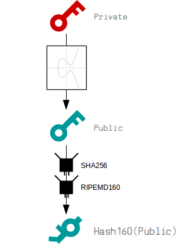
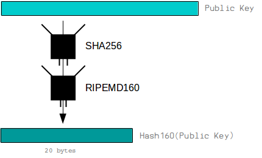
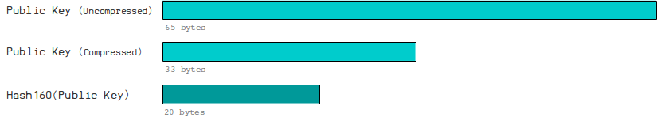
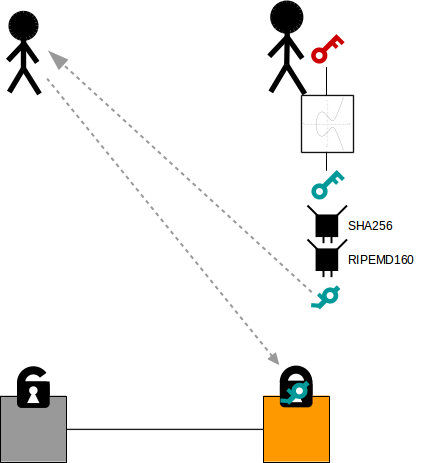
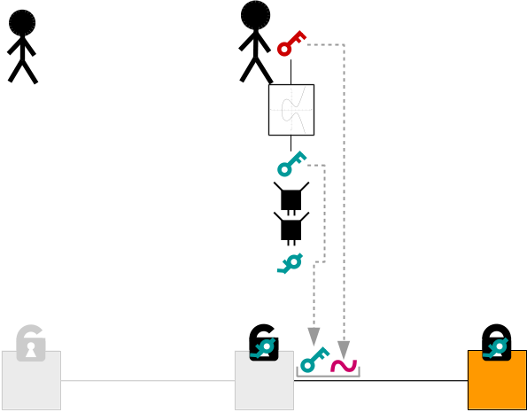
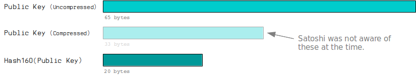
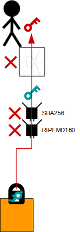

# 公钥哈希
将公钥的哈希值缩短。


公钥哈希是您*公钥*的哈希版本。

这是您向他人提供的公钥版本，以便他们向您发送比特币。它比原始公钥**短**，与直接提供公钥相比，可能为您的比特币提供额外的**安全层**。

它基本上也是一个地址的“原始”版本。

## 如何创建公钥哈希？
只需将您的公钥通过*SHA256*和*RIPEMD160哈希函数*处理即可：

有时它被称为HASH160（公钥），因为这比写RIPEMD160（SHA256（公钥））更简单。
就是这样。

例子：
```
publickey          = 02b4632d08485ff1df2db55b9dafd23347d1c47a457072a1e87be26896549a8737
hash160(publickey) = 93ce48570b55c42c2af816aeaba06cfee1224fae
```
### 为什么我们使用RIPEMD160？

因为[RIPEMD160](https://en.wikipedia.org/wiki/RIPEMD)生成160位（20字节）摘要，比原始公钥（65字节*未压缩*，33字节*压缩*）更小。


这意味着我们最终创建的地址将比完整的公钥包含更少的字符，更容易传递。

>我们与SHA256一起使用它的原因是因为RIPEMD160本身不是最强大的哈希函数。

## 比特币中如何使用公钥哈希？
当你想要接收比特币时，你会把你的公钥哈希给别人。然后，他们将把它放入交易*输出*的*锁定代码*中。

这将创建一个*P2PKH*锁定脚本。


当您想要解锁这些比特币（将它们发送给新的交易对象）时，您只需将原始公钥以及数字签名放入*输入*的解锁代码中。


因此，当一个节点来验证这个交易时，它会：

1. 检查提供的**公钥**是否正确地哈希到**公钥哈希值**上。
2. 如果检查通过，它们将像往常一样对**公钥**进行验证**签名**。
因此，与*P2PK*锁定不同，它不仅仅检查**签名**与公钥的匹配性，还会先**检查公钥的哈希值**。

这就是为什么这种锁定系统被称为P2PKH的原因。

### 代码
```ruby
require 'digest' # Hash Functions Library

publickey = '02b4632d08485ff1df2db55b9dafd23347d1c47a457072a1e87be26896549a8737'

binary = [publickey].pack("H*") # Convert to binary first before hashing
sha256 = Digest::SHA256.digest(binary)
ripemd160 = Digest::RMD160.digest(sha256)
hash160 = ripemd160.unpack("H*")[0] # Convert back to hex

puts hash160 # 93ce48570b55c42c2af816aeaba06cfee1224fae
```

## 常见问题
### 为什么我们要对公钥进行哈希处理？

因为这是比特币交易设计时的规定，这是Satoshi开发比特币时设计的方式。

>关于为什么地址是公钥哈希，这是你需要问Satoshi的原因。-[ Pieter Wuille](https://bitcoin.stackexchange.com/a/72201/24926)

可能是因为Satoshi当初不知道可以使用压缩公钥（33字节而不是65字节），所以对公钥进行哈希处理是为了创建一个更短的（20字节）版本，以便将其提供给其他人。

>为了使比特币地址简短，它们是公钥的哈希值。- [Satoshi Nakamoto](https://satoshi.nakamotoinstitute.org/posts/bitcointalk/threads/134/#7)


### 替代理论：额外的安全性
一种替代理论是使用Hash160提供了额外的安全层。

例如，如果我们在想要接收比特币时立即公开我们的公钥，那么保护您免受攻击者获取私钥的“唯一”方式就是*椭圆曲线*。

从椭圆曲线乘法逆推出私钥是极其困难的，但你可以尝试。

然而，如果我们提供公钥的哈希版本，攻击者就必须破解RIPEMD160和SHA256哈希函数，同时解决椭圆曲线问题。

现在你需要破解两种不同的哈希函数。

因此，当你在区块链上拥有比特币时，哈希函数就像是额外的障碍，攻击者必须跨越它们才能尝试获取我们的私钥（并窃取我们的比特币）。

**那么椭圆曲线不够保护吗？**
实际上，它是很好的保护。

由于椭圆曲线乘法的特性，从公钥到私钥的反向计算是不可能的。这被称为“椭圆曲线离散对数问题”。

然而，如果通过某种奇迹解决了这个问题，仍然有两个不同的哈希函数可以保护我们的私钥。

**但是你不是仍然会公开你的公钥吗？**
是的。但在这个系统中，你的公钥只在最后一刻（当你来花费你的比特币时）公开。

理论上，如果有人想推导出你的私钥，在你的交易传播到网络并被挖掘到一个块之前，他们将有一小段时间来完成。因此，这比从一开始就暴露你的公钥更安全。

## 感谢
感谢[Pieter Wuille](https://twitter.com/pwuille)解释[为什么我们使用公钥的哈希值](https://bitcoin.stackexchange.com/a/72201/24926)而不是原始公钥。