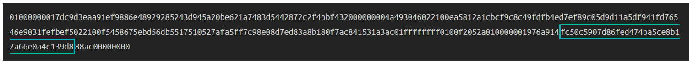
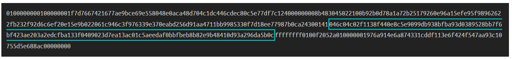

# <center>公钥</center>
<center>从私钥中数学生成的独特数字。</center>

.png)

公钥就像你用来接收比特币的账号号码。

它是由你的[私钥](../Private%20Key/Private%20Key.md)创建的，私钥就像该账号号码的密码。

## 如何生成公钥？
使用你的**私钥**（它只是一个大的随机数）来生成相应的公钥。

你使用你的私钥执行**椭圆曲线乘法**，这将给你一个最终的椭圆曲线上的固定点。该点的**x**和**y**坐标就是你的公钥。

.png)

### 代码
这里是从私钥创建公钥的基本代码。

我还没有解释[椭圆曲线数学](../ECDSA/ECDSA.md)是如何工作的，但我仍然包括了这段代码，以展示如何开始计算自己的公钥。
```ruby
# example private key
private_key = "ef235aacf90d9f4aadd8c92e4b2562e1d9eb97f0df9ba3b508258739cb013db2"

# --------------------------
# Secp256k1 Curve Parameters
# --------------------------
# y^2 = x^3 + ax + b
$a = 0
$b = 7 # using global variables for convenience

# prime modulus
$p = 2 ** 256 - 2 ** 32 - 2 ** 9 - 2 ** 8 - 2 ** 7 - 2 ** 6 - 2 ** 4 - 1

# number of points on the curve
$n = 115792089237316195423570985008687907852837564279074904382605163141518161494337

# generator point (the starting point on the curve used for all calculations)
$g = {
  x: 55066263022277343669578718895168534326250603453777594175500187360389116729240,
  y: 32670510020758816978083085130507043184471273380659243275938904335757337482424,
}

# --------------------------
# Elliptic Curve Mathematics
# --------------------------
# Modular Inverse - Ruby doesn't have a built-in function for finding modular inverses, so here's one using the extended Euclidean algorithm.
def modinv(a, m = $p)
  a = a % m if a < 0 # make sure a is positive
  prevy, y = 0, 1
  while a > 1
    q = m / a
    y, prevy = prevy - q * y, y
    a, m = m % a, a
  end
  return y
end

# Double - Add a point on the curve to itself.
def double(point)
  # slope = (3x^2 + a) / 2y
  slope = ((3 * point[:x] ** 2) * modinv((2 * point[:y]))) % $p # using modular inverse to perform "division"

  # new x = slope^2 - 2x
  x = (slope ** 2 - (2 * point[:x])) % $p

  # new y = slope * (x - new x) * y
  y = (slope * (point[:x] - x) - point[:y]) % $p

  # return x, y coordinates of point
  return { x: x, y: y }
end

# Add - Add two points together.
def add(point1, point2)
  # double if both points are the same
  return double(point1) if point1 == point2

  # slope = (y1 - y2) / (x1 - x2)
  slope = ((point1[:y] - point2[:y]) * modinv(point1[:x] - point2[:x])) % $p

  # new x = slope^2 - x1 - x2
  x = (slope ** 2 - point1[:x] - point2[:x]) % $p

  # new y = slope * (x1 - new x) - y1
  y = ((slope * (point1[:x] - x)) - point1[:y]) % $p

  # return x, y coordinates of point
  return { x: x, y: y }
end

# Multiply - Use the double and add operations to quickly multiply a point by an integer (e.g. a private key).
def multiply(k, point = $g) # multiply the generator point by default
  # create a copy the initial starting point (for use in addition later on)
  current = point

  # convert integer to binary representation (for use in the double and add algorithm)
  binary = k.to_s(2)

  # double and add algorithm for fast multiplication
  binary.split("").drop(1).each do |char| # ignore first binary character
    # 0 = double
    current = double(current)

    # 1 = double and add
    if char == "1"
      current = add(current, point)
    end
  end

  # return the final point
  return current
end

# -------------------------
# Private Key To Public Key
# -------------------------
# convert private key to an integer
k = private_key.to_i(16)

# multiply generator point by this private key
point = multiply(k, $g) # this point is the public key

# convert x and y values of this point to hexadecimal
x = point[:x].to_s(16).rjust(64, "0")
y = point[:y].to_s(16).rjust(64, "0")

# uncompressed public key format (not used much these days, just showing how it looks)
public_key_uncompressed = "04" + x + y

# compressed public key format (every x value has a y that could be one of two possible points)
if (point[:y] % 2 == 0)
  prefix = "02" # if y is even
else
  prefix = "03" # if y is odd
end

public_key_compressed = prefix + x # only uses the full x coordinate

# -------
# Results
# -------
puts private_key           #=> ef235aacf90d9f4aadd8c92e4b2562e1d9eb97f0df9ba3b508258739cb013db2
puts public_key_compressed #=> 02b4632d08485ff1df2db55b9dafd23347d1c47a457072a1e87be26896549a8737
```

### 为什么要使用椭圆曲线？

使用椭圆曲线乘法可以为你的私钥和公钥之间建立一个**数学连接**。它还具有两个重要的特性：

#### 1. 不能反向计算私钥。
你可以使用椭圆曲线乘法正向计算，但无法进行反向数学计算。
.png)

这意味着从你的私钥到公钥有一个数学连接，但没有人可以使用你的公钥来找出你的私钥。

因此，你可以公开你的公钥，同时保持你的私钥保密。

#### 2. 你可以证明你拥有私钥而不泄露它。
基本上，使用一些椭圆曲线数学，你可以创建一个数字签名，证明你拥有与公钥相对应的私钥，而不必透露你的实际私钥。

就像说你有一个账户的密码，但你不必向任何人展示你的实际密码来证明它。

.png)

这要归功于数字签名似乎神奇的特性，而这一切都是通过椭圆曲线数学实现的。

## 公钥格式
公钥只是椭圆曲线上一点的x和y坐标。它通常以[十六进制](../../Other/Hexadecimal/hexadecimal.md)格式存储。

有两种公钥格式：

### 1. 未压缩
>这是旧格式。它通常已停止使用，而更短的压缩格式更受欢迎。

比特币最初使用**x**和**y**坐标来存储公钥。

在这种未压缩格式中，只需将**x**和**y**坐标放在一起，然后在整个字符串前加上04以表示它是未压缩的公钥：
.png)
这是一个未压缩的公钥的示例：
```
public key (uncompressed) = 04b4632d08485ff1df2db55b9dafd23347d1c47a457072a1e87be26896549a87378ec38ff91d43e8c2092ebda601780485263da089465619e0358a5c1be7ac91f4
```
### 2. 压缩
然而，由于椭圆曲线沿着其x轴是对称的，每个x坐标只会有两个可能的y坐标。

.png)

这里有个技巧...

* 如果 y 是偶数，它对应其中一个点。
* 如果 y 是奇数，它对应另一个点。
因此，在压缩的公钥格式中，我们只需存储完整的 **x** 坐标，以及指示 **y** 坐标是偶数还是奇数的前缀。
.png)
我们只需要存储**y**坐标是偶数还是奇数。

以下是压缩公钥与未压缩公钥的示例：
```
public key (uncompressed) = 04b4632d08485ff1df2db55b9dafd23347d1c47a457072a1e87be26896549a87378ec38ff91d43e8c2092ebda601780485263da089465619e0358a5c1be7ac91f4
public key (compressed)   = 02b4632d08485ff1df2db55b9dafd23347d1c47a457072a1e87be26896549a8737
```

这种压缩格式最终使我们能够计算出完整的**x**和**y**坐标，但在区块链内节省了大量空间（例如当我们创建将[输出](../../Transaction/Transaction%20Data/output/output.md)锁定到特定公钥的交易时）。

#### 如何解压公钥
你可以通过解决曲线方程y^2 = x^3 + 7来解压缩公钥。

这将为你提供未压缩密钥的可能缺失的y值。然后，你可以使用压缩密钥的前缀来确定使用哪个y值（因为任何数字的平方根都有两个可能的答案，例如16 = +4或-4）。
```ruby
# Compressed public key
compressed = "02b4632d08485ff1df2db55b9dafd23347d1c47a457072a1e87be26896549a8737"

# Split compressed key in to prefix and x-coordinate
prefix = compressed[0..1]
x      = compressed[2..-1].to_i(16)

# Secp256k1 curve parameters
p = 0xfffffffffffffffffffffffffffffffffffffffffffffffffffffffefffffc2f

# Work out y values using the curve equation y^2 = x^3 + 7
y_sq = (x**3 + 7) % p # everything is modulo p

# Secp256k1 is chosen in a special way so that the square root of y is y^((p+1)/4)
y = y_sq.pow((p+1)/4, p) # use modular exponentation

# Use prefix to select the correct value for y
# * 02 prefix = y is even
# * 03 prefix = y is odd 
if (prefix == "02" && y % 2 != 0) # if prefix is 02 and y isn't even, use other y value
    y = (p - y) % p
end
if (prefix == "03" && y % 2 == 0) # if prefix is 03 and y is even, use other y value
    y = (p - y) % p
end

# Construct the uncompressed public key
x = x.to_s(16).rjust(64, "0") # convert to hex and make sure it's 32 bytes (64 characters)
y = y.to_s(16).rjust(64, "0")
uncompressed = "04" + x + y

# Result
puts uncompressed #=> 04b4632d08485ff1df2db55b9dafd23347d1c47a457072a1e87be26896549a87378ec38ff91d43e8c2092ebda601780485263da089465619e0358a5c1be7ac91f4
```

## 公钥在比特币中如何使用？

你可以向其他人透露你的公钥，以便他们在创建交易时将其包括在输出的[锁定脚本](../../Transaction/Transaction%20Data/output/scriptPubKey/scriptPubKey.md)中。
.png)
我们可以把我们的公钥给别人，这样他们就可以向我们发送比特币。这被称为Pay-To-Pubkey（[P2PK](../../Script/P2PK/P2PK.md)）。

然而，在比特币中，我们现在更常用的是在公钥之前进行[hash160](../Public%20Key/Public%20Key%20Hash/public-key-hash.md)。然后，在解锁输出时才使用[公钥](../Public%20Key/Public%20Key%20Hash/public-key-hash.md)。（初始锁定将首先检查公钥的哈希值是否正确,然后再将其与签名进行比对。）
.png)
我们的公钥的Hash160现在存储在锁定中。这被称为支付到公钥哈希（[P2PKH](../../Script/P2PKH/P2PKH.md)）。

## 在区块链中，公钥在哪里可以找到？
如果你正在查看[原始区块链数据](../../Blockchain/Blkdat/blkdat.md)，则公钥通常可以在[交易数据](../../Transaction/Transaction%20Data/Transaction%20Data.md)中找到。
例如，在标准的P2PKH交易中：
公钥哈希位于[输出](../../Transaction/Transaction%20Data/output/output.md)的锁定代码（[scriptPubKey](../../Transaction/Transaction%20Data/output/scriptPubKey/scriptPubKey.md)）中。

接下来，在下一笔花费比特币的交易中...

原始公钥可以在[输入](../../Transaction/Transaction%20Data/Input/input.md)的解锁代码（scriptSig）中找到。


>正如你所看到的那样，公钥开头的04表示它是一个未压缩的公钥。这使得它几乎是现在通常使用的压缩公钥的两倍长。

### 库
今天大多数语言都可以使用现有的**椭圆曲线库**来帮助你创建公钥（而不必须自己编写数学代码）。例如：
```ruby
require 'ecdsa' # Use an elliptic curve library

# This private key is just an example
privatekey = "ef235aacf90d9f4aadd8c92e4b2562e1d9eb97f0df9ba3b508258739cb013db2"

# Elliptic curve multiplication
group = ECDSA::Group::Secp256k1 # Select the curve used in Bitcoin
point = group.generator.multiply_by_scalar(privatekey.to_i(16)) # Multiply by integer (not hex)

# Convert public key point to a compressed hexadecimal public key
publickey = ECDSA::Format::PointOctetString.encode(point, compression: true).unpack("H*").join

puts publickey
```

* Ruby: [github.com/DavidEGrayson/ruby_ecdsa](https://github.com/DavidEGrayson/ruby_ecdsa)
* PHP: [github.com/BitcoinPHP/BitcoinECDSA.php](https://github.com/BitcoinPHP/BitcoinECDSA.php)

## Resources
* [Bitcoin 101 - Generating a Public Key in Python](https://www.youtube.com/watch?v=jQLmaBjYrk4)
* [Graphical Address Generator](https://www.royalfork.org/2014/08/11/graphical-address-generator/#learnmeabitcoin)