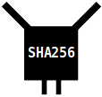

# 挖矿
向区块链添加新的区块。
.png)

**挖矿**是尝试将新的*交易* *块*添加到*区块链*上的过程。它基本上是一个网络范围内的竞争，网络上的任何节点都可以尝试将下一个块添加到链上。

每个新挖掘出的块都会在网络上广播，每个节点在将其添加到其区块链之前都会独立验证它。
.png)
节点使用新区块更新他们的区块链。

在添加新块后，每个挖矿节点重新启动进程，试图在链中构建在其之上。因此，区块链通过网络中节点的协作不断被构建。

>该系统被设计为平均**每10分钟**挖掘出一个新块。

## 1. 挖矿是如何工作的？
挖矿过程始于将一个*候选区块*填满来自节点*内存池*中的交易。

这个候选区块是我们要尝试在我们的区块链上挖掘的区块（然后将其发送给其他人，以便他们也可以将其添加到他们的区块链中）。
.png)

接下来，我们为这个*候选块*构建一个块头。这基本上是块内所有数据的简要摘要，其中包括对我们要在其上构建的区块链中的现有块的引用。
.png)
你可以通过*区块哈希*来引用先前的区块，而区块中所有交易的摘要都包含在*默克尔根*中。

现在我们准备开始“挖掘”这个块。为了做到这一点，我们将这个块的块头放入[SHA256](https://en.wikipedia.org/wiki/SHA-2)*哈希函数*中，并希望它输出的数字低于当前*目标*。

尝试一下！- SHA256
哈希函数基本上是一个小型计算机程序，它接收任意数量的数据，将其混淆，并产生一个不可预测的结果。不同的数据块产生不同的结果。


>**注意**：哈希函数的结果以十六进制显示，但可以轻松地转换为十进制数。

>**注意**：在挖掘过程中，数据通过哈希函数进行两次处理，因此结果不同（但它对说明目的很有帮助）。

.png)
目标是您的区块哈希必须低于的数字，才能将该区块添加到区块链上。

如果块头的哈希值不在目标值以下，你可以通过增加块头中的*nonce*字段来不断尝试，这样你可以保持相同的基本块头，但却可以得到完全不同的哈希结果。如果幸运的话，你可能会得到一个当前目标值以下的哈希值。
.png)
挖矿过程基本上是尽可能快地对一个块头进行哈希运算，以尝试成为第一个获得足够低结果的节点。

如果您成功获取了一个低于目标值的块哈希，则可以将您的块广播到网络上。每个节点在接收到新块后会确认该块头哈希是否低于目标值，然后将此“挖掘”块添加到它们的区块链上。
.png)
恭喜，您刚刚将一批交易挖掘到了区块链上。

从这里开始，每个节点将停止在自己的候选区块上工作，构建一个新的区块（从其内存池中获取新的交易），并开始尝试在链上构建这个新的区块。
.png)
矿工开始尝试将下一批交易添加到链上。

因此，矿工们不断地独立（但协作地）工作，以新的交易块扩展区块链。

>挖矿的过程通常被称为**工作量证明**。
“工作量证明”一词只是指得到一个块哈希值低于目标值需要付出努力，并且一旦你做到了，任何人都可以检查哈希值是否低于目标值。
换句话说，哈希函数被用作一种证明你在块上执行了所需数量的“工作”的方式。

>工作量证明涉及扫描一个值，当进行哈希运算时（例如使用SHA-256），哈希以若干个零位开头。-[**中本聪**](https://bitcoin.org/bitcoin.pdf)

## 2. 谁能挖矿?
**任何节点**都可以尝试挖掘一个区块，每个节点都有成功的机会。因此，我们有一个整个网络范围的竞争，任何网络上的节点都可能成为将下一批交易添加到区块链上的节点。
.png)

然而，虽然任何人都可以尝试挖矿，但能够尽可能快地执行哈希计算确实可以提高成功挖掘新区块的机会。
.png)

>任何人在任何时间内找到解决方案的机会与他们的 CPU 功率成比例。-[中本聪](https://satoshi.nakamotoinstitute.org/emails/cryptography/13/#selection-173.284-173.369)

因此，拥有最多处理能力（或“哈希能力”）的矿工很可能比那些无法快速哈希的人挖掘更多的块。因此，尽管任何人都可以挖掘，但它往往集中在拥有专业挖掘硬件和便宜电力的人之间。

## 3. 为什么要挖矿块？
因为如果你能够挖掘一个区块，你就可以获得一个区块奖励。

你知道，当你构建一个候选区块时，你可以在区块顶部放置自己的特殊交易。这被称为coinbase交易，它允许你发送给自己一定数量的之前不存在的比特币。
.png)
Coinbase交易实际上允许您创建新的比特币并将它们发送给自己。

如果你挖到了这个区块，一旦该区块在*最长的链*中达到100个块的深度，你就可以花费从coinbase交易中获得的比特币。
.png)

因此，这个**区块奖励作为一个激励**，促使矿工挖掘新的区块，并不断尝试扩展已知的最长区块链。
.png)

>**提示**：发送不存在的比特币只允许在coinbase交易中进行，这使它们成为所有新比特币的来源。
**提示**：挖掘引入新比特币进入网络的事实是为什么这个过程被称为“挖掘”，尽管从实际角度来看，它更多地涉及将新交易添加到区块链中。

## 4. 挖掘一个区块需要多长时间？
该系统被设计成，网络中的一个矿工平均**每10分钟**成功挖掘一个新区块。
.png)

这个时间控制是由*目标*控制的，就像一个极低的杆子，一个块的哈希必须通过它才能被允许进入区块链。
.png)
每个节点都知道当前区块链高度的当前目标。

如果在两周的时间内，挖矿的速度比平均值10分钟更快（例如，因为更多的矿工加入网络），则目标值将向下调整，以便更难挖掘一个区块，因此**区块之间的平均时间恢复**到约10分钟左右。
.png)
每个节点独立调整目标，但如果它们每个人都有相同的块链，它们将计算出相同的目标。

因此，目标定期进行调整，以尝试保持每个新区块之间的时间间隔为10分钟，这样可以预测地保持新区块的稳定速率并使新比特币的发行量保持稳定。

## 5. 我们为什么要挖矿?
因为这个**系统允许网络上的计算机解决冲突，而无需中央计算机或权威机构来处理它们**。

你看，比特币在独立计算机的网络上运行，因此可能会创建两个冲突的交易（将同一比特币发送到不同的地方），并同时将它们插入网络上的不同节点。一些节点将首先收到交易A，而其他节点将首先收到交易B。
.png)
所有计算机如何达成一致，决定哪些交易应该被记录在区块链中？

由于挖矿机制的存在，**只有其中一笔交易会被记录在区块链上**。

最终，网络中的一个节点会从其内存池中挖掘出一块交易，然后将该块广播到网络的其余部分。当节点接收到该块时，它们将将其添加到自己的链中，并从其**内存池中删除任何冲突的交易**。
.png)

因此，挖矿过程充当了一种跨计算机网络的交易排序机制，挖掘出的块对于区块链中的内容具有最终决定权。更好的是，由于任何人都可以进行挖矿，因此网络上没有任何单个节点能够完全控制哪些交易被记录在区块链上。

>除非一个单独的矿工获得了*大部分的挖矿算力*...

## 6.你如何挖掘一个区块？
你首先要构建一个区块的*区块头*。例如，这是*第100,000个区块*的区块头的开头：
```
0100000050120119172a610421a6c3011dd330d9df07b63616c2cc1f1cd00200000000006657a9252aacd5c0b2940996ecff952228c3067cc38d4885efb5a4ac4247e9f337221b4d4c86041b00000000
```

现在你已经得到了区块头，你尝试通过将其通过SHA256哈希函数（两次）来“挖掘”它。你不断增加nonce值，以尝试获得低于目标值的结果。

例如：
```
Nonce     Hash256
--------  -------
00000000: 5bd0d617b30a972407ad69a845cd74fb201d940cd45acc15fcd4761493bc3ae2
01000000: 6879c316d8a96269825111bb0616331307bb6677b2af55127922d8c568e4b2db
02000000: 34d69cb489442234ec54462e18262bf1a9c756a4e7909e68edf979a0cb39a3fa
03000000: 8cf5e032093cfcbf4f6b443608631dd33699fca13dcbd6118992f9d451b70dd8
04000000: a32d73e3f2fd0579c44080cb6b1717582d37b8f47a8445922dee0996b503c04c
05000000: 70b11dabc90a107918a55eff7e940d41b0ce1924aeed2f0b7ccb2d4ee60e1617
06000000: b38afc30567703629226557a7748bea449693156e0b116b03a8442ccc3b9005e
07000000: 2a6008f39daa1238388eadcab111c6b556c3d89a46558c98f8ed32746fb5d7b8
08000000: 248e33c82a744786e7e16336612221850e32f8e6cb09b2eb0b0730ac6beb71b4
09000000: a4aea05d2750e49e8f95f5608293f6b4f45bd34aee51e86893dd8c0230d19185
0a000000: ce2225a69a5bf2dbb25cbb27fda78a8c4c3ac5280ec7996426eeefeb0e5e1ecb
...
```
最终，您可能会找到一个nonce值，它会产生比目标值更小的哈希结果：
```
Nonce    Hash256
-------- -------
0f2b5710: 000000000003ba27aa200b1cecaad478d2b00432346c3f1f3986da1afd33e506
```
>提示：在*块头*中，nonce是一个4字节的字段，其中数字以*十六进制*和*小端字节顺序*表示。

### 示例代码
这里有一些简单的Ruby代码，展示了如何挖掘一个区块（就像上面的那个）。它非常简单。唯一棘手的部分是在哈希之前以正确的格式获取块头数据。
```ruby
require 'digest/sha2'

# -----------------
# Utility Functions
# -----------------

# The hash function used in mining (convert hexadecimal to binary first, then SHA256 twice)
def hash256(data)
  binary = [data].pack("H*")
  hash1 = Digest::SHA256.digest(binary)
  hash2 = Digest::SHA256.hexdigest(hash1)
end

# Convert a number to fit inside a field that is a specific number of bytes e.g. field(1, 4) = 00000001
def field(data, size)
  hex = data.to_i.to_s(16).rjust(size * 2, '0')
end

# Reverse the order of bytes (happens often when working with raw bitcoin data)
def reversebytes(data)
  data.scan(/../).reverse.join
end

# ------------
# Block Header
# ------------

# Target (optional)
target = '000000000004864c000000000000000000000000000000000000000000000000'

# Block Header (Fields)
version    = '1'
prevblock  = '000000000002d01c1fccc21636b607dfd930d31d01c3a62104612a1719011250'
merkleroot = 'f3e94742aca4b5ef85488dc37c06c3282295ffec960994b2c0d5ac2a25a95766'
time       = '1293623863'  # Unixtime (29 Dec 2010, 11:57:43)
bits       = '1b04864c'
nonce      = 0             # 274148111

# Block Header (Serialized)
header = reversebytes(field(version, 4)) + reversebytes(prevblock) + reversebytes(merkleroot) + reversebytes(field(time, 4)) + reversebytes(bits)

# -----
# Mine!
# -----
loop do
  # hash the block header
  attempt = header + reversebytes(field(nonce, 4))
  result = reversebytes(hash256(attempt))

  # show result
  puts "#{nonce}: #{result}"

  # end if we get a block hash below the target
  if result.to_i(16) < target.to_i(16)
    break
  end
  
  # increment the nonce and try again...
  nonce += 1
end
```

### 指令
>bitcoin-cli getblocktemplate
该命令从节点的*内存池*中获取交易，并返回您开始挖掘新块所需的数据。
>>**注意**：此命令返回关键块头信息，如**前一个块**、**时间**和**比特数**，但您需要自己选择交易并构*建默克尔根*。

>bitcoin-cli submitblock [hexdata]
将您的区块发送到网络。

>bitcoin-cli getmininginfo
向您展示一些有趣的挖矿信息。
如果您事先运行bitcoin-cli getblocktemplate命令，它还会向您显示有多少来自内存池的交易将被包含在下一个区块中。
```
$ bitcoin-cli getmininginfo

{
    "blocks": 790843,
    "currentblockweight": 3995794,
    "currentblocktx": 2630,
    "difficulty": 49549703178592.68,
    "networkhashps": 3.447695144262456e+20,
    "pooledtx": 50592,
    "chain": "main",
    "warnings": ""
}
```

## 链接
* https://en.bitcoin.it/wiki/Proof_of_work
* https://en.bitcoin.it/wiki/BIP_0022