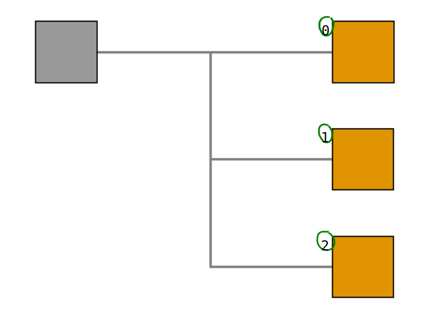

# 
VOUT

比特币交易中输出的向量。

**vout**是交易中[输出](../../Transaction/Transaction%20Data/output/output.md)的索引编号。

## 用途

你可以使用**txid**和**vout**来唯一**确定一个输出**以用作新交易中的[输入](../../Transaction/Transaction%20Data/Input/input.md)。

.png)

请输出数字2。

## 注释
>在编程中，计数从0开始。所有如果想使用现有交易的第一个输出，我们将vout设置为**0**。（第二个输出将为1。）

>**vout**中的“v”代表**向量**，因在再比特币源代码中，输出存储在[向量](http://www.cplusplus.com/reference/vector/vector/)数据结构中（类似于[数组](https://www.go4expert.com/articles/array-vector-stack-data-structures-t27921/)）。

## 链接

* https://www.quora.com/Why-do-array-indexes-start-with-0-zero-in-many-programming-languages
