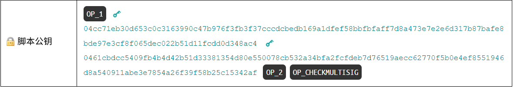

# 
P2MS

支付到多重签名

.png)

**P2MS**是一种脚本模式，允许你将比特币锁定到**多个**公钥，并要求**一些**（或全部）公钥的**签名**才能解锁它。

例如，你可以创建一个包括**3个不同人**的公钥的P2MS脚本，但只有**其中的2个人**需要提供他们的签名才能花费比特币。

.png)

**BIP 11**: [M-of-N标准交易](https://github.com/bitcoin/bips/blob/master/bip-0011.mediawiki)（2011年10月18日）

>虽然P2MS是一个标准脚本，但现在更常见的是将这种类型的脚本包装在[P2SH](../P2SH/P2SH.md)中（[见下文](#为什么我们现在使用p2sh而不是p2ms)）。

## P2MS如何工作？
多重签名脚本很容易创建。对于锁定脚本：

1. 包括一个操作码**M**，表示需要多少个签名。
2. 包括**公钥**。
3. 包括另一个操作码**N**，表示有多少个公钥。
4. 在末尾放置**CHECKMULTISIG**操作码。

要解锁P2MS脚本，你只需要提供所需的**签名**数量。在这种情况下，**M**是一个：

|scriptSig|OP_0 304402203f16c6f40162ab686621ef3000b04e75418a0c0cb2d8aebeac894ae360ac1e780220ddc15ecdfc3507ac48e1681a33eb60996631bf6bf5bc0a0682c4db743ce7ca2b01|
|---|---|

>**CHECKMULTISIG Bug** 操作码存在一个 bug，它会从堆栈中弹出超出需要的额外元素（[偏移错误](https://stackoverflow.com/questions/2939869/what-is-exactly-the-off-by-one-errors-in-the-while-loop)）。因此，为了避免错误，在 scriptSig 的开头添加一个虚拟值（通常是 **OP_0**）。

## 执行
当这个脚本执行时，所有的**签名**和**公钥**都被推到栈上。

然后我们来到 **CHECKMULTISIG** 操作码：

1. 弹出 **N**，然后从堆栈弹出该数量的公钥。
2. 弹出 **M**，然后从堆栈弹出该数量的签名。

在弹出所有公钥和签名后，它将每个**签名**与每个**公钥**进行比较：

* 如果签名与公钥不匹配，则继续检查下一个公钥。然而，每个后续签名也将**忽略**该公钥（因此请确保你在scriptSig中按顺序放置签名！）。
* 如果签名与公钥匹配，则增加一个计数并重复检查下一个签名。

如果在所有签名都检查完毕后,有效签名的计数等于 **M**，则 **CHECKMULTISIG** 将 **1** 推到栈上，脚本有效。

.gif)

## 你可以在哪里找到P2MS脚本？
在区块链中很少能找到P2MS脚本，因为**大多数多重签名交易使用较新的[P2SH](../P2SH/P2SH.md)脚本。**

.png)

根据这个很酷的[区块链浏览器](https://webbtc.com/stats)，只有1%的锁定脚本是P2MS，因此很难找到它们。

尽管如此，以下是一些具有P2MS锁定脚本的交易示例：

* [60a20bd93aa49ab4b28d514ec10b06e1829ce6818ec06cd3aabd013ebcdc4bb1](https://learnmeabitcoin.com/explorer/transaction/60a20bd93aa49ab4b28d514ec10b06e1829ce6818ec06cd3aabd013ebcdc4bb1) - 第一笔P2MS交易。（2012年1月30日）
* [2daea775df11a98646c475c04247b998bbed053dc0c72db162dd6b0a99a59c26](https://learnmeabitcoin.com/explorer/transaction/2daea775df11a98646c475c04247b998bbed053dc0c72db162dd6b0a99a59c26) - 第二笔P2MS交易。（2012年2月3日）
* [14237b92d26850730ffab1bfb138121e487ddde444734ef195eb7928102bc939](https://learnmeabitcoin.com/explorer/transaction/14237b92d26850730ffab1bfb138121e487ddde444734ef195eb7928102bc939) - 第三笔P2MS交易。（2012年2月3日）

* [ac1d9ed701af32ea52fabd0834acfb1ba4e3584cf0553551f1b61b3d7fb05ee7](https://learnmeabitcoin.com/explorer/transaction/ac1d9ed701af32ea52fabd0834acfb1ba4e3584cf0553551f1b61b3d7fb05ee7) - 1-of-1多重签名
* [78b28d3c2324da8c2f01840021addbcabb68f7ce1d4da870cabe5e9df6afe63d](https://learnmeabitcoin.com/explorer/transaction/78b28d3c2324da8c2f01840021addbcabb68f7ce1d4da870cabe5e9df6afe63d) - 1-of-2多重签名
* [581d30e2a73a2db683ac2f15d53590bd0cd72de52555c2722d9d6a78e9fea510](https://learnmeabitcoin.com/explorer/transaction/581d30e2a73a2db683ac2f15d53590bd0cd72de52555c2722d9d6a78e9fea510) - 2-of-3多重签名

>你将不会在上面的交易中看到P2MS锁定脚本的任何地址，因为**P2MS没有自己的[地址](../../Keys/Address/Address.md)格式**（就像[P2PKH](../P2PKH/P2PKH.md)和[P2SH](../P2SH/P2SH.md)一样）。

## 为什么我们现在使用P2SH而不是P2MS？

因为通过使用[P2SH](../P2SH/P2SH.md)，你可以避免使用“原始”P2MS脚本时出现的缺点：

1. **P2MS没有[地址](../../Keys/Address/Address.md)格式**。因此，如果你想要让某人在你的比特币上放置P2MS锁定，你将需要自己构建和发送原始锁定脚本。更糟糕的是，他们可能无法为你创建此交易，因为大多数钱包仅在进行交易时允许你使用地址（而不是原始脚本）。
2. **P2MS仅限于3个*公钥***[^1]。1 P2MS的锁定脚本可以变得相当大，其中包含所有公钥，因此它仅限于3个（以防止在UTXO集中存储过多数据）。但是，使用P2SH，你可以使用多达**15个**公钥的多重签名锁定。
   
因此，如果你想，仍然可以使用P2MS，但使用P2SH来实现相同的目的更为方便。

>P2SH基本上是一种脚本，允许你在其中包装另一个脚本（例如P2MS）。

## 那么为什么我们既有P2MS又有P2SH？

因为在P2SH可用之前，P2MS成为了标准脚本。

* P2MS - 在**2012年1月**成为标准脚本。[^2]
* P2SH - 在**2012年4月**成为标准脚本。[^3] [^4]

它可以被删除作为标准脚本，但是…

>我们不能只是引入破坏现有功能的策略。- [Pieter Wuille](https://twitter.com/pwuille)

因此，P2MS仍然是P2SH存在之前的遗物。

## 链接
* https://medium.com/@alcio/the-state-of-bitcoin-multisig-82b3bf09b1ca

[^1]:https://bitcoin.stackexchange.com/questions/23893/what-are-the-limits-of-m-and-n-in-m-of-n-multisig-addresses
[^2]:https://github.com/bitcoin/bips/blob/master/bip-0011.mediawiki
[^3]:https://github.com/bitcoin/bips/blob/master/bip-0016.mediawiki
[^4]:https://en.bitcoin.it/wiki/Pay_to_script_hash