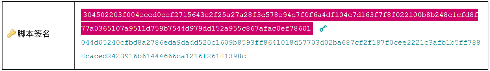

# P2PKH
付款至公钥哈希
.png)
这个脚本模式用于“发送”比特币给某个人。它是最常用的将输出锁定到某个人的公钥的脚本。

>它类似于[P2PK](../P2PK/P2PK.md)，但锁定包含**公钥的哈希**（而不是公钥本身）。

## P2PKH是如何工作的？
P2PKH脚本模式包含一个被[哈希处理的公钥](../../Keys/Public%20Key/Public%20Key%20Hash/public-key-hash.md)，周围包围着这些操作码：
|criptPubKey(加密公钥)|OP_DUP OP_HASH160 12ab8dc588ca9d5787dde7eb29569da63c3a238c OP_EQUALVERIFY OP_CHECKSIG|
|---|---|

为了解决这个脚本，上面散列的公钥的所有者需要提供原始的[公钥](../../Keys/Public%20Key/Public%20Key.md)和有效的**签名**。

简而言之，当这个脚本运行时：

* 原始**公钥**被**复制**并进行**HASH160**处理。
* 将这个哈希值与scriptPubKey中的**哈希公钥**进行比较，以确保它是**EQUALVERIFY**。
* 如果匹配，则脚本继续，并且**CHECKSIG**会对**签名**与公钥进行检查（就像P2PK脚本一样）。
.gif)

## 你可以在哪里找到P2PKH脚本？
当你想要“发送”比特币给某人时，P2PKH是钱包使用的默认脚本，因此你可以在*区块链的大多数块中找到它*。
.png)
每次你向以1开头的[地址](../../Keys/Address/Address.md)发送比特币时，你都会创建一个P2PKH锁定脚本。

以下是一些使用P2PKH的有趣交易：

* 6f7cf9580f1c2dfb3c4d5d043cdbb128c640e3f20161245aa7372e9666168516 - 第一笔P2PKH交易（2009年1月16日）
* a1075db55d416d3ca199f55b6084e2115b9345e16c5cf302fc80e9d5fbf5d48d - 披萨交易（10,000 BTC）
  
## 为什么我们既有P2PKH又有P2PK？
>如果P2PK可以很好地将比特币锁定到公钥上，为什么我们还需要更复杂的P2PKH脚本？

只有Satoshi知道为什么我们开始使用P2PKH，但原因可能是这样的……

**Satoshi想要让人们更容易地分享他们的公钥**。Satoshi知道你可以通过以下方式使公钥：

* 通过添加[校验和](../../Keys/Checksum/Checksum.md)（以检测错误）使其更安全
* 将公钥转换为[base58](../../Keys/Base58/Base58.md)后使其更短

然而，结果仍然相当大：
.png)
Satoshi可能在当时不知道[压缩公钥](../../Keys/Public%20Key/Public%20Key.md)。这意味着使用公钥（和P2PK锁定脚本）不是很方便。

因此，获取更短的结果的解决方案是先对公钥进行哈希：
.png)
[哈希函数](../../Other/Hash%20Function/Hash%20Function.md)是缩短任何东西的好方法。Hash160产生一个160位的结果，长度为40个字符。

因此，我们得到了一个更短的公钥版本（我们称之为[地址](../../Keys/Address/Address.md)），可以轻松地与其他人共享。任何钱包软件都可以接受此地址，并将其从base58解码以获取[公钥哈希](../../Keys/Public%20Key/Public%20Key%20Hash/public-key-hash.md)，然后可以将其设置在锁定脚本中。
.png)
钱包软件解码地址以获取其中的公钥哈希。

现在，我们只需要改变锁定机制，使其将输出锁定到公钥的哈希上。然后，我们提供原始的公钥来解锁它，并在进行签名检查之前检查该哈希是否匹配：
.png)
它的执行方式与P2PK非常相似-它只是先检查公钥哈希是否与scriptPubKey中的匹配。

从编程角度来看，它有点更复杂，但它确实可以使用更短、更方便的地址来发送和接收比特币。

我认为，Satoshi 在设计比特币时最终考虑到了可用性，这就是为什么我们有了P2PKH。

### 如果Satoshi知道压缩公钥，我们仍会使用P2PKH吗？
也许会，也许不会。这是个好问题。

如果你将一个[压缩的公钥](../../Keys/Public%20Key/Public%20Key.md)进行base58编码，你会得到一个长度为**51个字符**的地址（相比之下，你在哈希之前得到的地址只有**34个字符**），因此在创建地址之前进行哈希可能没有太大的激励：
.png)
51个字符对于传递来说并不算太多。

然而，到此时为止P2PKH已经成为比特币发送和接收的标准，这就是为什么我们一直使用它的原因。

尽管如此，从一开始就使用P2PK可能会更简单。