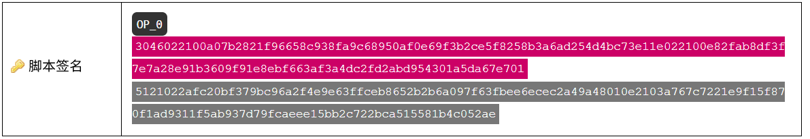

# 
P2SH

支付脚本哈希

.png)

P2SH是在**2012年4月**引入的标准脚本。它允许你将比特币锁定到脚本的哈希值上，然后在解锁这些比特币时提供原始脚本。

它基本上允许你**创建自己的自定义“赎回脚本”**，**但仍然可以轻松与其他人共享**。

>BIP 16：[脚本哈希支付](https://github.com/bitcoin/bips/blob/master/bip-0016.mediawiki)（2012年1月3日）

## P2SH是如何工作的？
锁定脚本包含另一个锁定脚本的哈希值（“**脚本哈希**”），由**HASH160**和**EQUAL**操作码包围：
| scriptPubKey|OP_HASH160 748284390f9e263a4b766a75d0633c50426eb875 OP_EQUAL|
|---|---|

解锁脚本然后包含你原始的自定义锁定脚本（“**赎回脚本**”），前面是解锁它所需的数据/操作码：

因此，在上述解锁脚本中，**赎回脚本**本身就是一个[P2MS](../P2MS/P2MS.md)锁定脚本，前面的签名就是解锁它所需的。

## 执行。

>**特殊形式**：P2SH锁定脚本模式被认为是“特殊”形式，因此它的执行方式与“正常”脚本略有不同。

P2SH脚本分为两个部分执行：

1. **标准执行**——首先对赎回脚本进行哈希，然后检查它是否等于锁定脚本中的脚本哈希值。
2. **赎回脚本执行**——这是特殊的部分。赎回脚本被反序列化并运行，就像它是一个锁定脚本一样。

### 1.标准执行
首先，整个脚本按照正常方式执行：

.png)
赎回脚本被哈希以确保与scriptPubKey中的哈希匹配。

通常情况下，这就是脚本执行结束的地方。然而，由于比特币在[BIP 16](https://github.com/bitcoin/bips/blob/master/bip-0016.mediawiki)的帮助下做出的更改，我们进入了P2SH脚本执行的第二个步骤...

### 2. 赎回脚本执行
脚本执行的第二部分只涉及原始的scriptSig。**赎回脚本**（一个数据推送）被**反序列化**为其组成部分（操作码和数据）。

你可以将赎回脚本看作是新的锁定脚本：

.gif)

无论如何，在赎回脚本被反序列化之后，整个脚本就像任何标准脚本一样运行。由于上面的示例中**赎回脚本**本包含一个[P2MS](../P2MS/P2MS.md)，因此以下是整个脚本的运行方式：

.gif)

在执行过程中，包含scriptPubKey的堆栈实际上在运行第一步之前被复制了一份。

## 为什么需要P2SH？

因为它使得与他人**共享复杂的锁定脚本变得更加容易**。

在P2SH出现之前，如果你想要在比特币上放置一个复杂的锁定脚本（例如[P2MS](../P2MS/P2MS.md)），你必须将**整个锁定脚本**提供给“发送”你这些比特币的人：
.png)

但是使用P2SH，你不需要给别人整个锁定脚本，你只需要给他们你**脚本的哈希值**：

.png)

当你稍后解锁比特币时，你提供原始脚本。

因此，发送方不再需要承担你的锁定脚本的大小（或细节）。

## P2SH的好处是什么？
P2SH带来了一些好处：

### 1. 发送方交易成本更低。
如果你想在比特币上放置自定义锁定脚本，则向你发送比特币的人必须将此脚本放入他们创建的交易中：
.png)

更大的锁定脚本会增加交易数据的大小，因此发送方将不得不支付更多的[交易费用](../../Transaction/Fees/Fees.md)来容纳你的脚本。

但是，使用P2SH，他们可以使用你的脚本的哈希创建锁定，这比完整脚本要小得多。
.png)

因此，**大型锁定脚本的负担不再落在发送者身上**（而是转移到接收者身上）。这有助于避免发送者对“发送”比特币到不是最简单和最便宜（例如[P2PKH](../P2PKH/P2PKH.md)）的锁定脚本的态度变得自满。

### 2. 我们可以使用地址来表示P2SH锁定脚本。
由于每个P2SH锁定脚本都具有统一的结构（得益于固定大小的[哈希值](../../Other/Hash%20Function/Hash%20Function.md)），我们可以为其设计一种标准[地址](../../Keys/Address/Address.md)格式（类似于[P2PKH](../P2PKH/P2PKH.md)地址格式）。

.png)

P2SH地址以3开头（由于在转换为[base58](../../Keys/Base58/Base58.md)之前添加了0x05前缀）。

因此，我们不必传递实际的P2SH锁定脚本，可以将其转换为地址并缩短它（再次缩短），从而更容易共享。
.png)

记住，地址包含[校验和](../../Keys/Checksum/Checksum.md)和并使用[base58](../../Keys/Base58/Base58.md)字符，因此它们比**原始脚本哈希**更适合共享。

### 3. P2SH具有更高的隐私性。

由于P2SH锁定脚本仅包含另一个锁定脚本的哈希值，因此仅仅通过查看哈希值，是不可能知道那个哈希值来自什么类型的锁定脚本：

.png)

**脚本哈希**可以是任何类型的脚本的[哈希值](../../Other/Hash%20Function/Hash%20Function.md)。

因此，没有人会知道一个输出是否属于某个人的公钥，或者它是否属于多个人。

直到有人花费它并揭示赎回脚本。

### 4.一个更小的UTXO集。
为了使比特币程序本身尽可能快地运行，所有交易的未花费输出（[UTXOs](../../Transaction/UTXO/)）都存储在你计算机的RAM中。

.png)

RAM可以让你快速访问数据，但它能够存储的数据量比硬盘少。

这些未使用交易输出（UTXO）还包含锁定脚本（scriptPubKeys），因此使用较小的P2SH脚本而不是较大的P2MS脚本可以节省存储UTXO集所需的RAM。

如果无法将整个UTXO集放入RAM中，节点在验证交易时会变得更慢。

## 在哪里可以找到P2SH脚本？
>寻找带有[3地址](../../Keys/Address/Address.md)的输出。通过查看scriptSig中的**赎回脚本**的内容，可以确定它是什么类型的锁定（例如多重签名）。

以下是已解锁的具有P2SH输出的第一笔交易：[^1]
* a0f1aaa2fb4582c89e0511df0374a5a2833bf95f7314f4a51b55b7b71e90ce0f - 1-of-2 Multisig
以下是P2SH用于多重签名的更多示例：

* 40eee3ae1760e3a8532263678cdf64569e6ad06abc133af64f735e52562bccc8 - 1-of-1 多重签名
* 450c309b70fb3f71b63b10ce60af17499bd21b1db39aa47b19bf22166ee67144 - 1-of-2 多重签名
* d3adb18d5e118bb856fbea4b1af936602454b44a98fc6c823aedc858b491fc13 - 2-of-3 多重签名
  
以下是P2SH用于自定义（非标准）赎回脚本的示例：

* bd60553862497ea33fb98f4086308740ed1e5637d5740b36271f7fca2ce7d8f1
* 7d46745463a28049cb93d2c964320912d9c296c1038cb24cc3716255c397a87f
* e901419693926c897f16e4f14e48f51489207b2a087435b8e82801c00c7ab121
* 2c6c3a1319c3e42b4801dab62e3d3d59c51c3535b8dad20e9580650f114c7026 - [Peter Todd SHA1哈希碰撞脚本](https://bitcointalk.org/index.php?topic=293382.0)

## 你可以在赎回脚本中放置哪种类型的脚本？
你可以在赎回脚本中放置几乎任何自定义的**锁定脚本**。

自**比特币0.10.0**以来，你不再受限于仅使用标准脚本：

>对于P2SH赎回脚本，IsStandard（）规则已被几乎完全删除，允许应用程序使用任何有效的脚本类型，例如“n-of-m OR y”，哈希锁定的Oracle地址等。虽然比特币协议始终支持这些类型的脚本，但在主网上实际使用它们不方便，因为标准比特币核心节点不会将它们中继到矿工，大多数矿工也不会将它们包含在他们挖掘的块中。-[比特币0.10.0发布说明](https://bitcoin.org/en/release/v0.10.0#standard-script-rules-relaxed-for-p2sh-addresses)

因此，如果你想在**赎回脚本**中使用各种**操作码**进行一些有趣的操作，那么这是你可以实现它的地方。

>确保你的非标准脚本最终会在执行结束时留下**单个OP_1**。
我曾经创建过一个脚本，它在堆栈上留下了**OP_1**  **OP_1**  **OP_1**，即使顶部元素是**OP_1**，我仍然收到了“**执行后堆栈上有额外的项目**”错误，交易将不会中继。

## P2SH在整个区块链中占用更多的空间吗？
是的，你是对的。

例如，使用简单的**P2MS**模式的完整的2-of-3多签脚本占用区块链中的**253个字节**：

.png)

另一方面，完整的2-of-3多重签名脚本使用**P2SH**在区块链中占用**278个字节**：

.png)

因此，将比特币锁定到脚本哈希的额外步骤会向整个脚本添加额外的**25个字节**。

然而，没有任何其他选择能够为自定义锁定脚本创建[地址](../../Keys/Address/Address.md)，因此为了这种方便而额外付出25个字节是合理的代价。

更不用说 [P2SH 的其他好处](#p2sh的好处是什么)了。

## 链接

* [P2SH 字节结构](https://bitcoin.stackexchange.com/questions/91825/non-segwit-p2sh-bytes-structure/91853#91853)

[^1]:https://twitter.com/Blyekklockdown/status/1198039227000332294