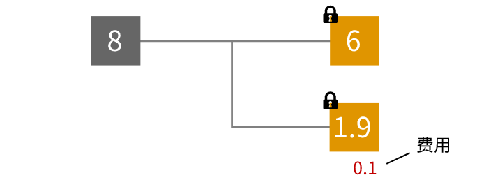
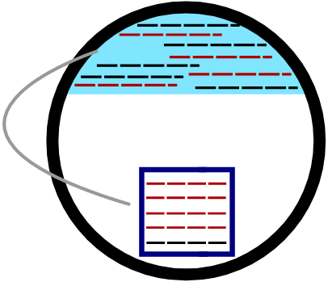
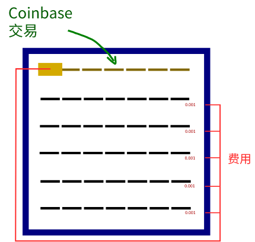
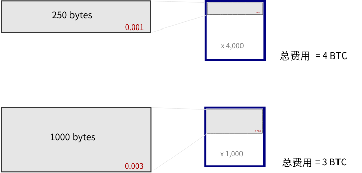

# 
交易费用

交易的剩余部分。

**交易费**是比特币交易的剩余部分。

## 为什么要使用交易费？
交易费可以激励矿工将你的交易包含在他们的[候选区块](../../Node/Candidate%20Block/Candidate%20Block.md)中。

如果[内存池](../../Node/Memory%20Pool/Memory%20Pool.md)中的交易数量超过了一个区块所能容纳的数量，矿工将选择具有最高手续费的交易。  
因此，如果内存池中存在大量比特币交易，但并非所有所有交易都能放入区块中，则可以使用交易费作为“购买区块空间”的一种方式。

## 交易费用去哪里了？
交易费用通过[coinbase交易](../Coinbase%20Transaction/Coinbase%20Transaction.md)被矿工所领取。

矿工有机会获得交易人员放入[候选块](../../Node/Candidate%20Block/Candidate%20Block.md)的所有交易费用。

## 按字节费用

* 比特币区块的大小限制为**1MB**（1,000,000字节）。
* [交易数据](../Transaction%20Data/Transaction%20Data.md)占用块中的空间（典型小交易大约占用250字节）。

因此，当矿工用交易填满一个区块时，他们会希望最大化他们可以收集的费用。他们通过选择在块中占用空间最少但收费最高的交易来实现这一目标。

第二笔交易的绝对费用更高，但如果你用这些交易填满一个区块，你将无法收集到更多的总费用。

因此，当你计算交易费用大小时，重要的指标是**每字节的费用**。

## 例子
|TXID|费用（BTC）|大小（字节）|费用/字节|
|---|---|---|---|
|[bf09e5531c0b1a4189b5a8e571007f7711b8d17f2d2afb1e6489bfa377e18542](https://learnmeabitcoin.com/explorer/transaction/bf09e5531c0b1a4189b5a8e571007f7711b8d17f2d2afb1e6489bfa377e18542)|0.00067868|226|0.00000300|
|[dee09e37ba2e8a51706e71e587bcdb9e13545a3419d93e77bf4d6fcb48a19745](https://learnmeabitcoin.com/explorer/transaction/dee09e37ba2e8a51706e71e587bcdb9e13545a3419d93e77bf4d6fcb48a19745)|0.00229300|2,290|0.00000100|
|[b1eeb475c72a82745bca1f9cc1bdb5020a1633eec0dd7022962e2a4d162e7e05](https://learnmeabitcoin.com/explorer/transaction/b1eeb475c72a82745bca1f9cc1bdb5020a1633eec0dd7022962e2a4d162e7e05)|0.00011300|225|0.00000050|

## 注释
>**任何比特币交易的剩余部分都是交易费用。全部都是。**
如果你创建一个使用10个BTC[输入](../Transaction/Transaction%20Data/Input/input.md)的比特币交易，并且只创建一个0.1个BTC[输出](../Transaction%20Data/output/output.md)，则剩余的9.9个BTC将被计算为交易费用。

>>**不幸的例子：**
>>* [291.2409个BTC交易费用](https://learnmeabitcoin.com/explorer/transaction/cc455ae816e6cdafdb58d54e35d4f46d860047458eacf1c7405dc634631c570d) - （[bitcointalk帖子](https://bitcointalk.org/index.php?topic=1451924.0)）
>>* [30个BTC交易费用](https://learnmeabitcoin.com/explorer/transaction/7e8fce9686572d8308d8c40fa3cb96fdbf96c0787c147d3159c893fd560aabc7) - ([Reddit帖子](https://www.reddit.com/r/Bitcoin/comments/1eh57i/messed_up_transaction_feeplease_help/)）
>>* [7个BTC交易费用](https://learnmeabitcoin.com/explorer/transaction/891af6431550ece772e2e2ebee13e856b971402763533babb2c49475ec260445) - （当时只有约85美元，但仍然是不必要的）