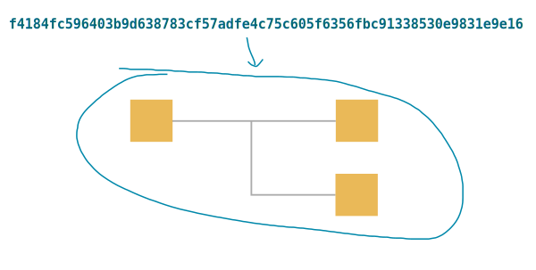
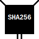
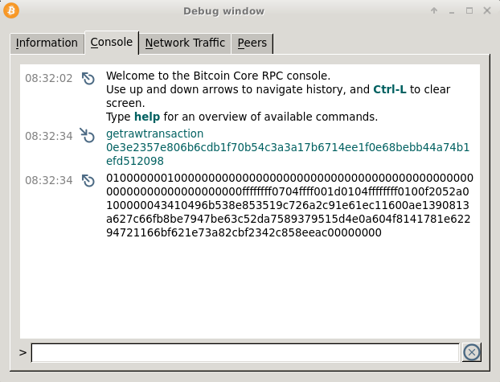

# <center>TXID</center>
<center>一笔交易数据的哈希值。</center>



TXID（交易ID）基本上是比特币交易的标识号码。

## 例子：
* f4184fc596403b9d638783cf57adfe4c75c605f6356fbc91338530e9831e9e16 - 2010年向Hal Finney进行的第一笔比特币交易。
* a1075db55d416d3ca199f55b6084e2115b9345e16c5cf302fc80e9d5fbf5d48d - 2010年进行了一笔以1万个BTC为交易额的披萨交易。
* 4ce18f49ba153a51bcda9bb80d7f978e3de6e81b5fc326f00465464530c052f4 - 包含我为此网站收到的第一笔捐款的交易。
TXID始终为**32字节**（64个字符）且为[十六进制](../../Other/Hexadecimal/hexadecimal.md)。

## 创建TXID

通过SHA256两次[哈希](../../Other/Hash%20Function/Hash%20Function.md)[交易数据](../Transaction%20Data/Transaction%20Data.md)，即可获得TXID。
```
0100000001c997a5e56e104102fa209c6a852dd90660a20b2d9c352423edce25857fcd3704000000004847304402204e45e16932b8af514961a1d3a1a25fdf3f4f7732e9d624c6c61548ab5fb8cd410220181522ec8eca07de4860a4acdd12909d831cc56cbbac4622082221a8768d1d0901ffffffff0200ca9a3b00000000434104ae1a62fe09c5f51b13905f07f06b99a2f7159b2225f374cd378d71302fa28414e7aab37397f554a7df5f142c21c1b7303b8a0626f1baded5c72a704f7e6cd84cac00286bee0000000043410411db93e1dcdb8a016b49840f8c53bc1eb68a382e97b1482ecad7b148a6909a5cb2e0eaddfb84ccf9744464f82e160bfa9b8b64f9d4c03f999b8643f656b412a3ac00000000
```



169e1e83e930853391bc6f35f605c6754cfead57cf8387639d3b4096c54f18f4 （注意：如果想在区块链中*查找此交易*，请先反转字节顺序...）

### 在区块链中搜索交易ID。
>如果你刚刚对一些交易数据进行了哈希，并想在区块链中*搜索TXID*，则必须以相反的字节顺序搜索它。
```
txid (original):  169e1e83e930853391bc6f35f605c6754cfead57cf8387639d3b4096c54f18f4
txid (searching): f4184fc596403b9d638783cf57adfe4c75c605f6356fbc91338530e9831e9e16
```

### 为什么?
欢迎来到比特币。

>由于历史原因，比特币核心使用的交易和块哈希是反转的。我不太清楚为什么。可能是像使用openssl bignum存储哈希等类似的东西，然后将它们作为数字打印出来。- [Wladimir van der Laan](https://github.com/laanwj)（比特币核心开发人员）

换句话说，这是比特币早期开发中的一小失误，现在已经成为标准。

## TXID在哪里使用？

### 1.搜索区块链。
如果你刚刚进行了交易，你可以使用TXID在区块链中找到它。例如：
```
bitcoin-cli getrawtransaction 0e3e2357e806b6cdb1f70b54c3a3a17b6714ee1f0e68bebb44a74b1efd512098
```



[比特币核心钱包](https://bitcoin.org/en/download)中的控制台窗口

>如果你的比特币钱包给你一个TXID，它很可能已经是可搜索的格式（反向字节顺序）。

### 2. 花费输出。
当你想在新交易中将现有[输出](../Transaction%20Data/output/output.md)用作[输入](../Transaction%20Data/Input/input.md)时，你会使用TXID。


<center>要引用现有的输出，你需要使用它所创建的txid以及该交易的vout编号。</center>

因为，TXID是交易的唯一标识符。

## 注释
### 为什么要进行两次哈希？为什么不只进行一次？

>在比特币中，通常会进行两次哈希以获得超级安全性。

>>Ferguson 和 Schneier 在他们的优秀著作《实用密码学》中（后来由 Ferguson、Schneier 和 Kohno 更新并更名为《密码工程》），提出了 SHA-256(SHA-256(x)) 的方式，以使 SHA-256 不易受到“长度扩展”攻击。他们称之为“SHA-256d”。
https://crypto.stackexchange.com/questions/779/hashing-or-encrypting-twice-to-increase-security/884#884

>哈希函数（如*SHA256*）非常适合创建身份识别号，因为它们可以接受任何数据字符串并始终产生一个短而独特的结果。

### Coinbase交易具有相同的TXID。
曾经出现过两个“不同”的[Coinbase交易](../../Transaction/Coinbase%20Transaction/Coinbase%20Transaction.md)具有相同的TXID的情况。

这些Coinbase交易使用同一个[地址](../../Keys/Address/Address.md)从两个不同的块中领取块奖励。这意味着它们的交易数据相同，因此TXID也相同。以下是这些交易以及它们所包含的块：
1. *e3bf3d07d4b0375638d5f1db5255fe07ba2c4cb067cd81b84ee974b6585fb468*
   * block 91,722: 00000000000271a2dc26e7667f8419f2e15416dc6955e5a6c6cdf3f2574dd08e
   * block 91,880: 00000000000743f190a18c5577a3c2d2a1f610ae9601ac046a38084ccb7cd721
2. *d5d27987d2a3dfc724e359870c6644b40e497bdc0589a033220fe15429d88599*
   * block 91,812: 00000000000af0aed4792b1acee3d966af36cf5def14935db8de83d6f9306f2f
   * block 91,842: 00000000000a4d0a398161ffc163c503763b1f4360639393e0e4c8e300e0caec 
### 修复方案。
最初，[BIP 30](https://github.com/bitcoin/bips/blob/master/bip-0030.mediawiki)引入了一条规则，防止区块包含已经存在的TXID。后来，[BIP 34](https://github.com/bitcoin/bips/blob/master/bip-0034.mediawiki)要求coinbase交易在它们的交易数据中包含它们正在挖掘的块的高度，以便coinbase交易可以不同。
### 链接
    * https://github.com/bitpay/insight-api/issues/42  
    * http://bitcoin.stackexchange.com/questions/3030/two-blocks-two-transactions-same-hash
    * http://bitcoin.stackexchange.com/questions/11999/can-the-outputs-of-transactions-with-duplicate-hashes-be-spent/

感谢DJBunnies向[我指出这一点](https://www.reddit.com/r/Bitcoin/comments/5waqc1/what_is_a_txid/de8m12j/)。