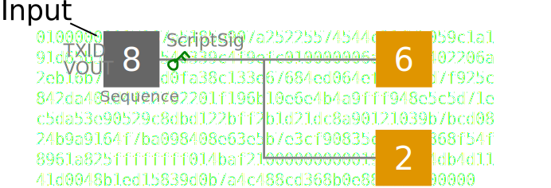
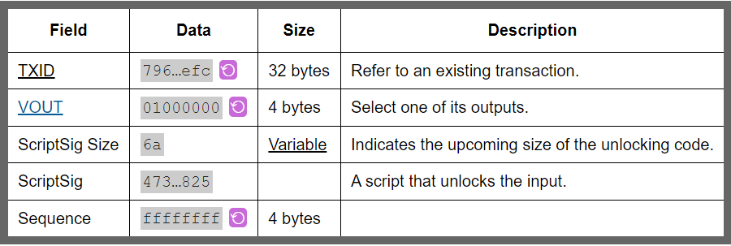
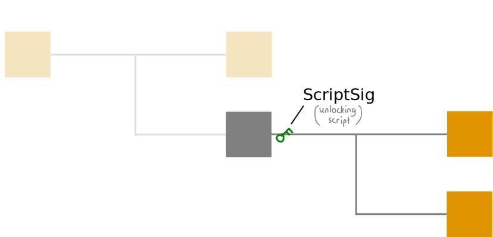

# 输入
一批比特币被用于比特币交易。


当你在交易中花费它时，**输入**是你称呼*输出*的东西。

## 结构
```
01000000017967a5185e907a25225574544c31f7b059c1a191d65b53dcc1554d339c4f9efc010000006a47304402206a2eb16b7b92051d0fa38c133e67684ed064effada1d7f925c842da401d4f22702201f196b10e6e4b4a9fff948e5c5d71ec5da53e90529c8dbd122bff2b1d21dc8a90121039b7bcd0824b9a9164f7ba098408e63e5b7e3cf90835cceb19868f54f8961a825ffffffff014baf2100000000001976a914db4d1141d0048b1ed15839d0b7a4c488cd368b0e88ac00000000
```

## 域


>**TXID字节顺序**：在*交易数据*中引用TXID时，您必须*反转字节顺序*才能将其恢复为原始格式。搜索TXID时使用的字节顺序是反向的（由于原始比特币客户端工作方式中存在历史错误）。

## 输入如何工作？
“输入”有两个任务：

1. 选择一个输出。
2. 解锁它。
   
### 1. 选择一个输出。
当您想将输出用作交易的输入时，只需指定您想要消费哪个输出。

每个交易都有一个唯一的TXID，因此通过使用具有特定输出编号（VOUT）的TXID，您可以引用区块链中的任何输出。


你只需要一个*txid*和一个*vout*，就可以选择区块链上的任何输出。

### 2. 解锁它。

选择一个输出后，你需要能够**解锁它**。

每个输出都设置了一个锁定脚本。因此，如果你想花费其中一个输出，你需要提供一个解锁脚本（称为ScriptSig）。


>*节点*会验证它们收到的每个交易。因此，如果您没有提供满足锁定脚本的解锁脚本，您的交易将被拒绝。

## 备注
listunspent
该命令会给你的比特币核心钱包提供一个未花费输出的列表。

换句话说，它会给你提供一个可以作为新交易**输入**的输出列表：
```
$ bitcoin-cli listunspent

[
  {
    "txid" : "txid",          (string) the transaction id
    "vout" : n,               (numeric) the vout value
    "address" : "address",    (string) the bitcoin address
    "account" : "account",    (string) DEPRECATED. The associated account, or "" for the default account
    "scriptPubKey" : "key",   (string) the script key
    "amount" : x.xxx,         (numeric) the transaction output amount in BTC
    "confirmations" : n,      (numeric) The number of confirmations
    "redeemScript" : n        (string) The redeemScript if scriptPubKey is P2SH
    "spendable" : xxx,        (bool) Whether we have the private keys to spend this output
    "solvable" : xxx,         (bool) Whether we know how to spend this output, ignoring the lack of keys
    "safe" : xxx              (bool) Whether this output is considered safe to spend. Unconfirmed transactions
                              from outside keys and unconfirmed replacement transactions are considered unsafe
                              and are not eligible for spending by fundrawtransaction and sendtoaddress.
  }
  ,...
]
```