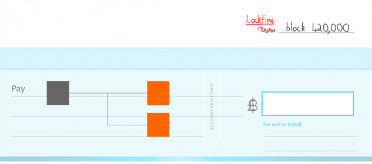
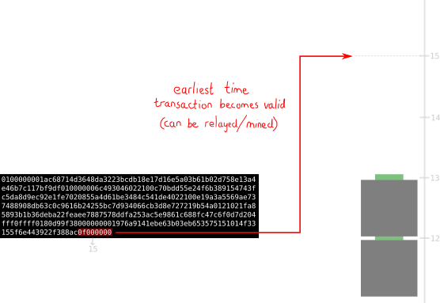

# 锁定时间
用于延迟日期的交易中的字段。

锁定时间（Locktime）是**设置交易在区块中可以被挖掘的最早时间**。

它是*交易数据*中的最后一个字段。

## 用途
您可以使用锁定时间确保交易被锁定到特定的**区块高度**或**时间点**。
|锁定时间|描述|
|---|---|
|< 500000000|在区块高度解锁。|
|>= 500000000|在特定时间（Unix时间）解锁|
如果您不希望您的交易被锁定到特定的区块或时间，请将锁定时间字段设置为0x00000000（或任何低于当前区块高度或Unix时间的值）。

>*节点*会验证它们接收到的每一笔交易（和区块）。因此，如果它们接收到一个带有未来锁定时间的交易（或包含此类交易的区块），它们将拒绝该交易。

## 例子
>为了使锁定时间生效，您需要将交易数据中的一个*输入*的序列值设置为低于默认最大值（0xffffffff）的任何值。

>[Unix时间](https://en.wikipedia.org/wiki/Unix_time)是自1970年1月1日以来的秒数。

>如上所述，锁定时间具有设置块高度或时间的双重用途。这是因为：
>>* 在我们达到500,000,000个块之前，需要**9,497年**。
>>* 当前的Unix时间是1,684,829,097（也称为2023年5月23日08:04:57），已经超过了500,000,000。

## 资源
* https://bitcoin.org/en/developer-guide#locktime-and-sequence-number
* http://bitcoin.stackexchange.com/questions/5914/how-is-locktime-enforced-in-the-standard-client
* http://bitcoin.stackexchange.com/questions/2025/what-is-txins-sequence

## 源代码
* [nLockTime](https://github.com/bitcoin/bitcoin/search?utf8=%E2%9C%93&q=nLockTime&type=Code)
* [validation.cpp](https://github.com/bitcoin/bitcoin/blob/668de70be039a4f1ffcf20aeae2a22ee71fc55a8/src/validation.cpp#L223) (IsFinalTx)