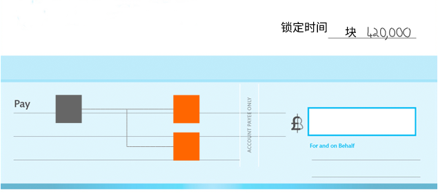

# 
锁定时间

用于延迟日期的交易中的字段。

锁定时间（Locktime）是**交易可以被挖掘到区块中的最早时间**。

它是[交易数据](../Transaction%20Data.md)中的最后一个字段。

## 用途
你可以使用锁定时间确保交易被锁定到特定的**区块高度**或**时间点**。
|锁定时间|描述|
|---|---|
|< 500000000|在区块高度解锁。|
|>= 500000000|在特定时间（Unix时间）解锁|
如果你不希望你的交易被锁定到特定的区块或时间，请将锁定时间字段设置为0x00000000（或任何低于当前区块高度或Unix时间的值）。

.png)

>[节点](../../../../Beginners/How%20Bitcoin%20Works/1.Network/Nodes/Nodes.md)会验证它们接收到的每一笔交易（和区块）。因此，如果它们接收到一个带有未来锁定时间的交易（或包含此类交易的区块），它们将拒绝该交易。

## 例子

大多数交易不使用锁定时间，因此它们的锁定时间设置为0x00000000。

尽管如此：
|锁定时间|十进制|描述|
|--|--|--|
|0xede80600	|452845 |这个交易只能在区块链达到高度452,845之后在网络上传递。（tx）|
|0x06241559	|1494557702 |这是Unix时间中的Fri，12 May 2017 02:55:02。只有在最后11个块的中位时间（根据它们[块头](../../../Block/block-header/block-header.md)中的时间字段）大于此时间时，交易才能在网络上中继。(tx)|
|0xb154c233	|868373681| 这是Unix时间中的Tue，08 Jul 1997 14:54:41。这实际上就像将锁定时间设置为0x00000000一样，因为*第一个区块*是在2011年2月2日23:16:42挖掘出来的。(tx)|
* swapendian
* hexdec
  
## 注释
>为了使锁定时间生效，你需要将交易数据中的[输入](../Input/input.md)之一的[序列值](../Transaction%20Data.md)设置为默认最大值（0xffffffff）以下的任何值。
>[Unix时间](https://en.wikipedia.org/wiki/Unix_time)是自1970年1月1日以来的秒数。  

>如上所述，锁定时间具有设置块高度或时间的双重用途。这是因为：
>>* 在我们需要**9,497年**才能达到500,000,000个块。
>>* 当前的Unix时间是1,684,829,097（也称为2023年5月23日08:04:57），已经超过了500,000,000。

## 资源
* https://bitcoin.org/en/developer-guide#locktime-and-sequence-number
* http://bitcoin.stackexchange.com/questions/5914/how-is-locktime-enforced-in-the-standard-client
* http://bitcoin.stackexchange.com/questions/2025/what-is-txins-sequence

## 源代码
* [nLockTime](https://github.com/bitcoin/bitcoin/search?utf8=%E2%9C%93&q=nLockTime&type=Code)
* [validation.cpp](https://github.com/bitcoin/bitcoin/blob/668de70be039a4f1ffcf20aeae2a22ee71fc55a8/src/validation.cpp#L223) (IsFinalTx)