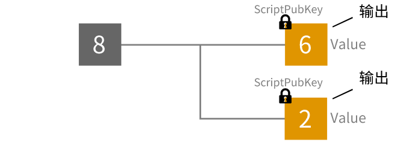
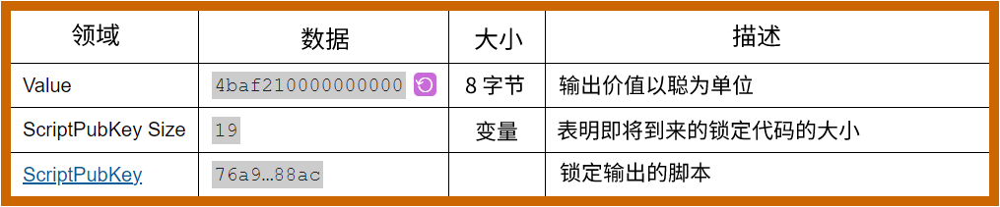
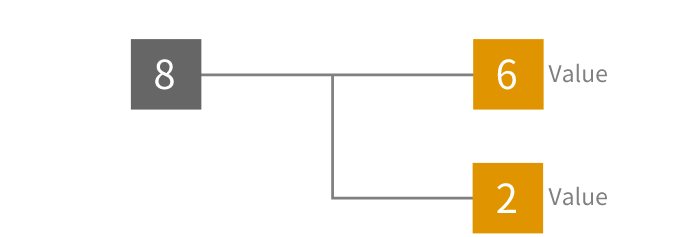
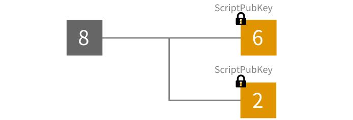
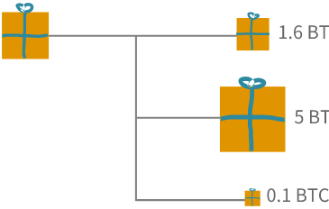

# <center>输出</center>
<center>一笔交易中创建的比特币批次。</center>



输出是在比特币[交易](../Transaction%20Data.md)中创建的**比特币批次**。 

每个输出都有一个**锁**，这意味着只有能够解锁它们的人才能将它们用作未来交易中的[输入](../Input/input.md)。 

## 结构
```
01000000017967a5185e907a25225574544c31f7b059c1a191d65b53dcc1554d339c4f9efc010000006a47304402206a2eb16b7b92051d0fa38c133e67684ed064effada1d7f925c842da401d4f22702201f196b10e6e4b4a9fff948e5c5d71ec5da53e90529c8dbd122bff2b1d21dc8a90121039b7bcd0824b9a9164f7ba098408e63e5b7e3cf90835cceb19868f54f8961a825ffffffff014baf2100000000001976a914db4d1141d0048b1ed15839d0b7a4c488cd368b0e88ac00000000
```
Transaction: [c1b4e695098210a31fe02abffe9005cffc051bbe86ff33e173155bcbdc5821e3](https://learnmeabitcoin.com/explorer/transaction/c1b4e695098210a31fe02abffe9005cffc051bbe86ff33e173155bcbdc5821e3)


## 领域


>如果想解码输出的值，只需要[交换字节顺序](https://learnmeabitcoin.com/tools/swapendian)，然后将其从[十六进制转换为十进制](https://learnmeabitcoin.com/tools/hexdec)。这你就可以得到以**Satoshis**为单位的值。

## 输出如何工作？
在选择要使用的[输入](../Input/input.md)后，你可以从中创建任意数量的输出。

对于每个输出，只需：

1. 赋予它一个价值。
2. 给它一个锁。

### 1. 价值
每个输出都有一个价值。这个价值以**Satoshis**为单位给出：



你可以创建任意数量的输出，只要它们的总和**不超过你要花费的输入的总和**。

### 2. 锁定
 
你还可以在创建输出时对其进行**锁定**。这些锁定脚本可以防止其他人将这些输出用作另一笔交易的[输入](../Input/input.md)（即花费它们）。

这个锁定代码称为ScriptPubKey。



只有当你能够解锁输出时，才能将其用作另一笔交易的[输入](../Input/input.md)。

## 注释
>我认为输出是不同大小的比特币批次。



>如果你愿意，输出的值可以为0。
例子：
>>* [1f22ec55dda438860ca4c284ddc69e0aba40308a4bed572bd2f6416b7623aa96](https://learnmeabitcoin.com/explorer/transaction/1f22ec55dda438860ca4c284ddc69e0aba40308a4bed572bd2f6416b7623aa96)
>>* [44a0d9fe1aee1704a127c1345e4deea2ef4384fbbd3c289b46cc4b584acdf42a](https://learnmeabitcoin.com/explorer/transaction/44a0d9fe1aee1704a127c1345e4deea2ef4384fbbd3c289b46cc4b584acdf42a)