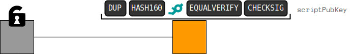

# 脚本公钥
放置在输出端的锁定机制。


**脚本公钥**（更容易被视为“锁定脚本”）是一种[脚本](../../../../Script/Script.md)，你可以将其放在[输出](../output.md)上，以防止他人花费它。

## 标准脚本
比特币中常用的锁定脚本有几种固定模式：

### 1. [Pay To Pubkey](../../../../Script/P2PK/P2PK.md)
```

04a9d6840fdd1497b3067b8066db783acf90bf42071a38fe2cf6d2d8a04835d0b5c45716d8d6012ab5d56c7824c39718f7bc7486d389cd0047f53785f9a63c0c9d OP_CHECKSIG
```
>提示：在上面的脚本的原始十六进制数据中，公钥前面有一个字节来表示即将到来的公钥的大小。例如，0x41表示“将下一个65个字节的脚本推送到堆栈上”。
>>0x01到0x4e之间的操作码用于[指示](https://en.bitcoin.it/wiki/Script#Constants)即将推送到堆栈上的数据的字节数。

### 2. [Pay To Pubkey Hash](../../../../Script/P2PKH/P2PKH.md)
```
OP_DUP OP_HASH160 fde0a08625e327ba400644ad62d5c571d2eec3de OP_EQUALVERIFY OP_CHECKSIG
```

>细节
这是最常见的锁定脚本。只有拥有与放置到脚本中的[公钥](../../../../Keys/Public%20Key/Public%20Key.md)相对应的私钥才能解锁它。
>>这是制作标准比特币交易时使用的默认锁定脚本。事实上，这个锁定脚本使用得如此频繁，以至于你可能认为各种“锁定脚本”不是一个事情。

### 3. [Pay To Multisig](../../../../Script/P2MS/P2MS.md)
```
OP_1 0378ee11c3fb97054877a809ce083db292b16d971bcdc6aa4c8f92087133729d8b 1283b5fbf5cc62d4399dfa1025c3e306295264494722c5085ceadadf1291f68125 a31752c9f17c628edc4c69c4c0846f8d814b21e046eabe06f9968a037ce0741c74 OP_3 OP_CHECKMULTISIG
```

### 4. [Pay To Script Hash](../../../../Script/P2SH/P2SH.md)
```
OP_HASH160 10b0ed2d1698ff0f0ea151cf41988d05b728746a OP_EQUAL
```

### 5. [NULL DATA](../../../../Script/NULL%20DATA/NULL%20DATA.md)
```
OP_RETURN 68656c6c6f20776f726c64
```
