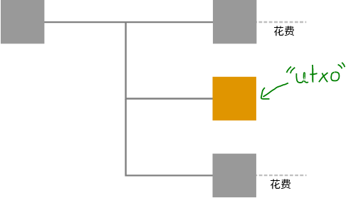
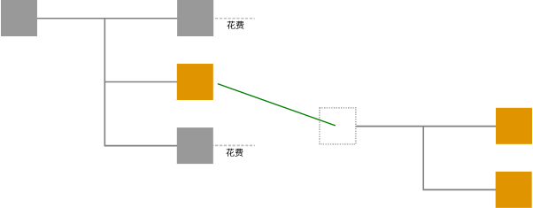
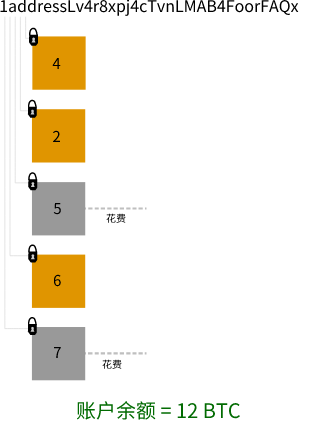

# <center>UTXO</center>
<center>未花费的交易输出</center>



一旦一个[输出](../Transaction%20Data/output/output.md)在交易中被“用尽”，它就不能再次使用。因此，已经花费的输出就像是一具尸体。

然而，未花费的输出仍然有效。只要你可以解锁它们，它们就可以**用于新的交易**，这使它们非常有用。这就是为什么已花费的输出和**未花费的输出**（UTXO）之间存在区别的原因。

## UTXO 在哪里使用？

### 1. 验证交易
一个[节点](../../../Beginners/How%20Bitcoin%20Works/1.Network/Nodes/Nodes.md)将通过检查其输入是否已经被花费来验证它接收到的交易。

因此，如果你想创建自己的比特币交易，你必须使用 UTXO 作为你的[输入](../Transaction%20Data/Input/input.md)。



<center>这个新交易是指一个未花费的输出。一切正常。</center>

然而，如果你尝试使用已经在另一个交易中使用过的输出，你的交易将会被节点拒绝。


<center>新交易是指一个已经被花费的输出。节点将拒绝这个交易。</center>

### 2. 地址余额

如果你想计算一个[地址](../../Keys/Address/Address.md)的余额，需要将所有[锁定](../Transaction%20Data/output/scriptPubKey/scriptPubKey.md)在该地址上的未花费输出相加。



## UTXO数据库
由于UTXO被用于验证节点接收到的每个交易，因此UTXO被存储在其自己的数据库中。
```
~/.bitcoin/chainstate/
```
该数据库允许你的节点通过检查交易的输入是否在UTXO数据库中可用来快速验证交易。

## 注释
>gettxoutsetinfo
此命令会给你提供有关此UTXO数据库的统计信息:
```
$ bitcoin-cli gettxoutsetinfo

{
  "height": 454974,
  "bestblock": "000000000000000001afbfe1209aee1882e8a8930bc1e020c4a37d98f72640d7",
  "transactions": 17707300,
  "txouts": 45845906,
  "bytes_serialized": 1791822745,
  "hash_serialized": "ed1bdcca4e08eb8270800d08b2f9dd7ce926f4ff9b1d7304b71c7a075a69098c",
  "total_amount": 16187023.59866495
}
```
>当你运行bitcoind时，UTXO数据库也会被加载到RAM中，这进一步有助于加快验证的速度。
**什么是RAM?**
RAM是随机存取存储器。
如果你在电脑上存储数据，从RAM中读取数据比从磁盘（即SSD或HDD）中读取数据更快。你的硬盘是用于长期存储的，而你的RAM是临时存储，你可以从中更快地读取数据。
>>你可以通过bitcoin.conf文件中的dbcache=选项来更改用于UTXO数据库的RAM数量（默认为100MB）。增加这个值将加快节点验证传入交易的时间。

## 资源
### 链接
* [UTXO database size chart - statoshi.info](http://statoshi.info/dashboard/db/unspent-transaction-output-set?panelId=8&fullscreen)
* [http://gavinandresen.ninja/utxo-uhoh](http://gavinandresen.ninja/utxo-uhoh)
* [https://bitcoin.org/en/developer-reference#gettxoutsetinfo](https://bitcoin.org/en/developer-reference#gettxoutsetinfo)