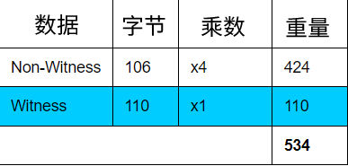

# 交易权重
用于衡量交易“规模”的度量标准。
.png)

随着[BIP 141](https://github.com/bitcoin/bips/blob/master/bip-0141.mediawiki#transaction-size-calculations)（*隔离见证*）的引入，**交易**获得了一个新的计量单位，称为**权重**。

这种权重测量基本上给交易的验证部分（签名数据）提供了折扣，所以它不会占用区块内部的太多“空间”。换句话说，**签名数据比其他交易数据更便宜**。

## 计算
交易的权重是通过将[交易数据](../Transaction%20Data/Transaction%20Data.md)的不同部分的大小（以字节为单位）乘以不同的值来计算的：
|数据|	倍数|
|---|---|
|Version|	x4|
|Marker|	x1|
|Flag|	x1|
|Input Count|	x4|
|[Input](../Transaction%20Data/Input/input.md)|	x4|
|Output Count|	x4|
|[Output](../Transaction%20Data/output/output.md)|	x4|
|Witness|	x1|
|[Locktime](../Transaction%20Data/locktime/locktime.md)|	x4|

## 例子
交易：*c586389e5e4b3acb9d6c8be1c19ae8ab2795397633176f5a6442a261bbdefc3a*
```
0200000000010140d43a99926d43eb0e619bf0b3d83b4a31f60c176beecfb9d35bf45e54d0f7420100000017160014a4b4ca48de0b3fffc15404a1acdc8dbaae226955ffffffff0100e1f5050000000017a9144a1154d50b03292b3024370901711946cb7cccc387024830450221008604ef8f6d8afa892dee0f31259b6ce02dd70c545cfcfed8148179971876c54a022076d771d6e91bed212783c9b06e0de600fab2d518fad6f15a2b191d7fbd262a3e0121039d25ab79f41f75ceaf882411fd41fa670a4c672c23ffaf0e361a969cde0692e800000000
```


## 常见问题解答
为什么是4倍？

>**4倍有助于在创建输出的成本和花费输出的成本之间创建更多的平衡。**

在典型的[交易数据](../Transaction%20Data/Transaction%20Data.md)中，可以使用约**32字节**创建输出，但花费它需要约**108字节**：
.png)
使用旧的度量标准，每个包含在交易中的字节数据都会增加其[费用](../Fees/Fees.md)。因此，花费一个输出的费用比创建一个输出的费用更高。

然而，通过使用新的权重指标，创建输出的成本和花费输出的成本之间的平衡更加均衡。
.png)
通过使用新的权重指标，创建输出的成本和支出输出的成本之间更加平衡。

因此，这种方式创造了更加平衡的支出激励，这有助于减少未花费交易输出集[UTXO](../UTXO/UTXO.md)的大小（在运行完整节点的计算机的RAM中占用宝贵的空间）。

## 感谢

感谢[luke-jr](https://github.com/luke-jr)解释如何将非见证数据乘以4有助于在创建和花费UTXO的成本之间创建平衡。
感谢[Pieter Wuille](https://twitter.com/pwuille)提供这个有用的链接：https://segwit.org/why-a-discount-factor-of-4-why-not-2-or-8-bbcebe91721e